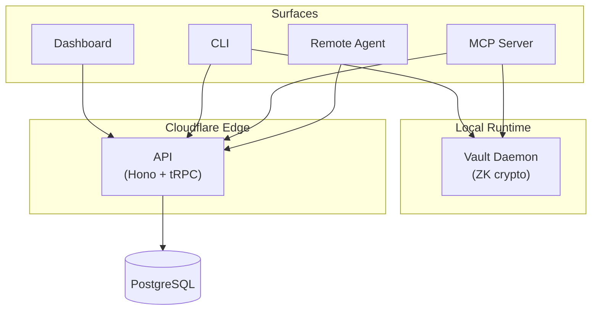

# abadge

### Your agents need credentials. You need control.

abadge is a credential control plane for AI agents. Store secrets, permission exactly which agents can use them, choose how they're delivered, and audit every access -- all from one place.

---

**The problem**: Agents are shipping to production. They call APIs, sign into services, and act on behalf of users. But credentials are still hardcoded in config, over-shared in environment variables, or buried in vaults with no per-agent scoping. When something goes wrong, there's no trace.

**The fix**: abadge puts a policy-checked, audited gateway between every agent and every credential.

---

## How it works

```
Store → Permission → Deliver → Audit
```

1. **Store** credentials with zero-knowledge or server-managed encryption
2. **Permission** each agent for exactly the credentials and capabilities it needs
3. **Deliver** secrets through env injection, file mounts, or direct reveal -- LLMs never see raw secrets
4. **Audit** every access attempt in an append-only log

## Surfaces

| | For | How |
|---|---|---|
| **Dashboard** | Operators | Web UI for managing credentials, agents, and permissions |
| **CLI** | Developers | `abadge run` injects secrets into any command |
| **MCP Server** | AI Agents | Tools that use secrets without exposing them to the model |
| **SDK** | Integrators | TypeScript client for programmatic access |
| **API** | Everything | tRPC control plane on Cloudflare Workers |

## Quick start

```bash
# Install
curl -fsSL https://raw.githubusercontent.com/punitarani/abadge/main/install.sh | bash

# Login
abadge login

# Store a secret
abadge item create --label "prod-db" --kind login --storage-mode server_managed

# Register an agent and grant access
abadge agent register -n "deploy-bot"
abadge permission create --agent-id <id> --item-id <id> --capability mount_env

# Run with the secret injected
abadge run --item <id> --env-var DB_PASSWORD -- ./deploy.sh
```

## Zero-knowledge option

For maximum security, choose zero-knowledge storage. Your master password derives the encryption key locally -- the server stores only ciphertext and can never decrypt your secrets, even in a full breach.

## Security highlights

- AES-256-GCM (server-managed) and XChaCha20-Poly1305 (zero-knowledge) encryption at rest
- API keys and session tokens hashed before storage, shown once
- Ed25519 signed sessions with 15-minute TTL for agents
- Per-agent, per-credential, per-capability permissions with optional expiry
- MCP tools redact secrets from LLM-visible output
- Append-only audit log for every access attempt (allowed and denied)
- Rate limiting, secure headers, CORS, CSRF protection

## Architecture



## Documentation

| Document | Description |
|---|---|
| [Overview](./docs/abadge.md) | What abadge is, who it's for, and how it works |
| [Workflows & Flows](./docs/flow.md) | Mermaid diagrams for every workflow across all surfaces |
| [Entities & Data Model](./docs/entities.md) | Database schema, entity relationships, lifecycle |
| [Security Model](./docs/SECURITY.md) | Encryption, auth, authorization, threats, and trust boundaries |
| [Architecture](./docs/ARCHITECTURE.md) | System design and package structure |
| [API Spec](./docs/specs/API.md) | tRPC procedures reference |
| [CLI Spec](./docs/specs/CLI.md) | Command reference |
| [MCP Spec](./docs/specs/MCP.md) | MCP tool reference |
| [SDK Spec](./docs/specs/SDK.md) | TypeScript client reference |
| [Crypto Spec](./docs/ENVELOPE_SPEC.md) | Cryptographic envelope and key hierarchy |
| [Threat Model](./docs/THREAT_MODEL.md) | Trust boundaries and breach analysis |
| [Development](./docs/DEVELOPMENT.md) | Setup, commands, and contributing |

## Tech stack

Hono + tRPC on Cloudflare Workers, Next.js dashboard, PostgreSQL via Hyperdrive, Drizzle ORM, Better Auth, Zod, Turborepo + Bun.

## Development

```bash
bun install          # Install dependencies
bun run docker:up    # Start local Postgres
doppler setup        # Configure secrets
bun run db:push      # Push schema
bun run dev          # Start dev servers
```

## Status

Active development. Building the credential control plane for the agent era.
