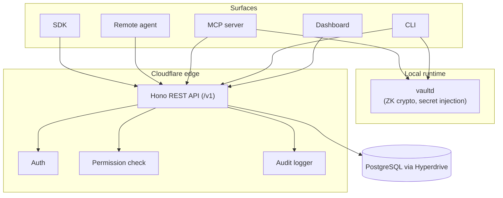

abadge is a small, explicit system. One Postgres database, one REST API, one local daemon for zero-knowledge crypto, and a thin set of clients.

## System overview

## Component map

| Layer | Owner |
|---|---|
| API | Hono REST API on Cloudflare Workers, `/v1` (`apps/api`) |
| Dashboard | Next.js App Router via OpenNext (`apps/web`) |
| CLI | Compiled Bun binary (`apps/cli`, `packages/cli`) |
| Local daemon | Long-running Bun process over Unix socket (`packages/daemon`) |
| MCP server | stdio MCP server (`packages/mcp`) |
| SDK | TypeScript client (`packages/sdk`) |
| Database | PostgreSQL via Hyperdrive, Drizzle ORM (`packages/db`) |
| Crypto | XChaCha20-Poly1305 (ZK), AES-256-GCM (server), Argon2id KDF, Ed25519 (`packages/crypto`) |
| Auth | Authentication service (`packages/auth`) |

## Trust tiers

abadge has four explicit trust tiers, ordered from strongest to weakest.

| Tier | Component | Trust | Can decrypt ZK? |
|---|---|---|---|
| 1 | Local daemon (`vaultd`) | Highest | Yes (in memory only) |
| 2 | Browser | High (XSS risk) | Yes (in JS memory) |
| 3 | API server | Medium | No for ZK items, yes for server-managed |
| 4 | Remote agents | Lowest | No |

The trust model determines which capabilities are allowed:

- **Local agents** (CLI, MCP) can `read` and `use` on any item.
- **Remote agents** can only `read` on server-managed items. They can never access zero-knowledge items.

See [Trust boundaries](/security/trust-boundaries) for the full breakdown of what each tier protects against.

## The four-layer model

Every operation in abadge maps to one of four layers:

<Steps>
  <Step title="Store">
    Encrypt-at-rest with the storage mode chosen at item creation. Zero-knowledge items use client-side XChaCha20-Poly1305 with an Argon2id-derived KEK. Server-managed items use server-side AES-256-GCM with the Worker's `ENCRYPTION_KEY`.
  </Step>
  <Step title="Permission">
    Explicit grants only. Every access requires a row in the `permissions` table linking (agent, item, capability). Permissions can carry an `expiresAt`. Remote-agent access is restricted at creation time.
  </Step>
  <Step title="Deliver">
    The capability determines the delivery mode. `read` returns the secret's value — the encrypted blob for local + ZK items, or plaintext over HTTPS for server-managed items. `use` reserves a mount handle and returns data for local injection (`delivery: env` or `delivery: file`).
  </Step>
  <Step title="Audit">
    Every attempt — allowed, denied, expired, revoked, cascade — is appended to `audit_logs`. The table has no foreign-key constraints so entries survive entity deletion.
  </Step>
</Steps>

## Tech stack

| Layer | Choice |
|---|---|
| Runtime | Bun |
| Build | Turborepo |
| API server | Hono on Cloudflare Workers |
| API style | JSON REST (`/v1`) |
| Frontend | Next.js App Router via OpenNext |
| Database | PostgreSQL via Hyperdrive |
| ORM | Drizzle |
| Auth | Authentication service |
| Validation | Effect Schema |
| ZK crypto | XChaCha20-Poly1305 (`@noble/ciphers`), Argon2id (`@noble/hashes`) |
| Server crypto | AES-256-GCM (WebCrypto) |
| Format/lint | Biome |

## What abadge does not have

To keep the surface small and reviewable, abadge intentionally does not run:

- background jobs, queues, or workflows
- service-mesh sidecars
- alternate auth systems
- ORM bypasses
- generic plugin systems
- HSM integration (planned post-v1)
