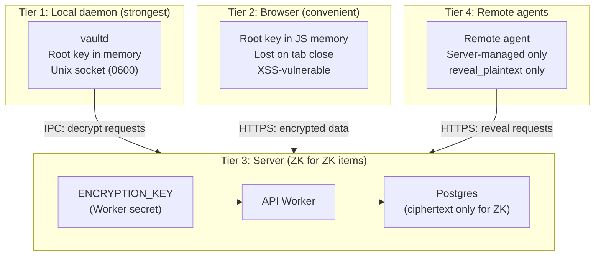
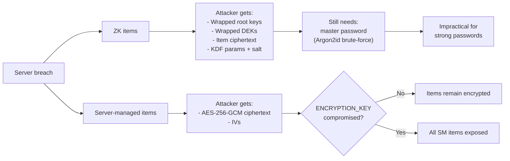

abadge has four explicit trust tiers. The capability matrix flows directly from these boundaries.

## Tier overview

## Tier 1 — Local daemon

`vaultd` is the primary trust boundary for zero-knowledge operations.

**What it protects:**
- Unlocked root keys (held in process memory only)
- Per-item DEK decryption
- Secret injection into spawned subprocesses

**Attack surface:**
- Unix domain socket (`0600` permissions, owner-only)
- Process memory (mitigated by auto-lock timeout and `sodium_memzero` on lock)
- Swap or core dumps (best-effort `mlock` via libsodium; not guaranteed)

**Honest limitation.** A local attacker with root or sudo access can read process memory. The daemon protects against network attackers and server compromise — not local root.

## Tier 2 — Browser

The browser holds the derived root key in JavaScript memory for the session.

**Additional attack surface beyond the daemon:**
- **XSS** — if achieved, the attacker can steal the unlocked root key. **Catastrophic.**
- Malicious JS bundle — if the server ships compromised code it can exfiltrate the key.
- Browser extensions can read page memory.
- Tab persistence — the key is lost on tab close (no `localStorage` or `IndexedDB`).

**Honest limitation.** The browser is a convenience surface. Users who need the strongest guarantees should use the CLI plus daemon.

## Tier 3 — Server (zero-knowledge for ZK items)

The server stores only ciphertext, wrapped keys, salts, and KDF parameters for ZK items.

**What the server cannot do:**
- Decrypt ZK item ciphertext
- Derive the user's root key or KEK
- Recover a profile without the master password or recovery key

**What the server can do:**
- Decrypt server-managed items (by design)
- See item IDs, storage modes, timestamps, and sizes for all items
- Delete or corrupt ciphertext (availability attack, not confidentiality)
- Serve malicious JS to browser clients (see Tier 2)
- Observe access patterns

**What a full server breach exposes:**
- All server-managed item plaintext (assuming `ENCRYPTION_KEY` is also obtained)
- ZK item ciphertext (useless without root keys)
- Wrapped root keys (useless without master passwords)
- KDF parameters (enables offline brute-force of weak master passwords)
- Access patterns and audit metadata

## Tier 4 — Remote agents

Remote agents (cloud workers, CI runners, webhook handlers) authenticate with API keys or keypair sessions and can only access **server-managed items** with **`reveal_plaintext`** permissions.

**What a compromised remote agent exposes:**
- Only the server-managed items it has permissions for
- Only until the permission expires or is revoked

**What it cannot access:**
- Any zero-knowledge item (no decryption capability)
- Any item without an explicit grant

## Threats and mitigations

| Threat | Mitigation |
|---|---|
| Server breach | ZK items remain encrypted. Server-managed items exposed if `ENCRYPTION_KEY` also leaks. |
| Weak master password | Argon2id with 64 MiB memory makes brute-force expensive. The product enforces minimum entropy. |
| Lost master password | Recovery key (shown once, user stores offline). No server-side recovery. |
| XSS in browser | CSP headers. Root key in JS memory only. Prefer CLI for high-security operations. |
| Compromised remote agent | Scoped permissions with expiry. Cannot access ZK items. Audit trail. |
| Local root attacker | Out of scope for v1. Daemon is defense-in-depth, not a guarantee. |
| Metadata leakage | ZK item metadata is encrypted inside the ciphertext envelope. Server sees only IDs, timestamps, and storage mode. |
| Key rotation failure | Per-item DEKs: rotation rewraps DEKs without re-encrypting content. Single transaction. |
| Nonce reuse | XChaCha20-Poly1305 uses 192-bit random nonces. Collision probability is negligible. |

## Server-breach impact by storage mode

## Explicit non-goals (v1)

- Protection against local root or admin attackers
- Hardware security module integration
- Secure multi-party computation for shared secrets
- Organization-level vault cryptography
- Tamper-evident audit log chaining
- Protection against compromised build/deploy pipelines serving malicious JS
