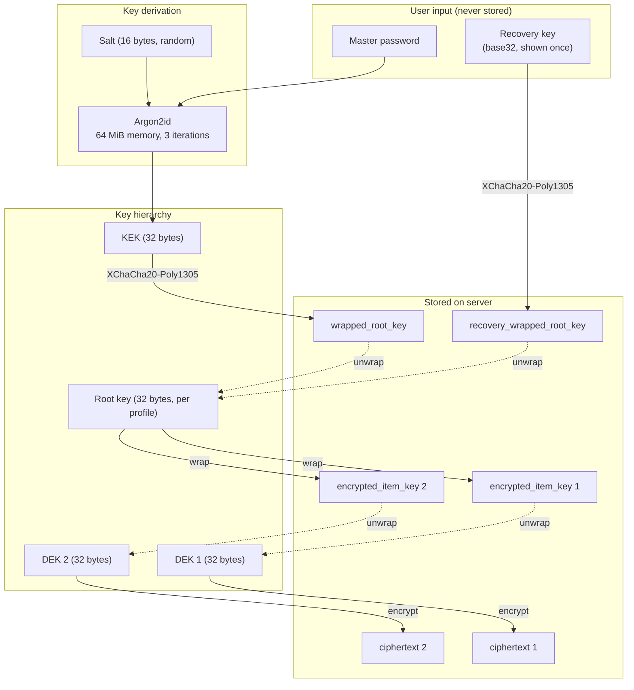
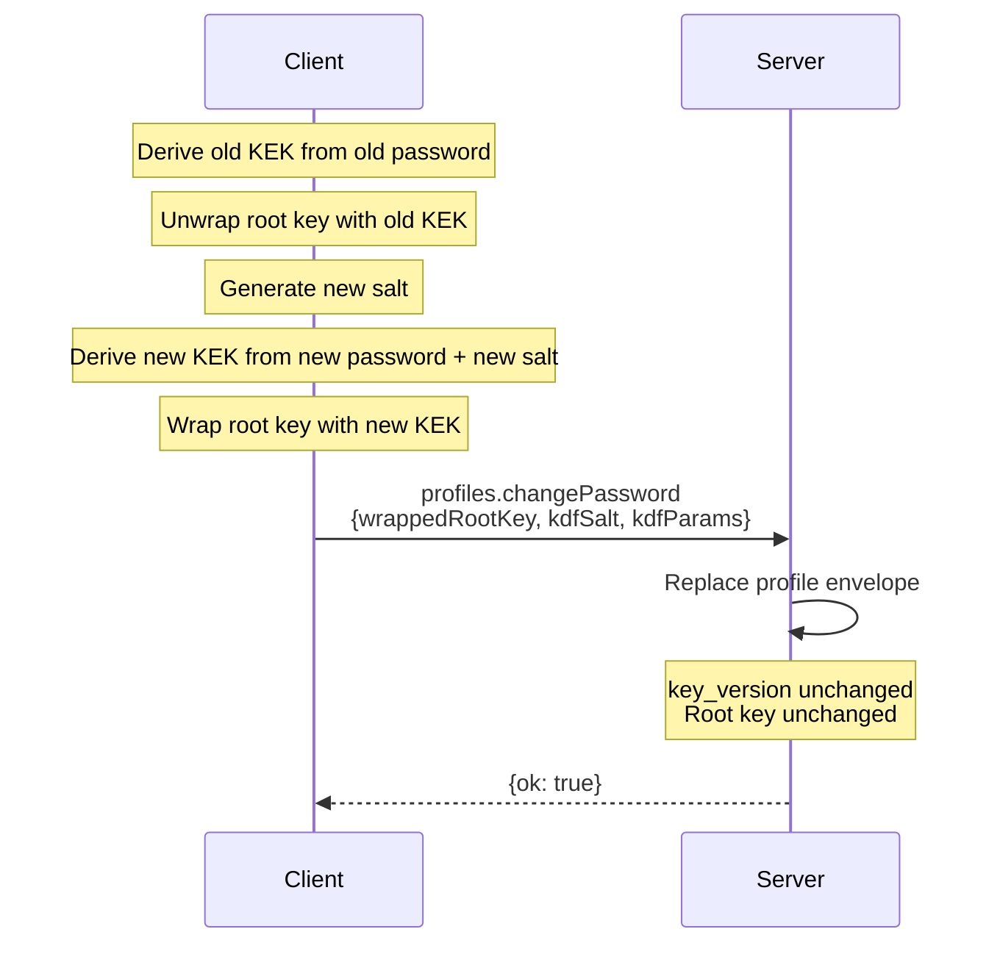
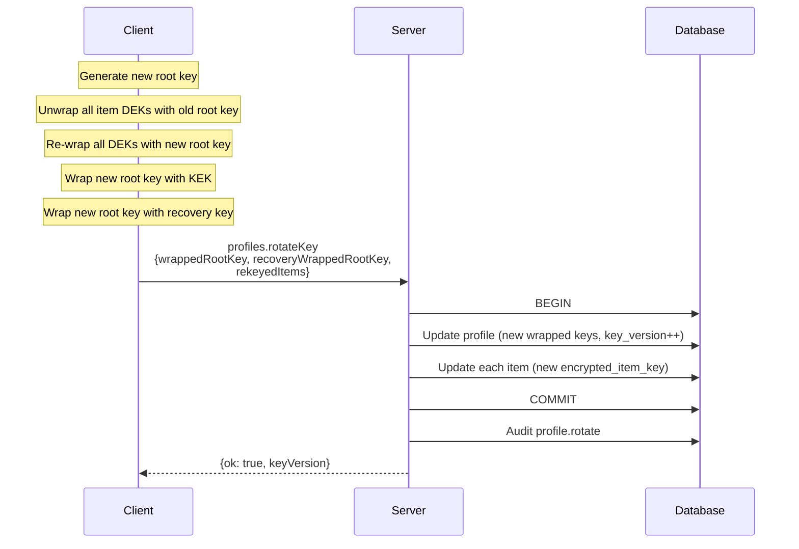

For zero-knowledge profiles, all cryptographic operations happen client-side — the browser, the CLI daemon, or any other approved local runtime. The server stores only ciphertext, wrapped keys, salts, and KDF parameters.

## Algorithms

| Purpose | Algorithm | Library | Key size | Nonce size |
|---|---|---|---|---|
| KDF (master password → KEK) | Argon2id | `@noble/hashes` | 32 bytes | N/A |
| Key wrapping (KEK → RK, RK → DEK) | XChaCha20-Poly1305 | `@noble/ciphers` | 32 bytes | 24 bytes |
| Item encryption (DEK → ciphertext) | XChaCha20-Poly1305 | `@noble/ciphers` | 32 bytes | 24 bytes |
| Server-managed encryption | AES-256-GCM | WebCrypto | 32 bytes | 12 bytes |
| API key hashing | SHA-256 | WebCrypto | N/A | N/A |
| Token generation | Random | `crypto.getRandomValues` | N/A | N/A |

## Key hierarchy



## KDF parameters

Default Argon2id parameters (client-side only):

```json
{
  "algorithm": "argon2id",
  "memory": 65536,
  "iterations": 3,
  "parallelism": 1,
  "hashLength": 32
}
```

Memory is in KiB (65536 KiB = 64 MiB), per RFC 9106's second recommendation for memory-constrained environments. The salt is 16 random bytes, stored alongside the wrapped root key.

## Wire formats

All binary data is **unpadded base64** (RFC 4648 §5, URL-safe alphabet) for storage and transport.

### Profile record

```json
{
  "wrapped_root_key": "<base64: nonce || RK encrypted by KEK>",
  "kdf_salt": "<base64: 16 bytes>",
  "kdf_params": {
    "algorithm": "argon2id",
    "memory": 65536,
    "iterations": 3,
    "parallelism": 1,
    "hashLength": 32
  },
  "recovery_wrapped_root_key": "<base64: nonce || RK encrypted by recovery key>",
  "key_version": 1
}
```

`wrapped_root_key` and `recovery_wrapped_root_key` carry their 24-byte XChaCha20-Poly1305 nonce as the first 24 bytes; the decrypt side splits on the known nonce length.

### ZK item record

```json
{
  "encrypted_item_key": "<base64: nonce || DEK encrypted by RK>",
  "ciphertext": "<base64: nonce || payload encrypted by DEK>",
  "crypto_version": 1
}
```

### ZK item plaintext envelope

```json
{
  "v": 1,
  "label": "prod postgres",
  "kind": "login",
  "tags": ["prod", "db"],
  "notes": "Primary production database",
  "fields": {
    "host": "db.example.com",
    "port": 5432,
    "username": "app",
    "password": "s3cret"
  }
}
```

The envelope is serialized to UTF-8 bytes, then encrypted with the item DEK.

### Server-managed item record

```json
{
  "server_ciphertext": "<base64: AES-256-GCM ciphertext>",
  "server_iv": "<base64: 12 bytes>",
  "server_key_version": 1
}
```

The plaintext envelope is the same JSON shape as ZK items.

## Recovery key format

256-bit random key encoded as base32 (RFC 4648), grouped in fives:

```
ABCDE-FGHIJ-KLMNO-PQRST-UVWXY-Z2345-67ABC-DEFGH-IJKLM-NOPQR-STUVW
```

52 base32 characters = 260 bits (padded from 256). The recovery key wraps the root key with the same XChaCha20-Poly1305 scheme as the KEK wrap.

## Password change flow



The root key never changes during a password change; only its wrap.

## Root key rotation flow



Partial payloads (missing some items) return `ROTATE_KEY_INCOMPLETE` with the missing IDs in `meta.missingItemIds`.

## Version fields

| Field | Where | Purpose |
|---|---|---|
| `crypto_version` | items | Envelope format. Allows future algorithm changes without breaking old items. |
| `content_version` | items | Optimistic concurrency. Incremented on every update. Server rejects stale writes. |
| `key_version` | profiles | Incremented on root-key rotation. Lets clients detect stale local caches. |

## API key format

- Prefix: `abg_` (remote agents) or `abl_` (local agents)
- Random portion: 32 bytes, base64url-encoded
- Server stores: SHA-256 hash + first 8 chars as lookup prefix
- Authentication: constant-time hash comparison
