These diagrams describe the canonical flows in abadge. Each one is implemented in code and exercised by tests; if a diagram and the implementation disagree, the implementation wins.

## System overview

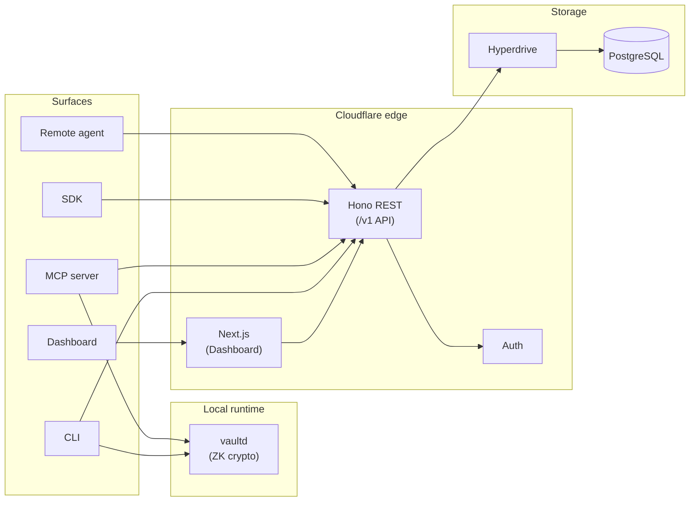

## User authentication

### Dashboard login

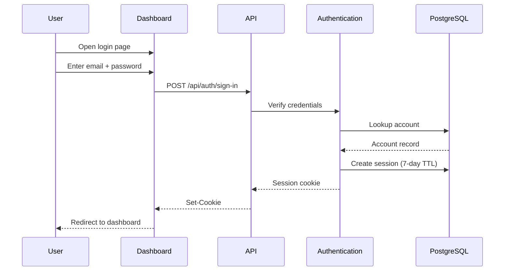

### CLI device authorization

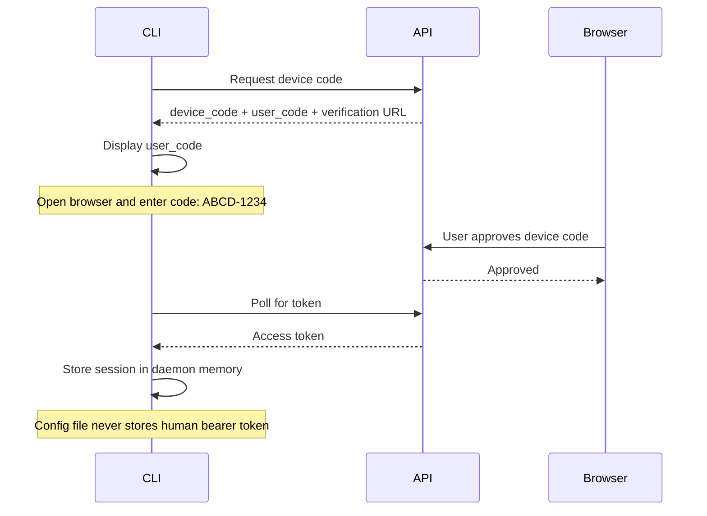

### Social login (Google / GitHub)

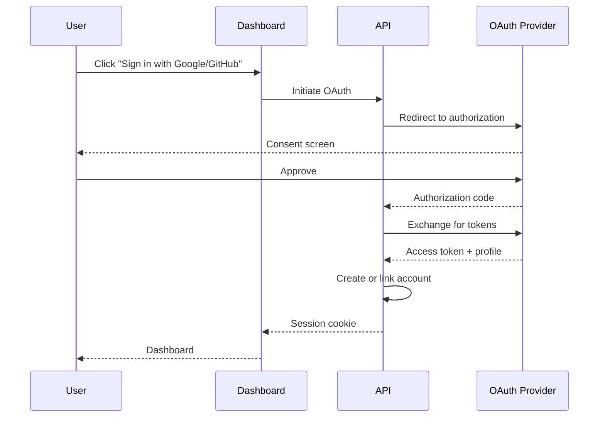

## Agent lifecycle

### Agent registration

```mermaid
sequenceDiagram
  participant User as User
  participant API as API
  participant DB as PostgreSQL

  User->>API: Create agent (name, kind)
  API->>API: Accept Ed25519 public key, or issue a bootstrap token
  API->>DB: Store agent (public key; token hashed if issued)
  API->>DB: Audit: agent.create
  API-->>User: Agent ID + one-time bootstrap token (if requested)

  Note over User: Bootstrap token shown ONCE
  Note over User: Never retrievable again
```

### Agent enrollment (public key)

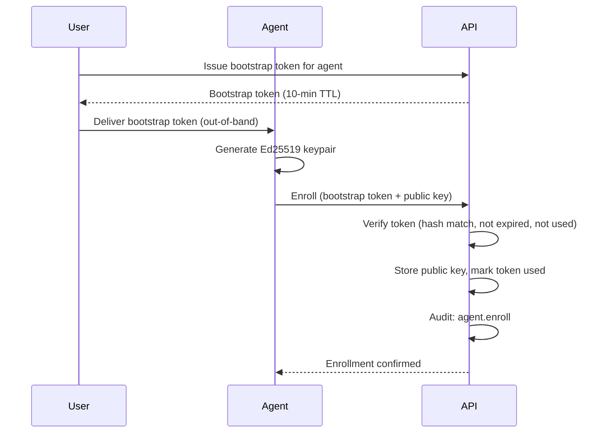

### Agent session exchange

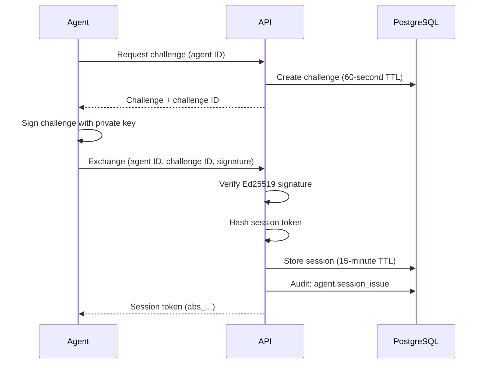

## Profile and item management

### Zero-knowledge profile bootstrap

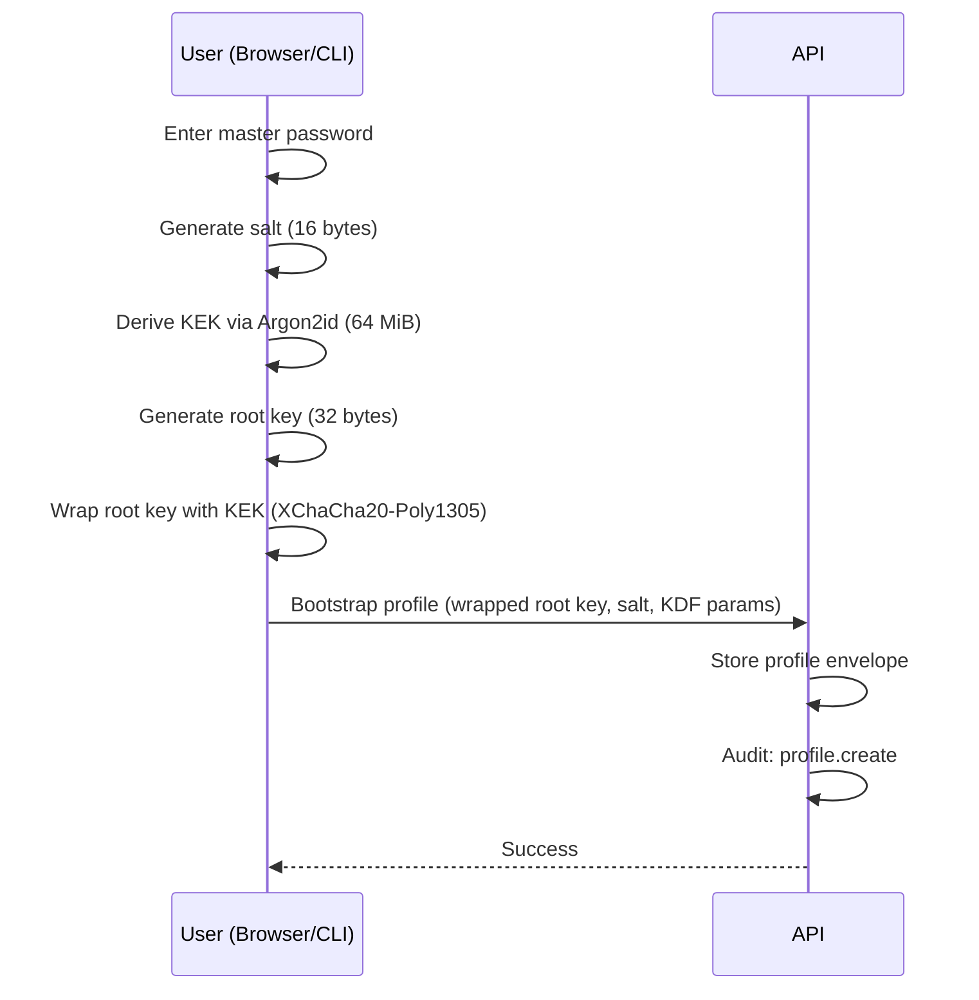

### Creating a zero-knowledge item

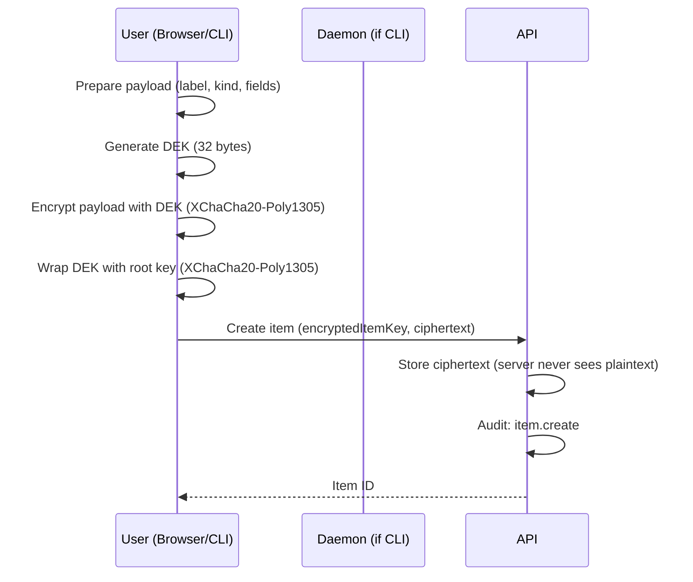

### Creating a server-managed item

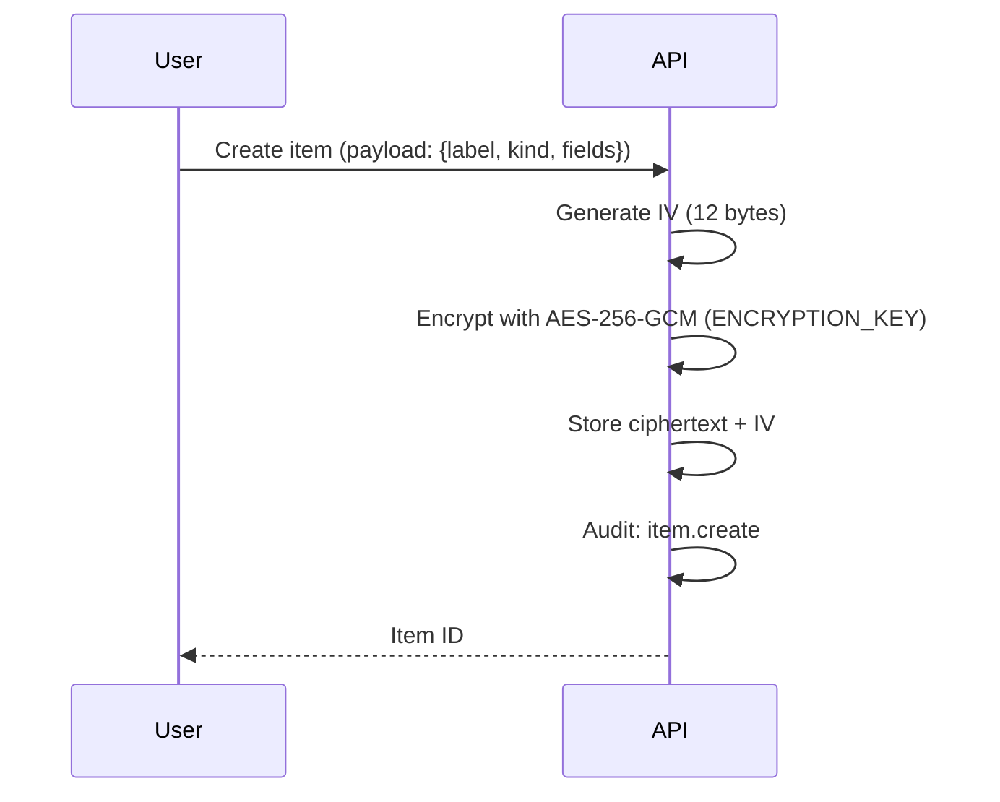

## Permission and access control

### Grant permission

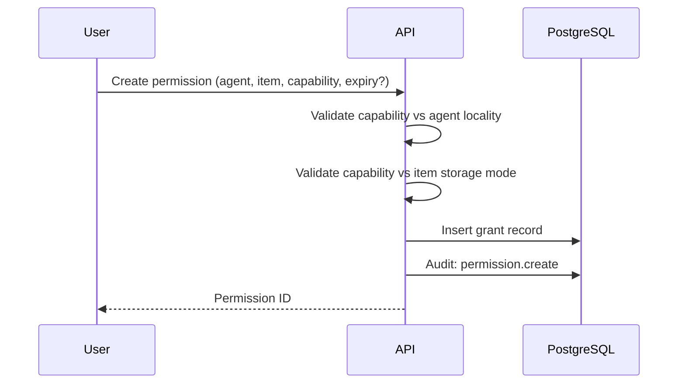

### Full access decision flow

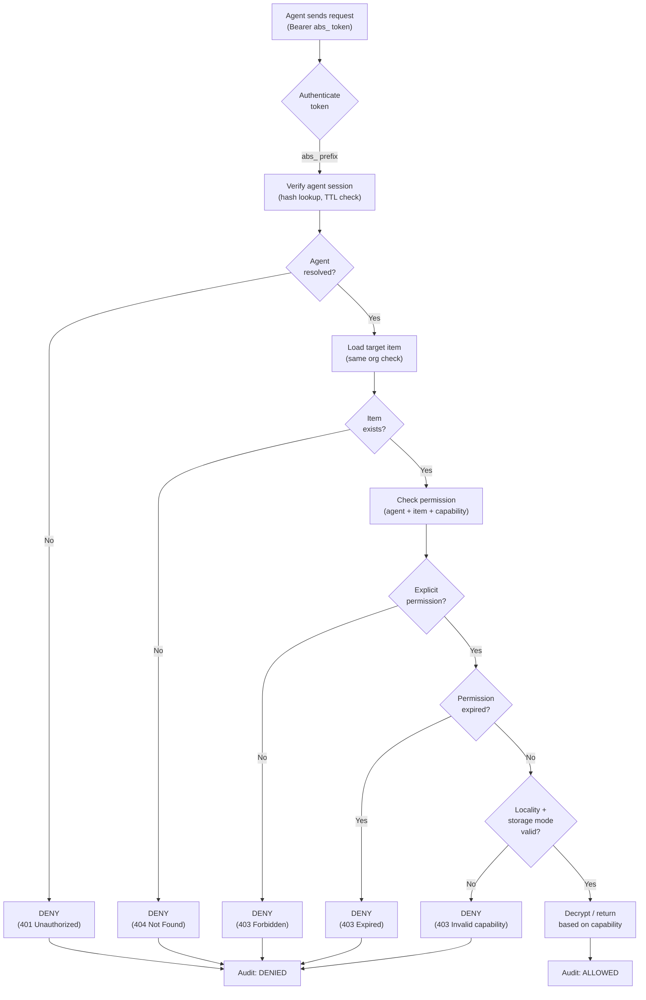

### Environment injection (`abadge run`)

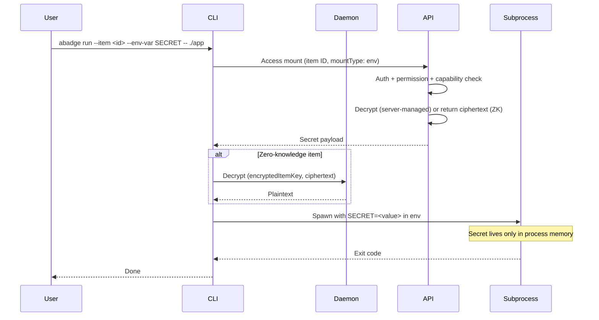

### File mounting (`abadge mount`)

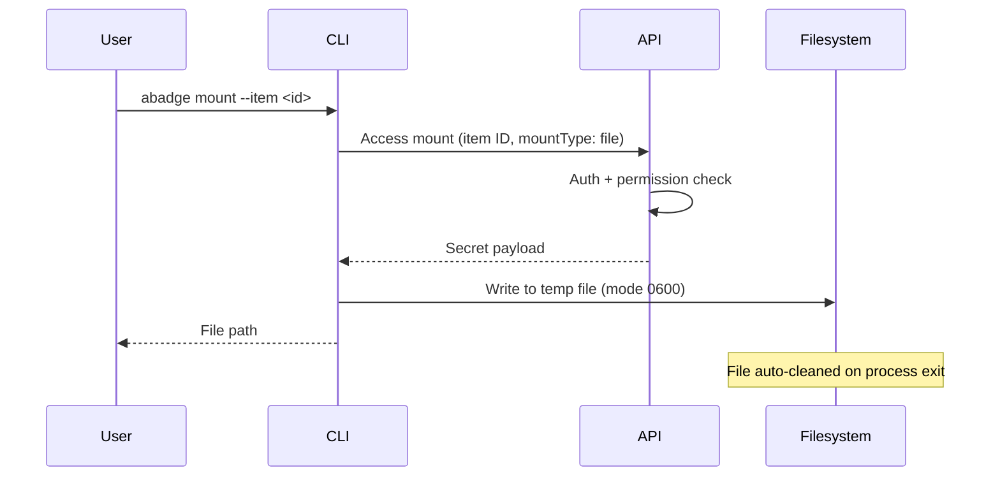

### MCP tool execution

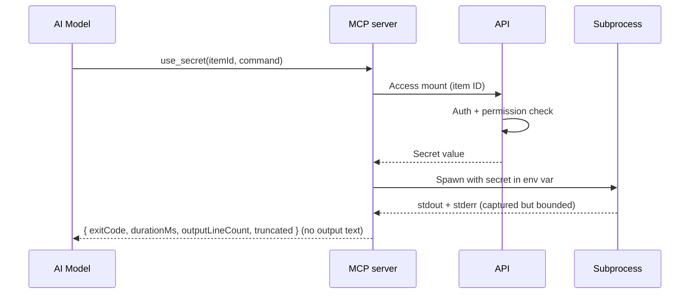
