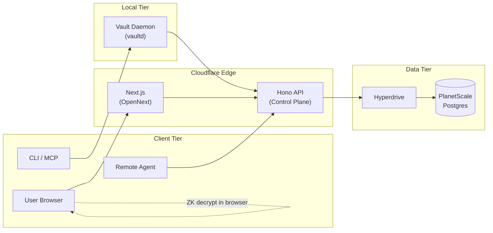
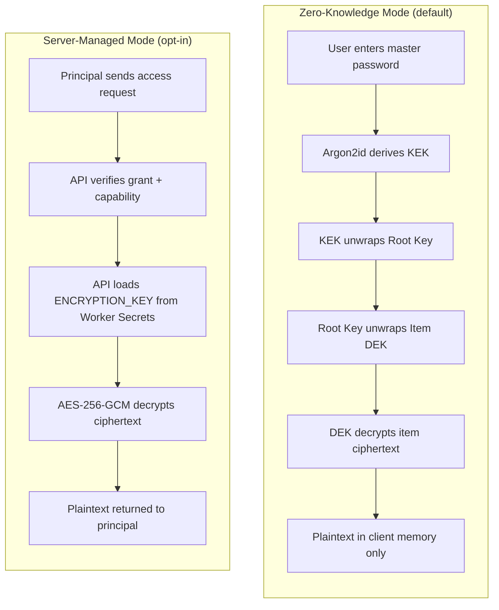
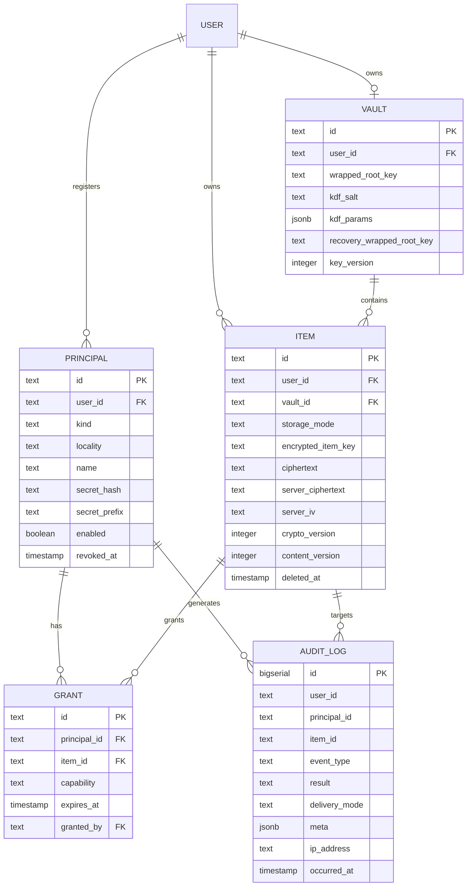
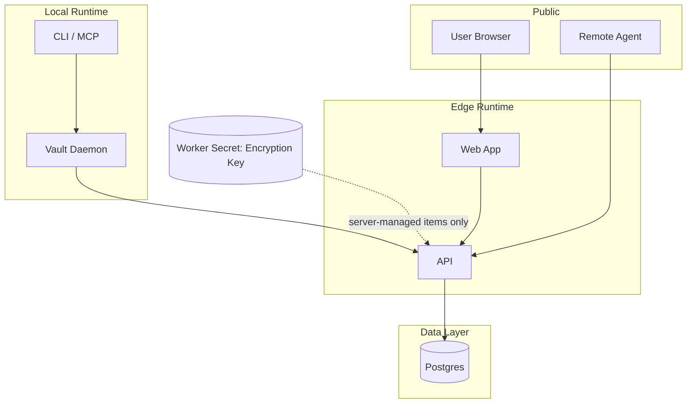
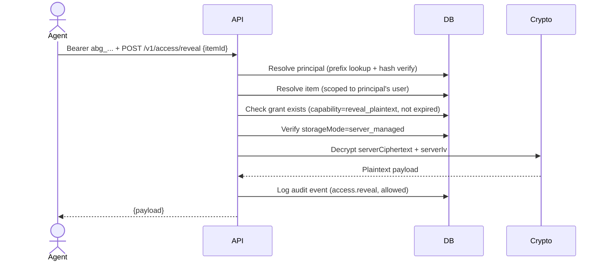
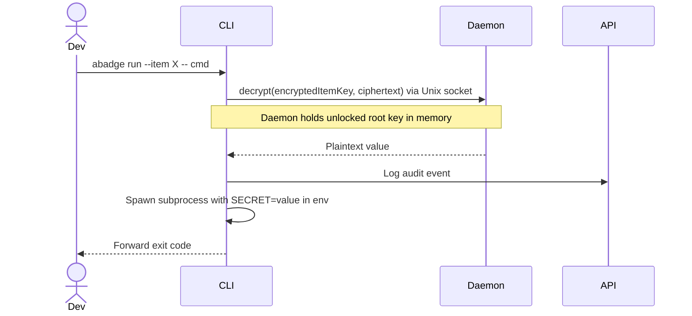
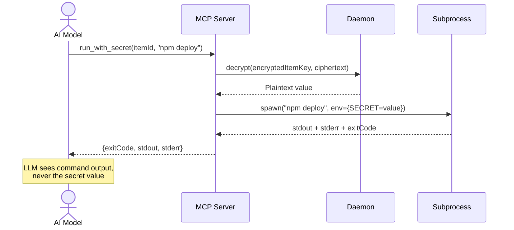
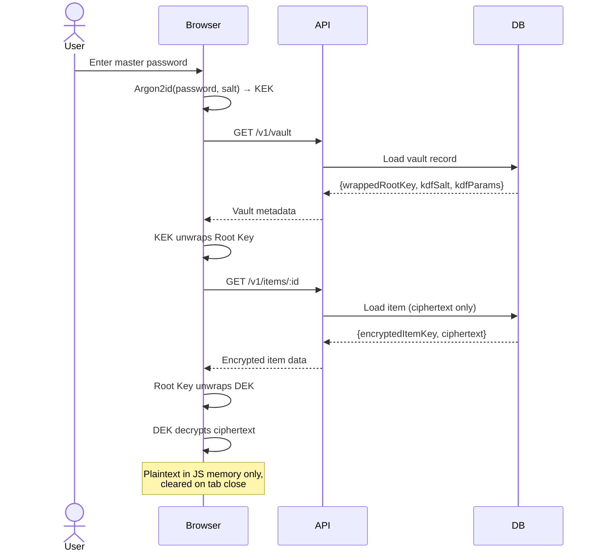
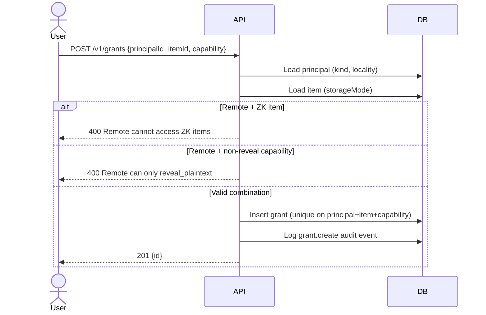

# Architecture

## Overview

abadge is a credential control plane for AI agents. Users store secrets in a personal vault with
dual encryption modes (zero-knowledge or server-managed), register principals (devices, CLIs, MCP
servers, remote agents), grant scoped capabilities per item, and audit every access attempt. The
system defaults to non-reveal delivery -- plaintext exposure is the exception, not the product.

## System parts

* **API** -- Hono on Cloudflare Workers. Canonical control plane for auth, vault management, item
  CRUD, principal management, grant enforcement, access control, and audit logging.
* **Web** -- Next.js App Router dashboard via OpenNext. Operator surface for items, principals,
  grants, and audit.
* **CLI** -- `abadge` command. Developer/admin interface for vault management, runtime secret use,
  and item management.
* **SDK** -- TypeScript client (`@abadge/sdk`). Typed API client for applications and agent runtimes.
* **MCP server** -- Model Context Protocol server for AI agents. Secrets never returned to the LLM
  by default.
* **Broker** -- Local execution engine shared by CLI and MCP. Handles subprocess injection, temp
  file mounts, and daemon IPC for zero-knowledge decryption.
* **Crypto** -- Shared cryptography package. Server-side AES-256-GCM, API key generation/verification,
  encoding utilities.
* **Database** -- Single Postgres instance (PlanetScale via Hyperdrive). Source of truth for all
  control-plane state.

## Package structure

```text
apps/
  api/        Hono API worker (control plane)
  cli/        Distributable CLI binary (bun build --compile)
  web/        Next.js dashboard
packages/
  auth/       Better Auth setup (server + client)
  broker/     local execution engine (env inject, file mount, daemon IPC)
  cli/        CLI tool library (commands, config, output)
  config/     shared tsconfig
  core/       shared types, zod schemas, constants, error shapes
  crypto/     server-side encryption, API key generation, encoding
  db/         Drizzle schema + database client
  env/        environment variable validation (server, client, worker)
  mcp/        MCP server for AI agents
  sdk/        TypeScript SDK (@abadge/sdk)
```

Build order: `config -> core -> env -> crypto -> db -> auth -> api/web` (Turborepo handles this).

## Deployment model



## Storage mode comparison



## Core concepts

### Vault

A user-owned encryption root. Each user has one vault containing:

* **wrappedRootKey**: The root KEK encrypted by the user's master password (via Argon2id KDF)
* **kdfSalt**: Salt for the key derivation function
* **kdfParams**: Argon2id parameters (algorithm, memory, iterations, parallelism, hashLength)
* **recoveryWrappedRootKey**: Optional recovery-wrapped root key
* **keyVersion**: Integer, incremented on root key rotation

The server never stores or sees the plaintext root key. The root key is unwrapped client-side
(in the browser or local daemon) using the master password.

### Item

A user-owned secret entry with one of two storage modes:

* **zero\_knowledge** (default): Client-side encrypted with XChaCha20-Poly1305. The server stores
  only ciphertext and a wrapped per-item DEK. Only the user (via master password) or local
  principals (via daemon) can decrypt.
* **server\_managed** (opt-in): Server-side encrypted with AES-256-GCM. Remote agents can access
  plaintext via the `reveal_plaintext` capability.

Items have:

* **storageMode**: `zero_knowledge` or `server_managed`
* **cryptoVersion**: Encryption format version
* **contentVersion**: Incremented on update (optimistic concurrency control)
* **Soft delete**: `deletedAt` timestamp, never hard-deleted

Item kinds: `login`, `api_key`, `token`, `json`, `certificate`, `ssh_key`, `opaque`.

### Principal

A registered consumer of secrets. Principals have a kind and derived locality:

| Kind | Locality | Auth prefix | Description |
|------|----------|-------------|-------------|
| `device` | local | `abl_` | User's registered device |
| `local_cli` | local | `abl_` | CLI installation |
| `local_mcp` | local | `abl_` | Local MCP server |
| `remote_agent` | remote | `abg_` | Hosted agent, cloud worker, webhook |

API keys are 32 random bytes + prefix, SHA-256 hashed before storage. Only the hash and an 8-char
prefix are persisted. Full key shown once at creation, never retrievable again.

### Grant

An explicit capability grant joining one principal to one item. Grants specify:

* **capability**: What the principal can do (`read_ciphertext`, `reveal_plaintext`, `mount_env`,
  `mount_file`, `use_without_reveal`)
* **expiresAt**: Optional expiration
* **grantedBy**: User who created the grant

Unique constraint on (principalId, itemId, capability). No wildcard grants.

### Capabilities

| Capability | Description | ZK Items | Server-Managed Items |
|------------|-------------|----------|---------------------|
| `read_ciphertext` | Receive encrypted item data | Local only | Local only |
| `reveal_plaintext` | Receive decrypted plaintext | Not allowed | Remote + Local |
| `mount_env` | Inject as env var in subprocess | Local only (daemon) | Local only (daemon) |
| `mount_file` | Write to temp file | Local only (daemon) | Local only (daemon) |
| `use_without_reveal` | Use without seeing value (future) | Future | Future |

### Audit log

Immutable event for every access attempt (allowed, denied, expired, revoked). No foreign key
constraints -- records persist after entity deletion. Includes principal identity, item identity,
event type, result, delivery mode, metadata, IP address, and timestamp.

Event types cover vault operations (bootstrap, unlock, password change, key rotation), item CRUD,
principal lifecycle, grant management, and access attempts.

## Entity model



## Trust boundaries



### Boundary rules

* The database never stores plaintext item values, API keys, or vault root keys
* For zero-knowledge items, the server never sees plaintext -- only wrapped keys and ciphertext
* For server-managed items, the encryption key lives only in Worker Secrets, never in the database
* The web app does not decide authorization for principal access
* The API decrypts server-managed items only after all authorization checks pass
* Principals can only access items owned by the same user who registered them
* Remote principals cannot access zero-knowledge items at all
* The LLM never receives raw secrets through the MCP server by default

## Main request paths

### Remote agent reveals server-managed item



### Local CLI accesses ZK item



### MCP agent uses secret without reveal



### Browser views ZK item



### Grant creation with capability validation



## Authentication

### Dashboard user auth

* Better Auth with email/password and optional social login (Google, GitHub)
* Session-based
* Used for all `/v1/*` management routes (vault, items, principals, grants, audit)

### Principal auth

* Bearer token in `Authorization` header
* Token prefixes: `abg_` (remote) or `abl_` (local)
* Prefix-based lookup optimization: try 8, 6, 4-char prefixes
* Constant-time hash comparison via SHA-256
* Updates `lastUsedAt` timestamp on successful auth
* Used for all `/v1/access/*` routes

### Authorization model

* No wildcard grants
* No cross-user access
* Explicit grant per principal-item-capability tuple
* Capability matrix enforcement (remote principals restricted from ZK items)
* Grant expiration checked on every access
* Locality checks on every access route

## Security invariant

A secret value is only returned when ALL conditions are true:

1. The principal presented a valid, enabled, non-revoked API key
2. The item exists and belongs to the principal's owner
3. A grant exists for this principal-item pair with the required capability, and has not expired
4. The capability is compatible with the item's storage mode and the principal's locality
5. For server-managed items: server decrypts using ENCRYPTION_KEY
6. For ZK items: the local daemon decrypts using the unlocked root key (server never sees plaintext)
