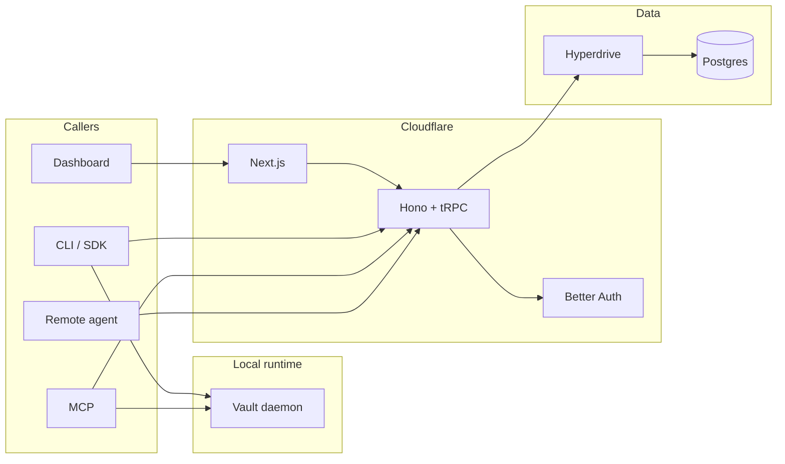

# Architecture

## Overview

abadge is a credential control plane for agent access. Users own vaults and items, register
agents, permission per-item capabilities, and inspect every access attempt through an append-only
audit log.

The system keeps one synchronous control plane:

* Postgres is the single source of truth
* Hono runs as the outer Cloudflare Worker shell
* tRPC is the only application transport for the control plane
* local daemon IPC stays on JSON-RPC over a Unix socket

## System parts

* **API worker**: Hono middleware for headers, CORS, rate limiting, Better Auth, `/health`, and
  the mounted tRPC fetch adapter at `/trpc`
* **Web**: Next.js App Router dashboard. Client-rendered operator surface backed by one React
  Query + tRPC provider
* **CLI**: local operator tool that talks to the control plane through `@abadge/sdk`, ships as a
  compiled Unix binary, and runs the daemon through an internal `abadge daemon serve` mode
* **SDK**: `AbadgeClient`, implemented directly on top of the shared tRPC client
* **MCP**: local Model Context Protocol server that uses the same tRPC access path as other
  agents
* **Daemon**: local zero-knowledge vault runtime that unlocks, encrypts, decrypts, mounts files,
  and spawns subprocesses
* **Database**: single Postgres instance accessed through Drizzle

## Package structure

```text
apps/
  api/        Hono worker shell + tRPC mount
  web/        Next.js dashboard
packages/
  auth/       Better Auth wiring
  cli/        CLI commands and config
  config/     Shared tsconfig
  core/       Effect Schema contracts, constants, tagged errors
  crypto/     Encryption and API-key primitives
  daemon/     Local vault daemon, JSON-RPC client, and execution helpers
  db/         Drizzle schema and DB client
  env/        Environment validation
  mcp/        MCP server and tools
  sdk/        Public TypeScript client
  trpc/       Canonical app router, context, clients, error mapping
```

## Control-plane topology



## Transport model

`packages/trpc` owns:

* the canonical `appRouter`
* `publicProcedure`, `sessionProcedure`, `scopedSessionProcedure`, and `agentProcedure`
* request-context creation
* browser and node clients
* server callers for tests and internal use
* tRPC error normalization

The application router is split into seven domain routers:

* `auth`
* `vault`
* `items`
* `agents`
* `permissions`
* `access`
* `audit`

There is no parallel REST layer.

## Request context

Each tRPC request constructs context once:

* Worker `env`
* validated worker env
* per-request DB handle
* Better Auth instance
* request headers
* response headers
* derived IP address

Procedure middleware then adds identity:

* `sessionProcedure` resolves browser sessions or Better Auth bearer sessions
* `scopedSessionProcedure` is the route-tier alias used for session-only management procedures
* `agentProcedure` resolves an agent token, including legacy fallback

## Contract model

`packages/core` is the canonical contract package:

* Effect Schema definitions
* derived `Type` and encoded boundary types
* constants for item kinds, capabilities, audit types, and localities
* tagged domain errors

Every public procedure declares both input and output schemas. No custom transformer is used.

## Data flow

### Session flow

1. caller hits `/trpc`
2. Hono middleware applies headers, CORS, and rate limiting
3. tRPC builds request context
4. `sessionProcedure` resolves the user identity
5. `scopedSessionProcedure` marks routes that require an authenticated operator session
6. Effect program runs domain logic
7. response is encoded as JSON-safe data

### Agent flow

1. caller sends `Authorization: Bearer ...`
2. `agentProcedure` resolves the agent identity
3. permission and locality checks run before any decrypt path
4. access attempt is appended to the audit log
5. ciphertext or payload is returned based on capability and storage mode

### Zero-knowledge flow

1. browser or daemon unlocks the vault locally
2. local runtime encrypts or decrypts item payloads
3. API stores ciphertext and wrapped item keys
4. remote agents never receive zero-knowledge plaintext

## Persistence model

Core persisted entities:

* `vaults`
* `items`
* `agents`
* `permissions`
* `audit_log`
* `operator_tokens` (legacy maintenance data, not part of the public v0 auth surface)
* Better Auth tables

Current runtime logic depends on explicit permissions and does not use a background job system.

## Boundaries

Keep these boundaries explicit:

* Hono owns outer HTTP concerns
* tRPC owns application transport and auth middleware
* Effect programs own operation flow and error propagation
* Drizzle owns all database access
* daemon JSON-RPC owns local vault operations

That split keeps the repo readable in one pass and prevents duplicate control-plane paths.
