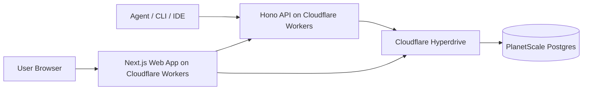
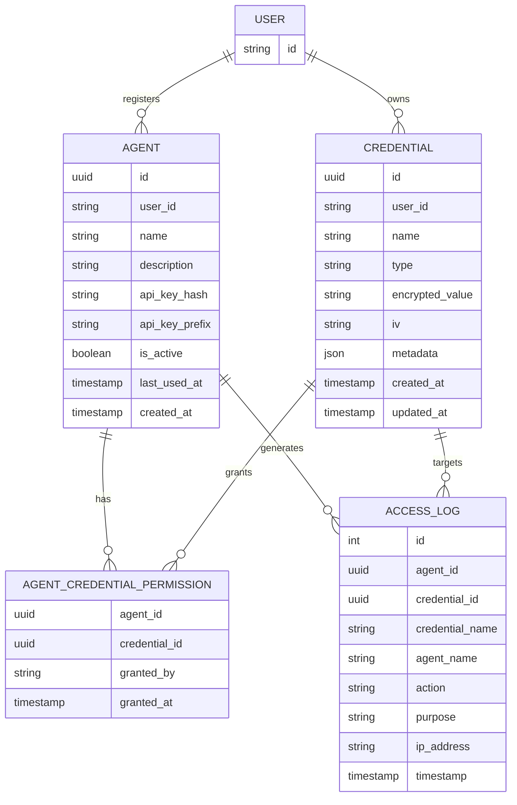
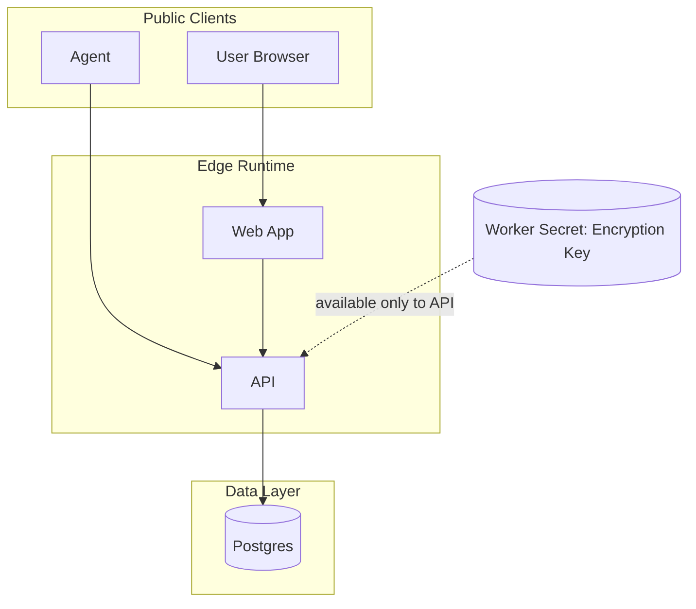
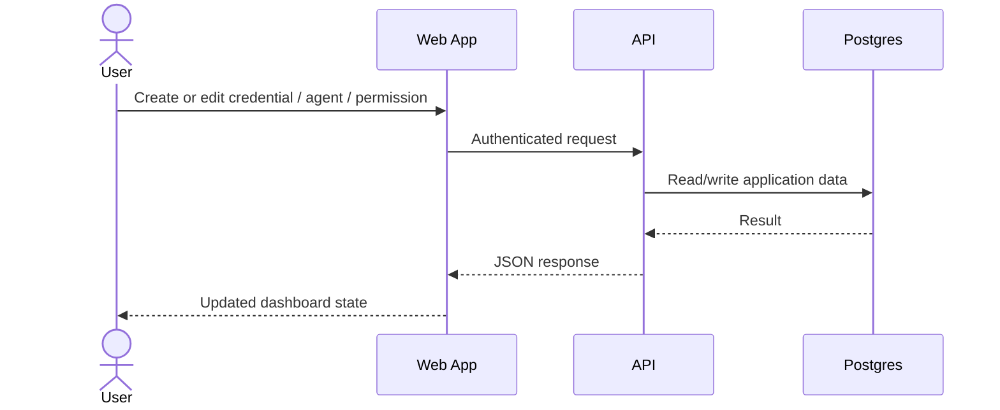
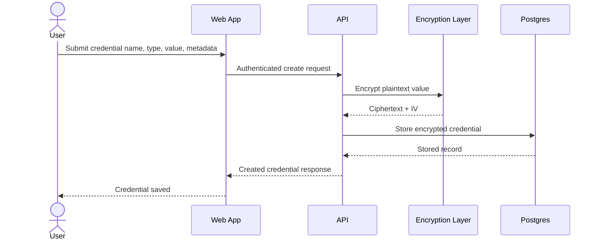
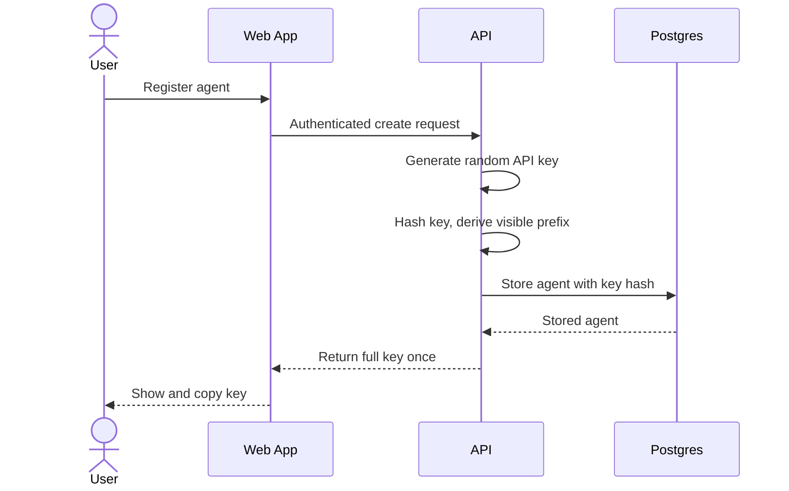
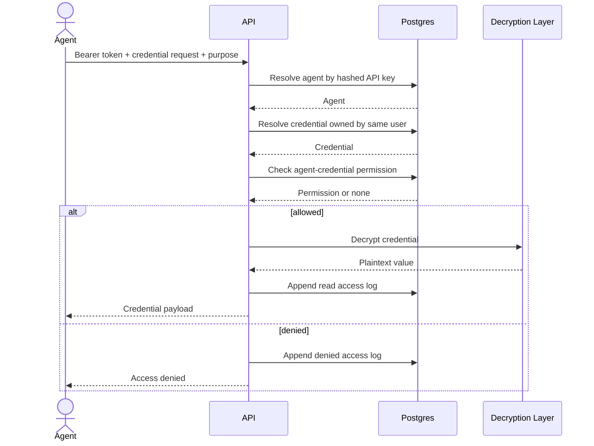

# Architecture

## Overview

abadge is a two-app monorepo for storing credentials, granting per-agent access, and serving secrets to authorized agents with a full audit trail.

### System parts

* **Web app** — dashboard for users to manage credentials, agents, permissions, and audit history
* **API app** — request/response backend for dashboard operations and agent access
* **Database** — single Postgres source of truth for auth, vault data, permissions, and logs
* **Crypto boundary** — credentials are decrypted only inside the API during an authorized read

## Deployment model



## Design goals

* minimal system surface area
* explicit user control over agent access
* single durable state store
* edge-friendly request latency
* no background infrastructure for MVP
* complete read auditability

## Non-goals for MVP

* shared/team vaults
* automated rotation
* external sync/integrations
* workflow engines or queues
* real-time collaboration

## Core concepts

### User

The human owner of credentials, agents, and permissions.

### Credential

A user-owned named secret entry.

Fields conceptually include:

* identity: id, user, name
* classification: type
* secret material: encrypted value + IV
* optional annotations: metadata
* timestamps

### Agent

A user-registered consumer of secrets.

Fields conceptually include:

* identity: id, user, name
* auth material: hashed API key + visible prefix
* status: active/inactive
* timestamps and last-used data

### Permission

A join between one agent and one credential. This is the only grant model in v1.

### Access log

An immutable event for every allowed or denied credential access attempt.

## Entity model



## Trust boundaries



### Boundary rules

* the database never stores plaintext credentials
* the encryption key does not live in the database
* the web app does not decide authorization for agent reads
* the API is the only place where credential decryption happens
* agents can only access credentials owned by the same user who registered them

## Main request paths

### 1) Dashboard CRUD path



This path is used for:

* credential CRUD
* agent CRUD
* grant/revoke permission
* audit log queries

### 2) Credential creation path



### 3) Agent registration path



### 4) Agent credential access path



## Authentication and authorization

### Dashboard user auth

* handled by Better Auth
* session-based
* used for all management operations in the dashboard

### Agent auth

* bearer token only
* API key shown once at creation time
* only the SHA-256 hash is stored
* inactive agents are rejected

### Authorization model

* no wildcard grants
* no type-level grants
* no cross-user access
* permission is checked on every credential read

## Data ownership rules

* users own credentials
* users own agents
* permissions only connect entities owned by the same user
* audit events are append-only records of access attempts

## Storage model

### Database responsibilities

* user/session/auth records
* encrypted credentials
* registered agents
* permission joins
* access logs

### API responsibilities

* input validation
* encryption/decryption
* permission checks
* audit logging
* response shaping

### Web responsibilities

* authenticated dashboard UX
* form submission and navigation
* showing the one-time agent key
* rendering audit history

## Why the architecture is intentionally simple

### Included

* Workers
* Hyperdrive
* Postgres
* Hono
* Next.js
* Drizzle
* Better Auth

### Explicitly excluded for MVP

* Durable Objects
* Queues
* Workflows
* pub/sub
* background processing
* multi-region state replication logic

Reason: every core action is a synchronous request-response backed by a single database, so extra infrastructure would add cost and complexity without solving a real v1 problem.

## Security model

### Controls

* AES-256-GCM at rest
* worker-secret encryption key
* hashed agent API keys
* per-credential ACLs
* immutable access logs
* secure headers
* rate limiting
* parameterized database access

### Security invariant

A secret is only returned when all four conditions are true:

1. the agent presented a valid active API key
2. the credential exists
3. the credential belongs to the agent's owner
4. the agent has an explicit grant to that credential

## Failure behavior

* unknown credential → not found
* invalid or inactive API key → unauthorized
* missing permission → forbidden and logged
* failed dashboard auth → unauthorized
* denied reads still produce audit events

## Monorepo structure

```text
apps/
  api/   Hono API worker
  web/   Next.js dashboard
packages/
  auth/  auth config and helpers
  config/ shared config
  core/  shared types and schemas
  db/    schema and database client
```

## Operational summary

abadge is a thin, edge-hosted policy and decryption layer over a single Postgres database. Users manage encrypted credentials and grants through the dashboard. Agents authenticate with API keys, request only the secrets they were explicitly allowed to read, and generate a permanent audit trail on every access attempt.
