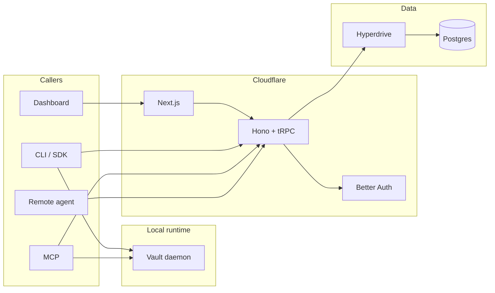

# Architecture

## Overview

abadge is a credential control plane for agent access. Users belong to organizations, store secrets
in encrypted profiles, register agents, grant per-item capabilities, and inspect every access
attempt through an append-only audit log.

The system keeps one synchronous control plane:

* Postgres is the single source of truth
* Hono runs as the outer Cloudflare Worker shell
* tRPC is the only application transport for the control plane
* local daemon IPC stays on JSON-RPC over a Unix socket

## System parts

* **API worker**: Hono middleware for headers, CORS, rate limiting, Better Auth, `/health`, and
  the mounted tRPC fetch adapter at `/trpc`
* **Web**: Next.js App Router dashboard. Client-rendered operator surface backed by one React
  Query + tRPC provider
* **CLI**: local operator tool that talks to the control plane through `@abadge/sdk`, ships as a
  compiled Unix binary, and runs the daemon through an internal `abadge daemon serve` mode
* **SDK**: `AbadgeUserClient` (session auth) and `AbadgeAgentClient` (agent auth), implemented
  on top of the shared tRPC client
* **MCP**: local Model Context Protocol server that uses the same tRPC access path as other agents
* **Daemon**: local zero-knowledge vault runtime that unlocks, encrypts, decrypts, mounts files,
  and spawns subprocesses
* **Database**: single Postgres instance accessed through Drizzle

## Package structure

```text
apps/
  api/        Hono worker shell + tRPC mount
  web/        Next.js dashboard
packages/
  auth/       Better Auth wiring
  cli/        CLI commands and config
  config/     Shared tsconfig
  core/       Effect Schema contracts, constants, tagged errors
  crypto/     Encryption and API-key primitives
  daemon/     Local vault daemon, JSON-RPC client, and execution helpers
  db/         Drizzle schema and DB client
  env/        Environment validation
  mcp/        MCP server and tools
  sdk/        Public TypeScript client
  trpc/       Canonical app router, context, clients, error mapping
```

## Control-plane topology



## Transport model

`packages/trpc` owns:

* the canonical `appRouter`
* `publicProcedure`, `sessionProcedure`, `scopedSessionProcedure`, and `agentProcedure`
* request-context creation
* browser and node clients
* server callers for tests and internal use
* tRPC error normalization

The application router is split into domain routers:

* `auth`
* `organizations`
* `profiles`
* `vault` (legacy; retained for web app compatibility)
* `items`
* `agents`
* `permissions`
* `access`
* `audit`

There is no parallel REST layer.

## Request context

Each tRPC request constructs context once:

* Worker `env`
* validated worker env
* per-request DB handle
* Better Auth instance
* request headers
* response headers
* derived IP address

Procedure middleware then adds identity:

* `sessionProcedure` resolves browser sessions, Better Auth bearer sessions, or a personal API key (`abu_`) — all session identities
* `scopedSessionProcedure` is the route-tier alias used for session-only management procedures
* `agentProcedure` resolves an `abs_` agent session token

## Contract model

`packages/core` is the canonical contract package:

* Effect Schema definitions
* derived `Type` and encoded boundary types
* constants for item kinds, capabilities, audit types, and localities
* tagged domain errors with `{ code, message, hint, meta }` envelope
* `STANDARD_FIELDS_BY_KIND` and `CAPABILITY_MATRIX`
* `resolveFieldValue` / `expandFieldSelection` for field delivery

Every public procedure declares both input and output schemas. No custom transformer is used.

## Data model

### Organizations

Better Auth `organization` table. Every user receives a personal organization on first login.
Agents and permissions are scoped to an org. Org deletion cascades to agents and their active
sessions.

### Profiles

Org-scoped encryption boundaries. Each profile has a `storageMode` (`zero_knowledge` or
`server_managed`) and, for zero-knowledge profiles, a `wrappedRootKey` (encrypted by the user's
master password). Items belong to a profile.

Profiles replace the old single-user vault concept. All profile management
flows through `profiles.*` procedures and `POST /v1/orgs/{orgId}/profiles`
(see [`docs/API.md`](./API.md)).

### Items

Credential items stored within a profile. Two storage modes:

* `zero_knowledge` — client encrypted; server stores only ciphertext and wrapped item keys
* `server_managed` — server encrypts with `ENCRYPTION_KEY` using AES-256-GCM

Items have a `kind` that determines their standard field set (see [`docs/FIELDS.md`](./FIELDS.md)).
Soft-deleted via `deletedAt`.

### Agents

Service accounts registered per organization. Agents authenticate with one method:

* `public_key_session` — Ed25519 keypair with short-lived `abs_...` sessions (15-min
  TTL, background refresh at T-2 minutes)

Revoking an agent invalidates all active sessions immediately.

### Personal API keys

Personal API keys (prefix `abu_`) authenticate the management surface as the issuing user, scoped to
one org (table `user_api_keys`). They resolve to a **session identity**, not an agent — they reach
only the `sessionProcedure` surface (organizations, profiles, items metadata, agents, permissions,
audit, settings) and can never reach the agent-gated `access.*` surface. The secret is shown once and
stored as a SHA-256 hash plus an 8-character prefix; keys support an optional expiry and can be
revoked.

Agents are org-scoped, not user-scoped: deleting the user who created an agent sets `createdBy` to
null (orphaning it) rather than deleting the agent, so org workloads survive operator turnover
(§AB-0043). An orphaned agent keeps authenticating and accessing its grants; only an admin can
manage it (members lose the creator-ownership path), and its audit rows carry a null actor-user.

### Permissions

Agent × item capability grants, scoped to an org. Each permission specifies one capability from:
`read_ciphertext`, `reveal_plaintext`, `mount_env`, `mount_file`.

Permissions reference `grantedBy` (user, nullable) and support an optional `expiresAt`. Deleting an
item marks associated permissions invalid (cascade); deleting the granting user sets `grantedBy` to
null so the grant survives (§AB-0043).

### Audit log

Append-only with no foreign key constraints. Every access attempt (allowed or denied) is recorded
with: `userId`, `agentId`, `itemId`, `eventType`, `result`, `deliveryMode`, `meta`, `ipAddress`,
`occurredAt`.

## Data flow

### Session flow

1. caller hits `/trpc`
2. Hono middleware applies headers, CORS, and rate limiting
3. tRPC builds request context
4. `sessionProcedure` resolves the user identity
5. `scopedSessionProcedure` marks routes that require an authenticated operator session
6. Effect program runs domain logic
7. response is encoded as JSON-safe data

### Agent flow

1. caller sends `Authorization: Bearer ...`
2. `agentProcedure` resolves the agent identity
3. permission and locality checks run before any decrypt path
4. access attempt is appended to the audit log
5. ciphertext or payload is returned based on capability and storage mode

### Zero-knowledge flow

1. browser or daemon unlocks the profile locally using the master password
2. local runtime encrypts or decrypts item payloads
3. API stores ciphertext and wrapped item keys
4. remote agents never receive zero-knowledge plaintext

### Field delivery flow

1. agent calls `access.reveal` or `access.mount` with optional `field` parameter
2. `resolveFieldValue(payload, field?)` in `@abadge/core/secret-delivery` resolves the field
3. if no field specified and item has one string field, it is returned automatically
4. if no field specified and item has multiple string fields, `MULTI_FIELD_ITEM` is returned with
   available fields in the hint

## Cascade behavior

* Agent revoked → all active `agent_sessions` are invalidated
* Item deleted → all permissions for that item become invalid
* Member removed from org → agents owned by that member are revoked

## Boundaries

Keep these boundaries explicit:

* Hono owns outer HTTP concerns
* tRPC owns application transport and auth middleware
* Effect programs own operation flow and error propagation
* Drizzle owns all database access
* daemon JSON-RPC owns local vault operations

That split keeps the repo readable in one pass and prevents duplicate control-plane paths.
