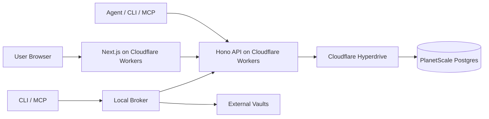
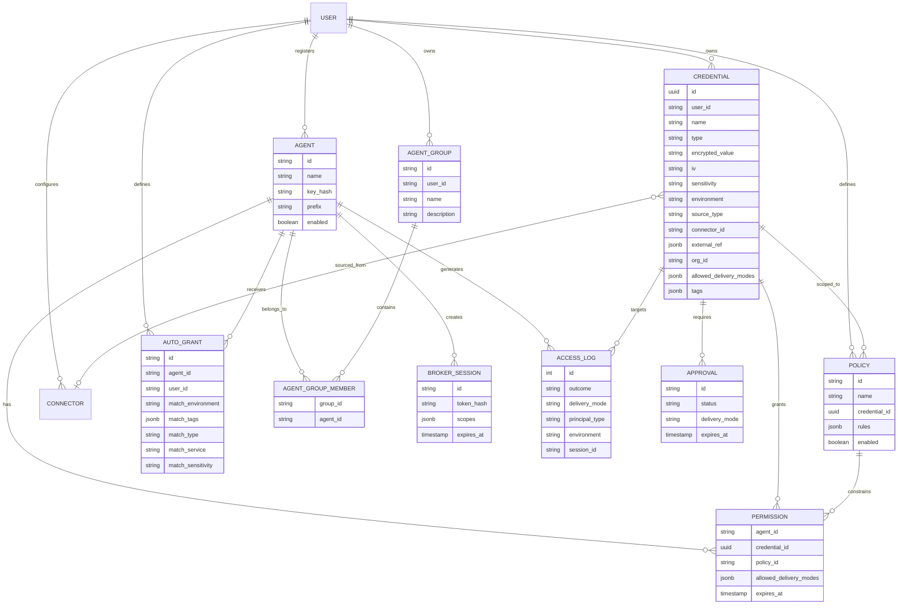
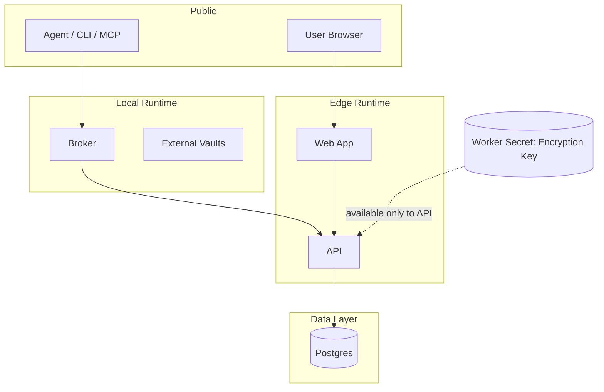
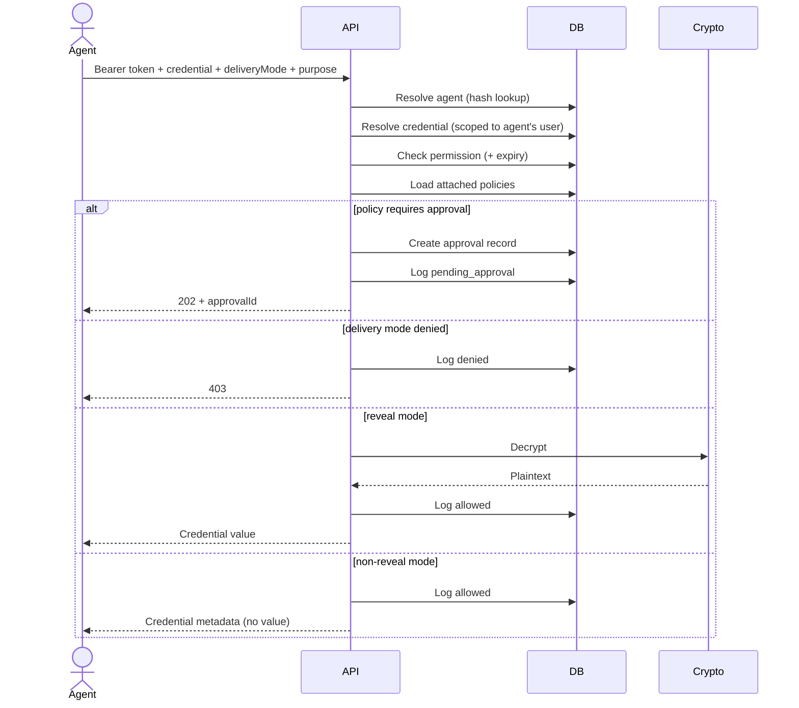
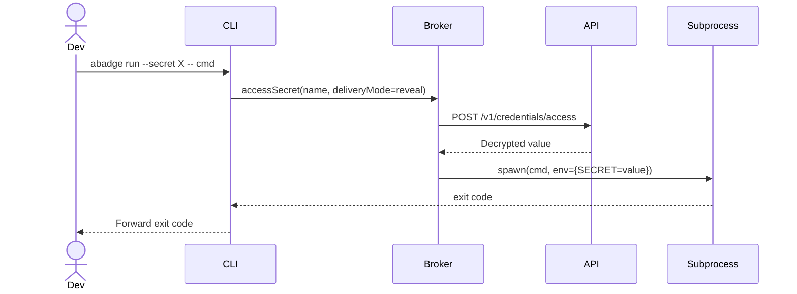

# Architecture

## Overview

abadge is a credential control plane for AI agents. Users store native encrypted credentials or
reference external secret systems, define access policies, register agents, grant scoped
permissions, and audit every access attempt. The system defaults to non-reveal delivery --
plaintext is the exception, not the product.

For v1, the product wedge is:

* **Access** -- explicit grants, policy checks, approvals, sessions, and audit
* **Connect** -- native credential storage plus external secret references
* **Interfaces** -- dashboard, REST API, CLI, SDK, and MCP

Native storage exists to support controlled runtime access. Abadge is not modeled as a general
human password manager.

### System parts

* **API** -- Hono on Cloudflare Workers. Canonical control plane for auth, CRUD, policy
  evaluation, approval workflows, encryption, session issuance, and audit logging.
* **Web** -- Next.js App Router dashboard. Operator surface for credentials, agents, policies,
  approvals, connectors, and audit.
* **CLI** -- `abadge` command. Developer/admin interface for runtime secret use and management.
* **SDK** -- TypeScript client for applications and agent runtimes that integrate directly with the
  control plane.
* **MCP server** -- Model Context Protocol server for AI agents. Secrets never returned to the LLM
  by default.
* **Broker** -- Local execution engine shared by CLI and MCP. Handles subprocess injection, temp
  file mounts, session management, and broker-side external vault connectors.
* **Database** -- Single Postgres instance (PlanetScale via Hyperdrive). Source of truth for all
  control-plane state.

## Deployment model



## Design goals

* minimal system surface area
* explicit user control over agent access
* delivery modes that avoid plaintext exposure by default
* policy-driven access with approval workflows
* single durable state store
* edge-friendly request latency
* complete audit trail on every access attempt
* no background infrastructure

## Core concepts

### Credential

A user-owned encrypted secret entry with structured metadata.

* **Identity**: id, user, name
* **Classification**: type (api_key, login, token, json_blob, oauth_client, service_account_json, cookie_session, pii, other)
* **Security**: sensitivity (low/medium/high/critical), allowed delivery modes, allowed destinations
* **Context**: environment (dev/staging/prod), service, provider, project, tags
* **Secret material**: AES-256-GCM encrypted value + IV (never stored plaintext)
* **Ownership**: ownerScope (user/org/system), orgId (for team-scoped credentials)
* **External source**: sourceType (native/external), connectorId, externalRef (name, path, version)

Credentials with `sourceType: "external"` store a reference to a secret in an external vault (Doppler, HashiCorp Vault, Infisical) rather than an encrypted value. The value is fetched from the connector at access time.

### Agent

A user-registered consumer of secrets, identified by a hashed API key with visible prefix.

### Permission

A grant joining one agent to one credential. Can optionally attach a policy and constrain delivery modes with an expiration.

### Policy

A set of rules attached to a credential or grant that governs access. Rule types:

* **delivery_mode** — restrict which delivery modes are allowed
* **environment** — restrict to specific environments
* **sensitivity** — require approval above a sensitivity threshold
* **destination** — allow/block specific destinations
* **ttl** — limit session duration

### Approval

A pending access request created when a policy requires human approval. Approvals have a 24-hour TTL and can be approved or denied by the credential owner.

### Broker session

A short-lived, scoped token that replaces static API keys for runtime access. Sessions have a TTL (max 24h), optional credential scopes, and delivery mode constraints.

### Connector

A configuration for fetching secrets from external vaults through the same policy and audit model. Two connector categories exist:

* **Client-side connectors** (via broker): native, 1Password, AWS Secrets Manager, Bitwarden, GCloud Secret Manager
* **HTTP connectors** (server-side, run in the API worker): Doppler, HashiCorp Vault, Infisical

HTTP connectors make outbound requests from the API worker. Connector configs are encrypted at rest.

### Auto-grant

A rule that automatically grants an agent permission to access any credential matching specified criteria. Matching criteria (conjunctive -- all non-null fields must match):

* `matchEnvironment` -- credential environment
* `matchTags` -- credential must have all specified tags
* `matchType` -- credential type
* `matchService` -- credential service
* `matchSensitivity` -- credential sensitivity level

Auto-grants can attach a policy and constrain delivery modes, same as manual permission grants.

### Agent group

A named collection of agents owned by a user. Groups organize agents for management purposes. Membership is tracked in a join table with cascade deletes.

### Delivery modes

| Mode | Behavior |
|------|----------|
| `reveal` | Return decrypted plaintext in API response |
| `env_inject` | API returns value; CLI/broker injects as environment variable in subprocess |
| `file_mount` | API returns value; CLI/broker writes to temp file (mode 0600), auto-cleaned |
| `browser_fill` | Metadata only; broker fills browser form fields |
| `operation_only` | Metadata only; credential used server-side without returning value |

Default is NOT reveal. Plaintext exposure requires explicit opt-in.

### Access log

Immutable event for every access attempt (allowed, denied, pending_approval, expired). No foreign key constraints — records persist after entity deletion.

## Entity model



## Trust boundaries



### Boundary rules

* the database never stores plaintext credentials or API keys
* the encryption key lives only in Worker Secrets, never in the database
* the web app does not decide authorization for agent reads
* the API is the only place where credential decryption happens
* decryption only occurs when deliveryMode is "reveal" AND authorization passes
* agents can only access credentials owned by the same user who registered them
* the LLM never receives raw secrets through the MCP server by default
* HTTP connectors (Doppler, HashiCorp Vault, Infisical) make outbound requests from the API worker -- connector credentials are encrypted at rest and never leave the server
* org-scoped credentials are accessible to org members; org admin/owner role is required for management operations

## Main request paths

### Policy-aware agent access (primary path)



### Local broker injection (CLI / MCP)



## Authentication

### Dashboard user auth

* Better Auth with email/password
* Session-based (7-day expiry)
* Used for all `/v1/*` management routes

### Agent auth (two methods)

1. **API key** (static) — `abd_` prefix, SHA-256 hashed, shown once at creation
2. **Broker session** (short-lived) — `abs_` prefix, SHA-256 hashed, TTL up to 24h, scoped

Agent auth middleware tries session token first (by prefix), then falls back to API key.

### Authorization model

* no wildcard grants
* no cross-user access
* explicit permission per agent-credential pair
* policy evaluation on every access
* delivery mode enforcement on every access
* permission expiration checked on every access

## Security model

### Controls

* AES-256-GCM encryption at rest
* Worker-secret encryption key (never in DB or code)
* SHA-256 hashed API keys and session tokens
* Per-credential ACLs with policy attachment
* Delivery mode enforcement (default non-reveal)
* Approval workflows for sensitive access
* Immutable audit log (no FK constraints)
* Secure headers and rate limiting
* Parameterized database access via Drizzle ORM

### Security invariant

A secret value is only returned when ALL conditions are true:

1. The agent presented a valid, active API key or non-expired session token
2. The credential exists and belongs to the agent's owner
3. An explicit permission grant exists and has not expired
4. All attached policies allow the requested delivery mode
5. No policy requires approval (or approval was granted)
6. The requested delivery mode is "reveal"

## Monorepo structure

```text
apps/
  api/        Hono API worker (control plane)
  cli/        Distributable CLI binary (bun build --compile)
  web/        Next.js dashboard
packages/
  auth/       Better Auth setup
  broker/     local execution engine
  cli/        CLI tool (library)
  config/     shared tsconfig
  core/       shared types, schemas, constants
  db/         schema and database client
  env/        environment validation
  mcp/        MCP server for AI agents
  sdk/        TypeScript SDK (@abadge/sdk)
```
