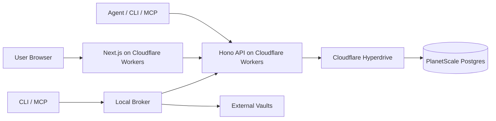
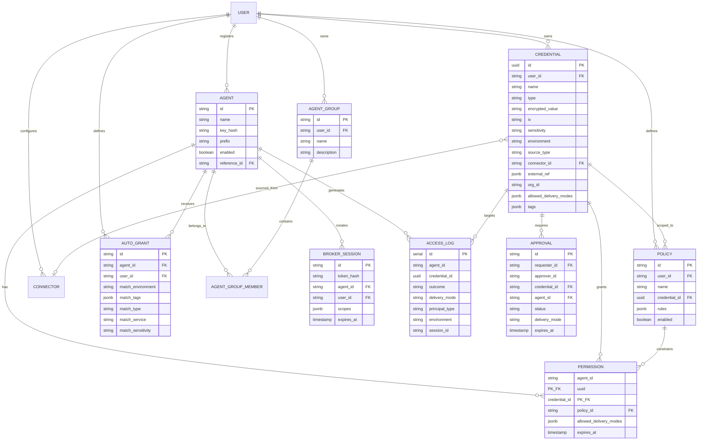
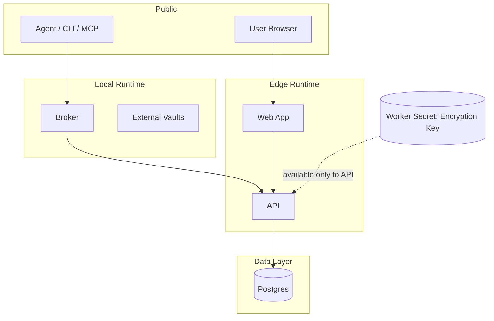
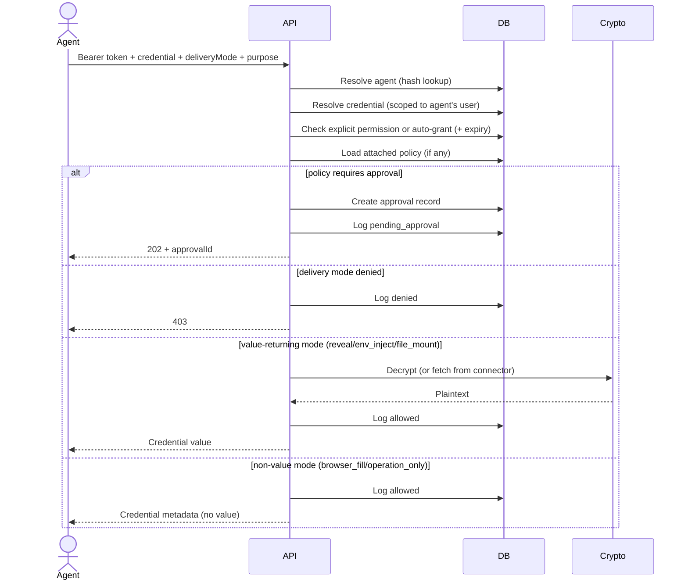
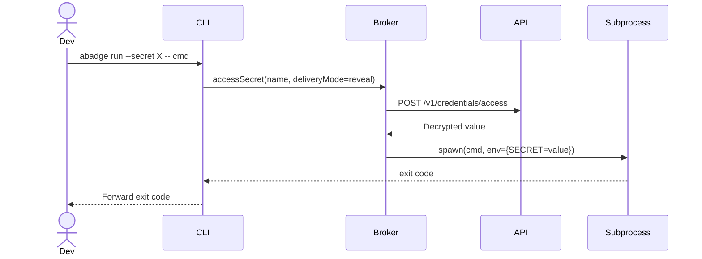

# Architecture

## Overview

abadge is a credential control plane for AI agents. Users store native encrypted credentials or
reference external secret systems, define access policies, register agents, grant scoped
permissions, and audit every access attempt. The system defaults to non-reveal delivery --
plaintext is the exception, not the product.

## System parts

* **API** -- Hono on Cloudflare Workers. Canonical control plane for auth, CRUD, policy
  evaluation, approval workflows, encryption, session issuance, and audit logging.
* **Web** -- Next.js App Router dashboard via OpenNext. Operator surface for credentials, agents,
  policies, approvals, connectors, and audit.
* **CLI** -- `abadge` command. Developer/admin interface for runtime secret use and management.
* **SDK** -- TypeScript client (`@abadge/sdk`). Typed API client for applications and agent runtimes.
* **MCP server** -- Model Context Protocol server for AI agents. Secrets never returned to the LLM
  by default.
* **Broker** -- Local execution engine shared by CLI and MCP. Handles subprocess injection, temp
  file mounts, session management, and broker-side external vault connectors.
* **Database** -- Single Postgres instance (PlanetScale via Hyperdrive). Source of truth for all
  control-plane state.

## Package structure

```text
apps/
  api/        Hono API worker (control plane)
  cli/        Distributable CLI binary (bun build --compile)
  web/        Next.js dashboard
packages/
  auth/       Better Auth setup (server + client)
  broker/     local execution engine (env inject, file mount, sessions, connectors)
  cli/        CLI tool library (commands, config, output)
  config/     shared tsconfig
  core/       shared types, zod schemas, constants, error shapes
  db/         Drizzle schema + database client
  env/        environment variable validation (server, client, worker)
  mcp/        MCP server for AI agents
  sdk/        TypeScript SDK (@abadge/sdk)
```

Build order: `config -> core -> env -> db -> auth -> api/web` (Turborepo handles this).

## Deployment model



## Core concepts

### Credential

A user-owned encrypted secret entry with structured metadata.

* **Identity**: uuid id, user\_id, name (unique per user)
* **Classification**: type (api\_key, login, token, json\_blob, oauth\_client, service\_account\_json, cookie\_session, pii, other)
* **Security**: sensitivity (low/medium/high/critical), allowed delivery modes, allowed destinations
* **Context**: environment (dev/staging/prod), service, provider, project, tags
* **Secret material**: AES-256-GCM encrypted value + IV (never stored plaintext)
* **Ownership**: ownerScope (user/org/system), orgId
* **External source**: sourceType (native/external), connectorId, externalRef (name, path, version)

Credentials with `sourceType: "external"` store a reference to a secret in an external vault rather than an encrypted value. The value is fetched from the connector at access time.

### Agent

A user-registered consumer of secrets, implemented as a Better Auth API key with prefix `abg_`. The key is SHA-256 hashed before storage. Only the hash and a visible prefix are persisted.

### Permission

An explicit grant joining one agent to one credential. Can attach a policy and constrain delivery modes with an expiration. Stored in `agent_credential_permissions` with a composite primary key.

### Auto-grant

A rule that automatically grants an agent permission to access any credential matching specified criteria. Matching is conjunctive (all non-null criteria must match). Evaluated at access time as a fallback when no explicit permission exists.

### Policy

A set of rules attached to a credential or grant that governs access:

* **delivery\_mode** -- restrict which delivery modes are allowed
* **environment** -- restrict to specific environments
* **sensitivity** -- require approval above a threshold
* **destination** -- allow/block specific destinations
* **ttl** -- limit session duration

Policy evaluation is a pure function with no side effects.

### Approval

A pending access request created when a policy requires human approval. Approvals have a 24-hour TTL. Only the credential owner can approve or deny.

### Broker session

A short-lived, scoped token (prefix `abs_`) that replaces static API keys for runtime access. Sessions have a TTL (max 24h), optional credential scopes, and delivery mode constraints. Revocable.

### Connector

A configuration for fetching secrets from external vaults. Two categories:

* **Client-side connectors** (via broker): native, 1Password, AWS Secrets Manager, Bitwarden, GCloud Secret Manager
* **HTTP connectors** (server-side): Doppler, HashiCorp Vault, Infisical

Connector configs are encrypted at rest with AES-256-GCM.

### Agent group

A named collection of agents owned by a user. Groups organize agents for management. Membership cascades on group deletion.

### Delivery modes

| Mode | Behavior | Value returned? |
|------|----------|-----------------|
| `reveal` | Return decrypted plaintext in API response | Yes |
| `env_inject` | API returns value; broker injects as env var in subprocess | Yes |
| `file_mount` | API returns value; broker writes to temp file (mode 0600) | Yes |
| `browser_fill` | Metadata only; broker fills browser form fields | No |
| `operation_only` | Metadata only; credential used server-side only | No |

Default is NOT reveal. Plaintext exposure requires explicit opt-in.

### Access log

Immutable event for every access attempt (allowed, denied, pending\_approval, expired). No foreign key constraints -- records persist after entity deletion. Includes agent identity, credential identity, delivery mode, outcome, destination, environment, purpose, session ID, IP address, and timestamp.

## Entity model



## Trust boundaries



### Boundary rules

* The database never stores plaintext credentials or API keys
* The encryption key lives only in Worker Secrets, never in the database
* The web app does not decide authorization for agent reads
* The API is the only place where credential decryption happens
* Decryption occurs only for value-returning delivery modes AND after authorization passes
* Agents can only access credentials owned by the same user who registered them
* The LLM never receives raw secrets through the MCP server by default
* HTTP connectors make outbound requests from the API worker -- connector credentials are encrypted at rest and never leave the server

## Main request paths

### Policy-aware agent access (primary path)



### Local broker injection (CLI / MCP)



## Authentication

### Dashboard user auth

* Better Auth with email/password and optional social login (Google, GitHub)
* Session-based
* Used for all `/v1/*` management routes

### Agent auth (two methods)

1. **API key** (static) -- `abg_` prefix, SHA-256 hashed, shown once at creation
2. **Broker session** (short-lived) -- `abs_` prefix, SHA-256 hashed, TTL up to 24h, scoped

Agent auth middleware tries session token first (by prefix), then falls back to API key.

### Authorization model

* No wildcard grants
* No cross-user access
* Explicit permission per agent-credential pair (or matching auto-grant)
* Policy evaluation on every access
* Delivery mode enforcement on every access
* Permission expiration checked on every access

## Security invariant

A secret value is only returned when ALL conditions are true:

1. The agent presented a valid, active API key or non-expired session token
2. The credential exists and belongs to the agent's owner
3. An explicit permission grant or matching auto-grant exists and has not expired
4. All attached policies allow the requested action
5. No policy requires approval (or approval was granted and not expired)
6. The requested delivery mode is value-returning (reveal, env\_inject, or file\_mount)
7. The delivery mode is permitted by credential, permission, and policy constraints
