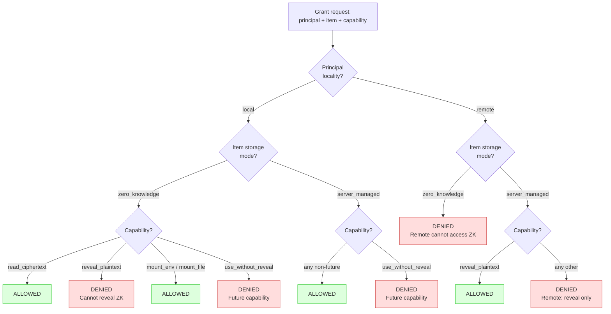
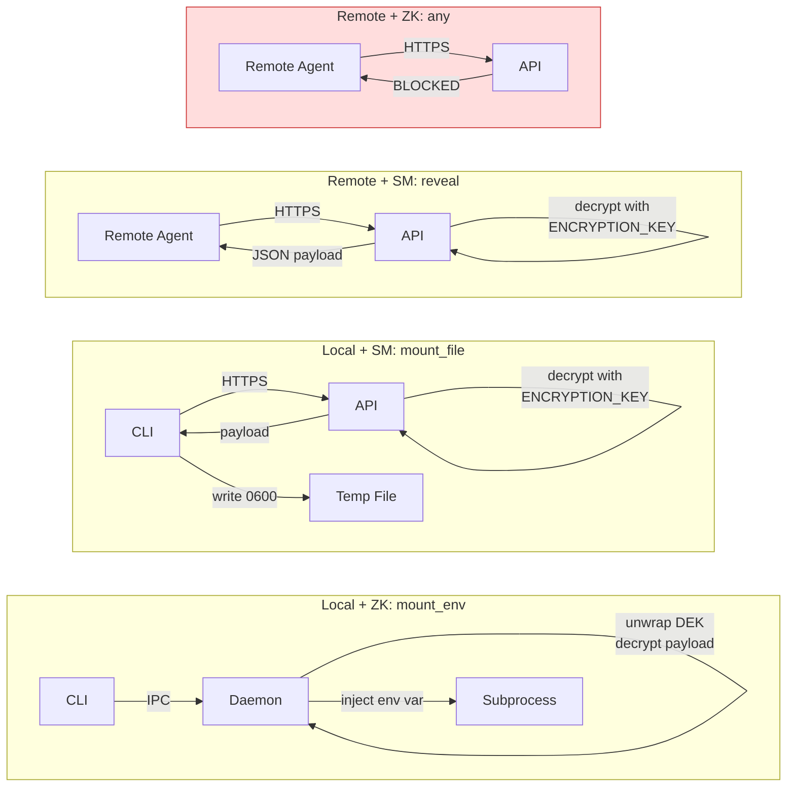

# Capability Matrix

## Principal Types

| Kind | Locality | Auth Method | Can Decrypt ZK | Description |
|------|----------|-------------|----------------|-------------|
| `device` | local | Session token | Yes (via daemon) | User's registered device |
| `local_cli` | local | Session token | Yes (via daemon) | CLI installation |
| `local_mcp` | local | Session token | Yes (via daemon) | Local MCP server |
| `remote_agent` | remote | API key | No | Hosted agent, cloud worker, webhook |

## Capabilities

| Capability | Description | ZK Items | Server-Managed Items |
|------------|-------------|----------|---------------------|
| `read_ciphertext` | Receive encrypted item data | Local only | Local only |
| `reveal_plaintext` | Receive decrypted plaintext | Not allowed | Remote + Local |
| `mount_env` | Inject as env var in subprocess | Local only (daemon) | Local only (daemon) |
| `mount_file` | Write to temp file | Local only (daemon) | Local only (daemon) |
| `use_without_reveal` | Use without seeing value (future: sign, mint) | Future | Future |

## Grant Validation Rules

When creating a grant, the server enforces:

1. **Remote + ZK + reveal**: Denied. Remote principals cannot reveal ZK items.
2. **Remote + ZK + any**: Denied. Remote principals cannot access ZK items at all.
3. **Remote + managed + reveal**: Allowed. This is the primary remote use case.
4. **Remote + managed + mount**: Denied. Remote principals can't mount locally.
5. **Local + ZK + any non-future capability**: Allowed. Daemon handles decryption.
6. **Local + managed + any non-future capability**: Allowed.

## Access Route Mapping

| Route | Required Capability | Item Mode | Principal Locality |
|-------|--------------------|-----------|--------------------|
| `POST /v1/access/ciphertext` | `read_ciphertext` | `zero_knowledge` | local |
| `POST /v1/access/reveal` | `reveal_plaintext` | `server_managed` | any |
| `POST /v1/access/mount` | `mount_env` or `mount_file` | any | local |

## Delivery Flow by Scenario

| Scenario | Flow |
|----------|------|
| User views ZK item in browser | Browser decrypts locally using root key in memory |
| CLI runs command with ZK secret | CLI → daemon (IPC) → daemon decrypts → daemon spawns subprocess with env var |
| Local MCP uses ZK secret | MCP → daemon (IPC) → daemon decrypts → daemon injects |
| Remote agent reveals managed secret | Agent → API (HTTPS) → server decrypts → returns plaintext |
| Remote agent tries to access ZK item | Denied at grant validation or access route |

