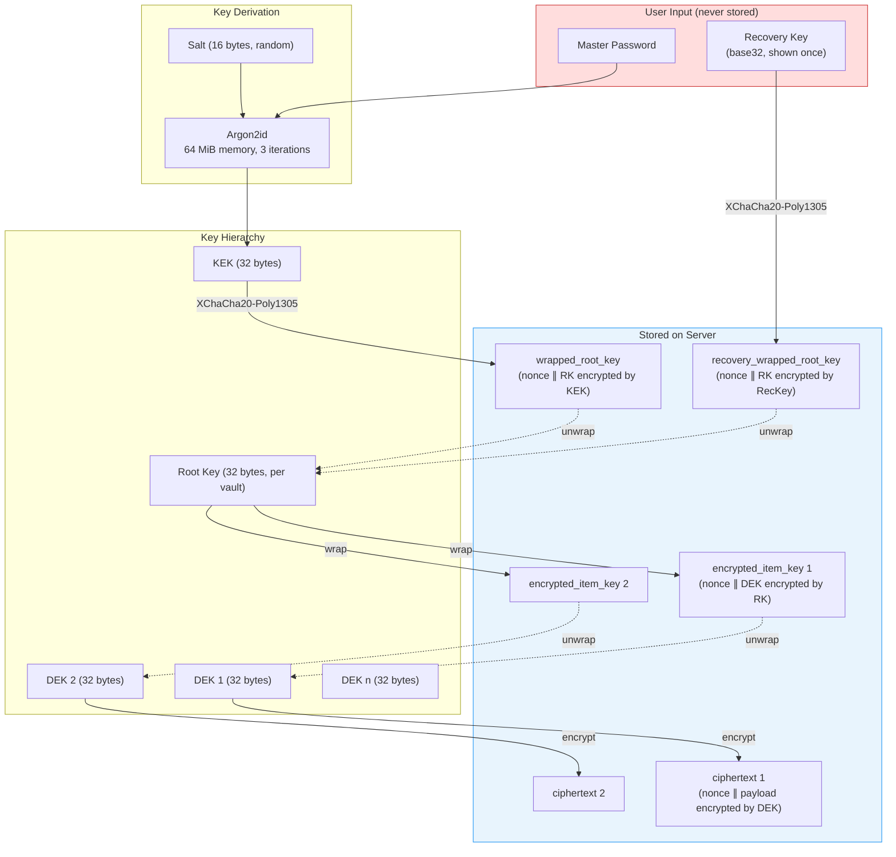
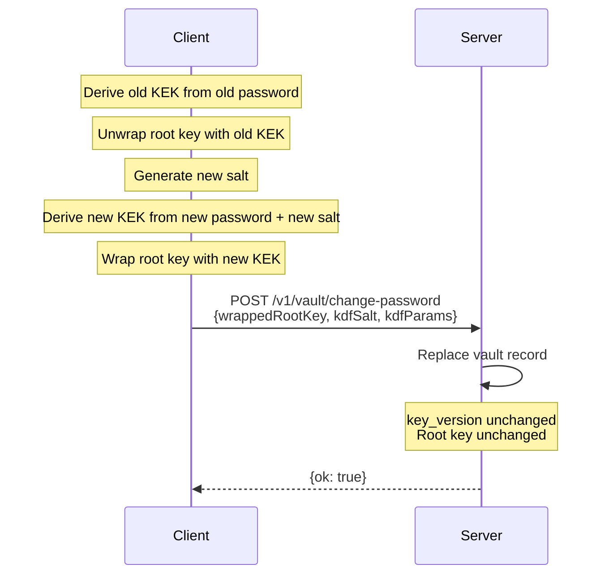
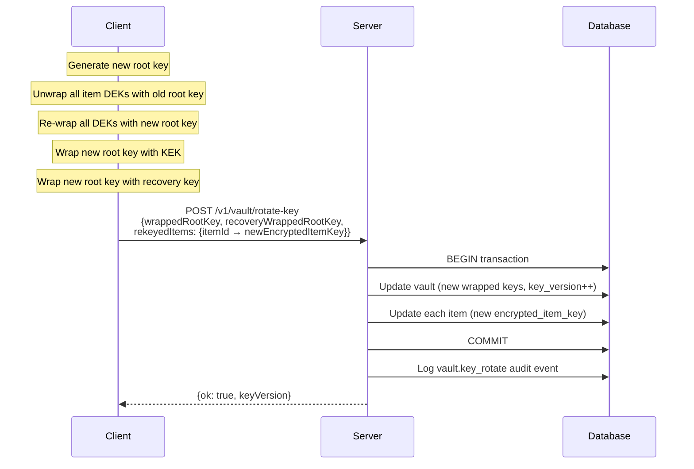

# Crypto Envelope Specification v1

## Algorithms

| Purpose | Algorithm | Library | Key Size | Nonce Size |
|---------|-----------|---------|----------|------------|
| KDF (master password → KEK) | Argon2id | hash-wasm | 32 bytes output | N/A |
| Key wrapping (KEK → RK, RK → DEK) | XChaCha20-Poly1305 | libsodium-wrappers | 32 bytes | 24 bytes |
| Item encryption (DEK → ciphertext) | XChaCha20-Poly1305 | libsodium-wrappers | 32 bytes | 24 bytes |
| Server-managed encryption | AES-256-GCM | WebCrypto | 32 bytes | 12 bytes |
| API key hashing | SHA-256 | WebCrypto | N/A | N/A |
| ID generation | Random | crypto.getRandomValues | N/A | N/A |

## Key Hierarchy Overview



## KDF Parameters

Default Argon2id parameters (client-side only):

```json
{
  "algorithm": "argon2id",
  "memory": 65536,
  "iterations": 3,
  "parallelism": 1,
  "hashLength": 32
}
```

Memory is in KiB (65536 KiB = 64 MiB). Per RFC 9106 second recommendation for memory-constrained environments.

Salt: 16 bytes, randomly generated, stored alongside wrapped root key.

## Key Hierarchy Wire Formats

All binary data is encoded as **unpadded base64** (RFC 4648 section 5, URL-safe alphabet) for storage and transport.

### Vault Record

```json
{
  "wrapped_root_key": "<base64: RK encrypted by KEK via XChaCha20-Poly1305>",
  "kdf_salt": "<base64: 16 bytes>",
  "kdf_params": { "algorithm": "argon2id", "memory": 65536, "iterations": 3, "parallelism": 1, "hashLength": 32 },
  "recovery_wrapped_root_key": "<base64: RK encrypted by recovery key via XChaCha20-Poly1305>",
  "key_version": 1
}
```

The `wrapped_root_key` field contains the concatenation: `nonce (24 bytes) || ciphertext+tag`. The decrypt side splits on the known nonce length.

### ZK Item Record

```json
{
  "encrypted_item_key": "<base64: nonce (24 bytes) || DEK encrypted by RK>",
  "ciphertext": "<base64: nonce (24 bytes) || payload encrypted by DEK>",
  "crypto_version": 1
}
```

Each encrypted field is self-contained: `nonce || ciphertext+tag` concatenated. The nonce is always the first 24 bytes (for XChaCha20-Poly1305).

### ZK Item Plaintext Envelope

The plaintext inside `ciphertext` is a JSON object:

```json
{
  "v": 1,
  "label": "prod postgres",
  "kind": "login",
  "tags": ["prod", "db"],
  "notes": "Primary production database",
  "fields": {
    "host": "db.example.com",
    "port": 5432,
    "username": "app",
    "password": "s3cret"
  }
}
```

- `v`: Envelope schema version (always 1 for now)
- `label`: Human-readable name
- `kind`: Item type (login, api_key, token, json, certificate, ssh_key, opaque)
- `tags`: Array of string tags
- `notes`: Optional freeform notes
- `fields`: Key-value pairs. Structure depends on `kind`. All values are strings or numbers.

This entire JSON blob is serialized to UTF-8 bytes, then encrypted with the item DEK.

### Server-Managed Item Record

```json
{
  "server_ciphertext": "<base64: AES-256-GCM ciphertext>",
  "server_iv": "<base64: 12 bytes>",
  "server_key_version": 1
}
```

The plaintext envelope is the same JSON structure as ZK items.

## Recovery Key Format

256-bit random key encoded as base32 (RFC 4648) in groups of 5:

```
ABCDE-FGHIJ-KLMNO-PQRST-UVWXY-Z2345-67ABC-DEFGH-IJKLM-NOPQR-STUVW
```

52 base32 characters = 260 bits (padded from 256). Displayed with dashes every 5 characters for readability.

The recovery key wraps the root key using the same XChaCha20-Poly1305 scheme as the KEK wrap. Stored as `recovery_wrapped_root_key` on the vault record.

## API Key Format

- Prefix: `abg_` (for remote principals) or `abl_` (for local principals)
- Random portion: 32 bytes, base64url-encoded
- Full key shown once on creation
- Server stores: SHA-256 hash of full key + first 8 chars as prefix for lookup
- Authentication: constant-time comparison of hashes

## Password Change Flow

1. Client derives old KEK from old password
2. Client unwraps root key with old KEK
3. Client derives new KEK from new password + new salt
4. Client wraps root key with new KEK
5. Client sends: new wrapped\_root\_key, new kdf\_salt, new kdf\_params
6. Server replaces vault record (same key\_version, root key unchanged)



## Root Key Rotation Flow

1. Client generates new root key
2. Client decrypts all item DEKs with old root key
3. Client re-wraps all DEKs with new root key
4. Client wraps new root key with current KEK
5. Client wraps new root key with recovery key
6. Client sends batch update: vault (new wrapped keys, incremented key\_version) + all items (new encrypted\_item\_key fields)
7. Server applies atomically in a transaction



## Version Fields

- `crypto_version` on items: Identifies the envelope format. Allows future algorithm changes without breaking old items. Current: 1.
- `content_version` on items: Optimistic concurrency. Incremented on every update. Server rejects updates with stale version.
- `key_version` on vaults: Incremented on root key rotation. Allows clients to detect stale local caches.
