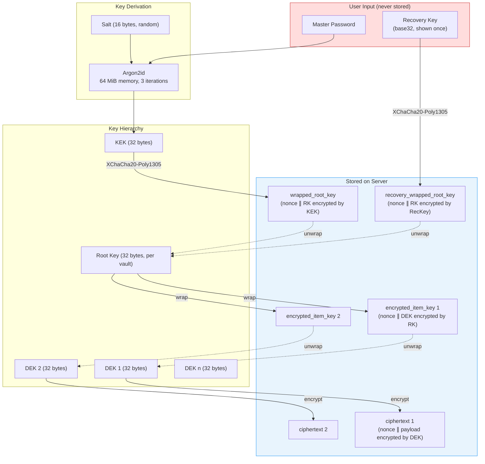
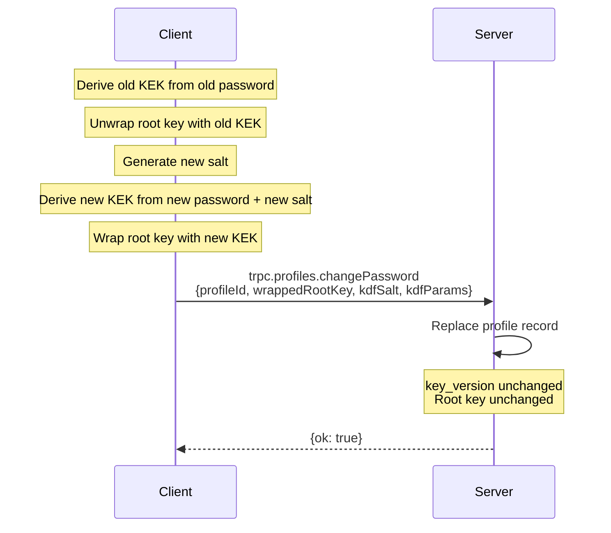
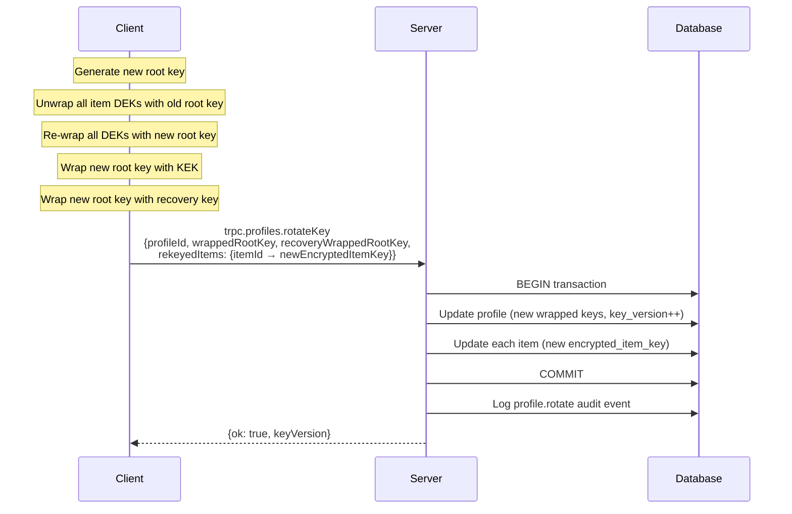

# Crypto Envelope Specification v1

## Algorithms

| Purpose | Algorithm | Library | Key Size | Nonce Size |
|---------|-----------|---------|----------|------------|
| KDF (master password → KEK) | Argon2id | @noble/hashes | 32 bytes output | N/A |
| Key wrapping (KEK → RK, RK → DEK) | XChaCha20-Poly1305 | @noble/ciphers | 32 bytes | 24 bytes |
| Item encryption (DEK → ciphertext) | XChaCha20-Poly1305 | @noble/ciphers | 32 bytes | 24 bytes |
| Server-managed encryption | AES-256-GCM | WebCrypto | 32 bytes | 12 bytes |
| API key hashing | SHA-256 | WebCrypto | N/A | N/A |
| ID generation | Random | crypto.getRandomValues | N/A | N/A |

## Key Hierarchy Overview



## KDF Parameters

Default Argon2id parameters (client-side only):

```json
{
  "algorithm": "argon2id",
  "memory": 65536,
  "iterations": 3,
  "parallelism": 1,
  "hashLength": 32
}
```

Memory is in KiB (65536 KiB = 64 MiB). Per RFC 9106 second recommendation for memory-constrained environments.

Salt: 16 bytes, randomly generated, stored alongside wrapped root key.

## Key Hierarchy Wire Formats

All binary data is encoded as **unpadded base64** (RFC 4648 section 5, URL-safe alphabet) for storage and transport.

### Vault Record

```json
{
  "wrapped_root_key": "<base64: RK encrypted by KEK via XChaCha20-Poly1305>",
  "kdf_salt": "<base64: 16 bytes>",
  "kdf_params": { "algorithm": "argon2id", "memory": 65536, "iterations": 3, "parallelism": 1, "hashLength": 32 },
  "recovery_wrapped_root_key": "<base64: RK encrypted by recovery key via XChaCha20-Poly1305>",
  "key_version": 1
}
```

The `wrapped_root_key` field contains the concatenation: `nonce (24 bytes) || ciphertext+tag`. The decrypt side splits on the known nonce length.

### ZK Item Record

```json
{
  "encrypted_item_key": "<base64: nonce (24 bytes) || DEK encrypted by RK>",
  "ciphertext": "<base64: nonce (24 bytes) || payload encrypted by DEK>",
  "crypto_version": 1
}
```

Each encrypted field is self-contained: `nonce || ciphertext+tag` concatenated. The nonce is always the first 24 bytes (for XChaCha20-Poly1305).

### ZK Item Plaintext Envelope

The plaintext inside `ciphertext` is a JSON object:

```json
{
  "v": 1,
  "label": "prod postgres",
  "kind": "login",
  "tags": ["prod", "db"],
  "notes": "Primary production database",
  "fields": {
    "host": "db.example.com",
    "port": 5432,
    "username": "app",
    "password": "s3cret"
  }
}
```

- `v`: Envelope schema version (always 1 for now)
- `label`: Human-readable name
- `kind`: Item type (login, api_key, token, json, certificate, ssh_key, opaque)
- `tags`: Array of string tags
- `notes`: Optional freeform notes
- `fields`: Key-value pairs. Structure depends on `kind`. All values are strings or numbers.

This entire JSON blob is serialized to UTF-8 bytes, then encrypted with the item DEK.

### Server-Managed Item Record

```json
{
  "server_ciphertext": "<base64: AES-256-GCM ciphertext>",
  "server_iv": "<base64: 12 bytes>",
  "server_key_version": 1
}
```

The plaintext envelope is the same JSON structure as ZK items.

## Recovery Key Format

256-bit random key encoded as base32 (RFC 4648) in groups of 5:

```
ABCDE-FGHIJ-KLMNO-PQRST-UVWXY-Z2345-67ABC-DEFGH-IJKLM-NOPQR-STUVW
```

52 base32 characters = 260 bits (padded from 256). Displayed with dashes every 5 characters for readability.

The recovery key wraps the root key using the same XChaCha20-Poly1305 scheme as the KEK wrap. Stored as `recovery_wrapped_root_key` on the vault record.

## Personal API Key Format

- Prefix: `abu_` (personal API key, bound to a user + org)
- Random portion: 32 bytes, base64url-encoded
- Full key shown once on creation
- Server stores: SHA-256 hash of full key + first 8 chars as prefix for lookup
- Authentication: constant-time comparison of hashes
- Resolves to a session identity (management surface only); never reaches `access.*`

## Password Change Flow

1. Client derives old KEK from old password
2. Client unwraps root key with old KEK
3. Client derives new KEK from new password + new salt
4. Client wraps root key with new KEK
5. Client sends: new wrapped\_root\_key, new kdf\_salt, new kdf\_params
6. Server replaces vault record (same key\_version, root key unchanged)



## Root Key Rotation Flow

1. Client generates new root key
2. Client decrypts all item DEKs with old root key
3. Client re-wraps all DEKs with new root key
4. Client wraps new root key with current KEK
5. Client wraps new root key with recovery key
6. Client sends batch update: vault (new wrapped keys, incremented key\_version) + all items (new encrypted\_item\_key fields)
7. Server applies atomically in a transaction



## Version Fields

- `crypto_version` on items: Identifies the envelope format. Allows future algorithm changes without breaking old items. Current: 1.
- `content_version` on items: Optimistic concurrency. Incremented on every update. Server rejects updates with stale version.
- `key_version` on vaults: Incremented on root key rotation. Allows clients to detect stale local caches.

## Server-Managed Per-Profile Envelope (v3)

See [ADR-004](./decisions/004-server-managed-per-profile-envelope.md) for the rationale. This section is the wire contract the AB-0030 implementation must satisfy.

### Key hierarchy (server-managed)

```
ENCRYPTION_KEY (master, AES-256-GCM)
  --wraps-->  profile DEK (32 bytes, one per server_managed profile)
                --encrypts-->  server item ciphertext
```

The profile DEK is the new intermediate key. `ENCRYPTION_KEY` no longer touches item content directly for v3 rows — only the DEK does.

### Profile record (added field)

```json
{
  "server_wrapped_dek": "<base64: iv (12 bytes) || AES-256-GCM(ENCRYPTION_KEY, DEK, wrapAad)>"
}
```

- `server_wrapped_dek` packs the whole wrap in one self-describing blob: `iv (12) || ciphertext+tag (48 = 32-byte DEK + 16-byte tag)`; the unwrap side splits on the known 12-byte IV length. This deliberately differs from item records, which keep `server_ciphertext` and `server_iv` as separate columns (reusing the existing v1/v2 schema). The two AES-256-GCM layouts must not be cross-parsed.
- The wrap is AAD-bound to `(orgId, profileId)` under a distinct domain-separation prefix (`abadge-sm-dek-v1`), mirroring `buildZkDekWrapAad`. This pins each wrapped DEK to exactly one profile, so a DEK blob transplanted to another profile fails to unwrap — closing the gap where a post-swap write would otherwise be silently encrypted under an attacker-chosen DEK.
- Provisioned for `server_managed` profiles on create/bootstrap, or lazily on the first v3 write. Lazy provisioning MUST be atomic: generate-and-wrap the DEK and persist it with a compare-and-set (`UPDATE … SET server_wrapped_dek = ? WHERE id = ? AND server_wrapped_dek IS NULL`) or a `SELECT … FOR UPDATE` row lock, in the same transaction as the item write, then encrypt the item under whichever DEK won the race. A "losing" DEK must never encrypt content, or its items become permanently unrecoverable.

### Server-managed item record (`server_key_version = 3`)

```json
{
  "server_ciphertext": "<base64: AES-256-GCM(profileDEK, payload)>",
  "server_iv": "<base64: 12 bytes>",
  "server_key_version": 3
}
```

AAD is unchanged from v2: the canonical `(orgId, profileId, itemId, keyVersion)` tuple from `buildServerAad`, with `keyVersion = 3`. The plaintext envelope is the same item JSON as all other modes.

### `server_key_version` semantics

| Version | Content key | AAD | Notes |
|---|---|---|---|
| 1 | `ENCRYPTION_KEY` | none | legacy; predates AAD binding |
| 2 | `ENCRYPTION_KEY` | `(orgId, profileId\|sentinel, itemId, 2)` | §AB-0001 direct-key + AAD |
| 3 | profile DEK | `(orgId, profileId, itemId, 3)` | §AB-0030 per-profile envelope |
| 4 | profile DEK | `(orgId, profileId, itemId, 4)` | §AB-0032 v3 + key-commitment prefix |

Decrypt **must** branch on the stored `server_key_version`: v1/v2 unwrap nothing and decrypt under `ENCRYPTION_KEY`; v3/v4 unwrap `server_wrapped_dek` and decrypt under the DEK; v4 additionally verifies and strips the key-commitment prefix first. New writes are always v4.

### Key commitment (`server_key_version = 4`, §AB-0032)

AES-GCM is not key-committing — a ciphertext can in principle be crafted to decrypt validly under two keys. v4 prefixes a 32-byte key-commitment tag to `server_ciphertext`:

```
server_ciphertext (v4) = base64(
  HMAC-SHA256(profileDEK, "abadge/server-envelope/key-commitment/v1")  // 32 bytes
  || AES-256-GCM(profileDEK, payload)
)
```

On decrypt the commitment is recomputed from the resolved DEK and compared **constant-time** before AES-GCM runs; a mismatch rejects the ciphertext (it was not produced under this key). v1–v3 carry no commitment and decrypt unchanged.

### `ENCRYPTION_KEY` rotation (v3)

Rotation rewraps each profile's `server_wrapped_dek` (unwrap with the old master key, wrap with the new) and **re-encrypts no item content** — the DEK, and therefore every item ciphertext bound to it, is unchanged. This is O(profiles), not O(secrets). See the rotation runbook (AB-0090).

### Golden vectors (required by the implementation)

The AB-0030 crypto tests MUST check in fixed vectors so a wire-format change fails loudly:

1. **DEK wrap round-trip:** a fixed 32-byte `ENCRYPTION_KEY` + fixed 32-byte DEK + fixed 12-byte IV + fixed `(orgId, profileId)` wrap AAD → a committed `server_wrapped_dek` string; unwrapping it returns the exact DEK, and unwrapping with a different `profileId` AAD fails authentication.
2. **Item round-trip under the DEK:** fixed DEK + fixed payload + fixed AAD tuple + fixed IV → a committed `server_ciphertext`; decrypting returns the exact payload.
3. **Cross-profile isolation:** two profiles with independently generated DEKs (and distinct `profileId` AAD); an item encrypted under profile A's DEK fails GCM authentication when decrypted in profile B's context. This catches both DEK confusion (wrong key) and AAD omission (wrong profile binding) — AB-0030 acceptance #2.
4. **Backward compatibility:** a v2 direct-key ciphertext still decrypts unchanged (AB-0030 acceptance #3).
