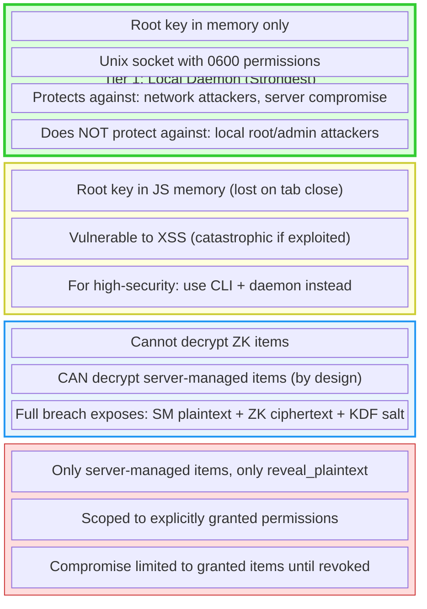

# Security Model

How abadge protects credentials across every surface.

---

## Principles

1. **No plaintext at rest** -- credentials are always encrypted in the database
2. **No decrypt before auth** -- authorization checks run before any decryption
3. **No implicit access** -- every agent-credential pair requires an explicit permission
4. **No silent access** -- every attempt (allowed or denied) is logged
5. **No secret exposure to LLMs** -- MCP tools inject secrets into subprocesses, never into model context

---

## Encryption

abadge supports two storage modes with different trust models.

### Zero-Knowledge Mode

The server never sees plaintext. All cryptographic operations happen in the browser or local CLI daemon.

```
Master Password → Argon2id (64 MiB, 3 iterations) → KEK (32 bytes)
KEK → unwraps → Root Key (32 bytes, per profile)
Root Key → unwraps → DEK (32 bytes, per item)
DEK → decrypts → Item Payload
```

| Operation | Algorithm | Key Size | Nonce Size |
|---|---|---|---|
| Password → KEK | Argon2id | 32 bytes output | N/A |
| Key wrapping | XChaCha20-Poly1305 | 32 bytes | 24 bytes |
| Item encryption | XChaCha20-Poly1305 | 32 bytes | 24 bytes |

**What the server stores**: Wrapped root key, KDF salt/params, wrapped DEKs, ciphertext. The server cannot derive any plaintext without the master password.

**Recovery**: A 256-bit recovery key (base32, shown once) independently wraps the root key. No server-side recovery exists.

### Server-Managed Mode

The API worker encrypts and decrypts with a shared key.

| Operation | Algorithm | Key Size | Nonce Size |
|---|---|---|---|
| Item encryption | AES-256-GCM | 32 bytes | 12 bytes (random) |

**Key source**: `ENCRYPTION_KEY` environment variable on the Cloudflare Worker, validated to decode to exactly 32 bytes (AES-256) at runtime. Decryption only happens after all authorization checks pass.

#### AES-GCM random-IV ceiling and rotation trigger (AB-0031)

Server-managed content uses AES-256-GCM with a random 96-bit IV. [NIST SP 800-38D](https://nvlpubs.nist.gov/nistpubs/Legacy/SP/nistspecialpublication800-38d.pdf) caps a single key at **2³² random-IV encryptions** before the IV-collision probability exceeds 2⁻³²; a GCM IV collision under one key is catastrophic (plaintext XOR leak + authentication-key recovery).

abadge keeps each key well inside that bound by two mechanisms:

* **Per-profile DEKs (AB-0030)** — `serverKeyVersion >= 3` content is encrypted under a per-profile data-encryption key, not the global `ENCRYPTION_KEY`. The 2³² budget therefore applies *per profile*, not globally: a single profile would need 4 billion server-managed writes to approach the limit.
* **Documented per-key rotation ceiling** — operationally, rotate (bump `serverKeyVersion` / re-derive the profile DEK) before any single key reaches **2²⁸ encryptions** (a 16× safety margin below the NIST bound). Rotation is a DEK rewrap with no content re-encryption (see the [key-rotation runbook](./runbooks/key-rotation.md)).

**Decision — AES-GCM + per-profile DEK, not XChaCha20.** XChaCha20-Poly1305's 192-bit random nonce is collision-safe to ~2⁸⁰ without counting, which would remove the ceiling entirely. We keep AES-GCM because (a) per-profile DEKs already push the per-key budget far beyond any realistic single-profile write volume, (b) AES-GCM is the WebCrypto-native primitive on Cloudflare Workers (XChaCha would add a userspace dependency on the server hot path), and (c) the rotation machinery (`serverKeyVersion` + DEK rewrap) is needed for KEK rotation regardless. Operators should alert on per-profile server-managed write counts approaching 2²⁸ and rotate; revisit XChaCha if a single profile's write volume ever makes counting impractical.

### Comparison

| Property | Zero-Knowledge | Server-Managed |
|---|---|---|
| Server sees plaintext | Never | During decrypt |
| Server breach exposure | Ciphertext only (unusable) | Plaintext if `ENCRYPTION_KEY` also compromised |
| Remote agent access | Not supported | `reveal_plaintext` only |
| Local agent access | `read_ciphertext`, `mount_env`, `mount_file` | `reveal_plaintext`, `mount_env`, `mount_file` |
| Setup complexity | Requires master password + profile | Just store the secret |

---

## Authentication

### Human Operators

| Surface | Method | Session Duration |
|---|---|---|
| Dashboard | Better Auth session cookie (email/password or OAuth) | 7 days |
| CLI | Better Auth device authorization flow | Bearer token in daemon memory |

**Dashboard**: Standard cookie-based sessions with CSRF protection via Better Auth. Supports Google and GitHub OAuth.

**CLI**: The CLI initiates a device authorization flow — user approves in the browser, CLI receives a bearer token. The token is held in daemon memory only; the config file never stores a human bearer token.

### Agent Authentication

Agents authenticate using one of two methods.

#### Public Key Sessions (Preferred)

The default for all new agents.

```
1. User registers agent with issueBootstrapToken: true (or provides publicKey directly)
2. Agent generates Ed25519 keypair locally
3. Agent enrolls with bootstrap token + public key  (abe_..., 10-min TTL)
4. For each session:
   a. Agent requests challenge (abc_..., 60-second TTL)
   b. Agent signs challenge with private key
   c. Server verifies Ed25519 signature
   d. Server issues session token (abs_..., 15-min TTL)
5. SDK schedules background refresh at T-2 minutes before expiry
```

**Storage**: Private key stored locally with `0600` permissions. Public key stored on server. Session tokens stored as SHA-256 hashes. No long-lived secrets are stored on disk for keypair agents.

#### Legacy API Keys (Migration Only)

For backward compatibility with existing integrations.

- Prefixes: `abl_` (local), `abg_` (remote)
- Full key shown once at creation, never retrievable
- Server stores SHA-256 hash + prefix (first 4-8 chars) for fast lookup
- Authentication: prefix-based DB lookup, then constant-time hash comparison

### Auth Resolution Order

Agent procedures try these methods in order:

1. `abs_` prefix → session token (hash lookup, TTL check)
2. `abl_`/`abg_` prefix → API key (prefix lookup, hash match)
3. Fallback → legacy Better Auth API key verification

Successful authentication updates `lastUsedAt` on the agent record.

---

## SecretValue Opaque Type

The SDK uses a `SecretValue` opaque type to prevent accidental logging or serialization of secret
data. The type requires an explicit `.expose()` call to access the underlying string value:

```ts
const result = await agent.access.read(itemId);
// result.value is a SecretValue — cannot be directly logged or serialized
const plaintext = result.value.expose(); // explicit unwrap
```

This ensures secrets are not accidentally included in log output, error messages, or JSON
serialization.

---

## Authorization

### Permission Model

Access requires an explicit permission linking an agent to an item with a specific capability.
There are no wildcards, no default permissions, and no implicit inheritance.

```
Agent + Item + Capability → Explicit Permission → Access
```

### Decision Flow

Every access request follows this exact order:

1. **Authenticate** the bearer token
2. **Resolve** the target item (must belong to the same org as the agent)
3. **Check** for an explicit permission matching (agent, item, capability)
4. **Verify** the permission has not expired
5. **Enforce** locality and storage mode constraints
6. **Audit** the attempt (before returning any data)
7. **Decrypt** only if all checks passed

Denied requests are audited and return an error. The order ensures no decryption happens unless fully authorized.

### Tenancy isolation (defense in depth)

Cross-organization isolation has two layers:

1. **Scoped data-access layer (AB-0010, primary control).** All reads/writes of the org-scoped tenant tables (`items`, `profiles`, `agents`, `permissions`, `audit_logs`) go through `scopedDb(orgId)` in `packages/trpc`. Its `findMany`/`findFirst` bake `organization_id = orgId` into the WHERE clause and `insert` auto-sets it, so a query cannot omit the tenant filter by construction. A CI test bans direct imports of those tables outside the scoped layer (allowlisting a few documented exceptions: the audit writer, auth resolution, the role-check `profiles` router, and the cross-org onboarding query in `organizations`).

2. **Row-level security backstop (AB-0011, DB-enforced).** `FORCE ROW LEVEL SECURITY` on `items`/`profiles`/`agents`/`permissions` with an `org_isolation` policy keyed on the `app.current_org` GUC, set transaction-locally via `set_config(..., true)` (so it survives Hyperdrive connection pooling) by `scopedDb.run()`. The policy **fails closed**: an unset or mismatched context returns zero rows, never an unfiltered leak. The backstop targets the NOSUPERUSER/NOBYPASSRLS runtime role (`app_runtime`, created by migration 0022, AB-0012); the migrator/owner and local superuser bypass it, so migrations and admin tooling are unaffected. **Status — not yet active:** the policies are deployed, but `scopedDb.run()` is not yet wired into the request read path and agent auth reads `agents` before an org context exists, so the app must keep connecting as the owner/BYPASSRLS role until the GUC wiring ships (see `docs/runbooks/least-privilege-db-role.md`). Until then, org isolation is enforced solely by the app-layer scoped-DB `organization_id` filters; RLS is the staged-but-dormant backstop that will catch a "forgot to filter" bug once the runtime role is cut over.

### Capability Enforcement Matrix

| | ZK Item (Local) | ZK Item (Remote) | SM Item (Local) | SM Item (Remote) |
|---|---|---|---|---|
| `read_ciphertext` | Allowed | **Denied** | N/A | N/A |
| `reveal_plaintext` | N/A | N/A | Allowed | Allowed |
| `mount_env` | Allowed | **Denied** | Allowed | **Denied** |
| `mount_file` | Allowed | **Denied** | Allowed | **Denied** |

**Key restrictions**:
- Remote agents can never access zero-knowledge items (no decryption capability)
- Remote agents can only `reveal_plaintext` on server-managed items
- Mount capabilities require a local runtime to inject secrets into

---

## Delivery Modes

How secrets reach agents — designed to minimize exposure.

### Environment Injection (`mount_env`)

Secret is passed as an environment variable to a spawned subprocess. The secret exists only in
process memory — never written to disk. The parent process does not retain the value after spawning.

#### Bulk env injection (`abadge run --all` / `access.bulkMountEnv`)

Bulk mode injects every item the agent has `mount_env` on within **one profile** in a single subprocess spawn. Invariants:

* **Profile is the trust boundary, enforced server-side.** The bulk endpoint takes `profileId` as input and joins `items.profileId = input` in the same query that scopes by `org` and `agentId`. A tampered CLI cannot exfiltrate items in other profiles via this endpoint, even when the agent has grants on them.
* **Cross-org probing returns `PROFILE_NOT_FOUND`, not `FORBIDDEN`** — the server checks profile-org membership before any data exposure, so existence of foreign profiles is never leaked.
* **Bulk is a UX layer over N explicit grants, not a wildcard.** Each `(agent, item, mount_env)` row is enforced individually; revoking any one grant takes that item out of the next bulk call.
* **Per-item audit fidelity preserved.** Every included item produces one `access.mount_env` row with `meta.viaBulk = true` and the dedicated `profileId` column populated. Bulk does not collapse audit history.
* **Audit reflects delivery intent, not the daemon's structural skip.** The API audits one `access.mount_env` row for every mount_env-granted item it returns to the daemon, even though the daemon then silently skips ZK items whose decrypted payload turns out to be multi-field (the structural filter cannot run server-side for ZK items because the server never sees plaintext). Auditors should treat bulk audit rows as "the agent received the data," not "the agent's subprocess saw an env var."
* **Reserved-env-key hard-reject.** A label normalizing to a name in `RESERVED_ENV_KEYS` (e.g. `LD_PRELOAD`, `NODE_OPTIONS`, `HTTPS_PROXY`) fails the bulk call with the offending item's id and label. Silently skipping would launch the user's app with the wrong env — refused for the same reason single-item `mount_env` validates env-var names.
* **Collision hard-reject.** Two items normalizing to the same env var fail with both item ids. Refuses to silently override.
* **Local-only.** `mount_env` is local-only per the capability matrix; remote agents are rejected at the gate with no per-item audit (no items were accessed).
* **ZK plaintext stays inside the daemon.** Same model as the existing `--expand-env`: the API returns each item's encrypted envelope; the daemon decrypts in-process and only env vars cross to the spawned child. CLI never sees ZK plaintext.
* **`buildChildEnv` strips `ABADGE_*`** from the inherited env before injecting bulk vars, so the spawned process can never read the agent session token.
* **Sanity ceiling: 256 items per call.** Both the API and the daemon enforce the cap (defense in depth — a tampered CLI can't blow the Unix-socket newline-delimited JSON buffer by skipping the API). Hit the cap and you get `BAD_REQUEST` with `meta.limit = 256`.
* **Active profile is explicit.** No implicit "first profile" fallback — if `activeProfileId` is unset and `--profile` not passed, the CLI hard-fails. Keeps "which trust boundary am I in" auditable.

### File Mounting (`mount_file`)

Secret is written to a temporary file with `0600` permissions (owner read/write only). The daemon
restricts mount paths to the OS temp directory (`os.tmpdir()`), rejecting any path outside it. The
MCP server auto-deletes after 5 minutes. The CLI returns the path for manual cleanup.

### Direct Reveal (`reveal_plaintext`)

Secret value returned over HTTPS in the API response. Used by remote agents that cannot use local
injection. Available only for server-managed items.

### MCP Secret Handling

The MCP server adds additional protections for AI model contexts:

- Secrets are injected into subprocess env vars, never passed to the LLM
- stdout/stderr is scanned and the secret value is replaced with `[REDACTED]`
- Output is truncated to 4 KB to prevent memory issues
- `mount_secret` returns only an opaque `mountId`, never the file path or content

---

## Audit Trail

### Guarantees

- **Append-only**: Audit entries are never updated or deleted
- **Second sink**: Every committed row is also mirrored, best-effort, to an off-box append-only log sink; a divergence between that sink and the DB flags a DB-side deletion (`scripts/audit-divergence-check.ts`). The mirror never blocks or fails a request, and its structured output is redacted like every other log.
- **No foreign keys**: Entries survive entity deletion (agents, items, permissions)
- **Every attempt**: Both allowed and denied access is logged
- **Metadata**: Structured `meta` field captures additional context per event type

### What Gets Logged

| Category | Events Logged |
|---|---|
| Profile | Create, rotate, delete, delete cascade |
| Items | Create, export, update, delete, delete cascade |
| Auth | Login, logout, token issue, token revoke |
| Agents | Create, bootstrap issue, enroll, rotate, revoke, revoke cascade, session issue/reject/revoke |
| Permissions | Create, revoke, revoke cascade |
| Access | Ciphertext read, reveal, env mount, file mount |

### Audit Entry Fields

Each entry records: user, agent (if applicable), item (if applicable), event type, result
(`allowed`/`denied`/`expired`/`revoked`/`cascade`), delivery mode, IP address, timestamp, and a
`meta` JSON blob.

---

## Network Security

### Transport

- All API traffic over HTTPS (Cloudflare edge TLS)
- Local daemon communication over Unix domain socket (`0600` permissions)
- No unencrypted network paths

### API Hardening

| Control | Implementation |
|---|---|
| Rate limiting | In-memory per-IP counters (60/min auth, 100/min API) |
| CORS | Restricted to trusted origins only |
| Secure headers | Hono `secureHeaders()` middleware |
| CSRF | Better Auth built-in protection |
| Input validation | Effect Schema on all external input |
| SQL injection | Drizzle ORM parameterized queries (no raw SQL) |
| Audit write ordering | Audit entries are awaited before returning responses |
| Authorization-read freshness | Hyperdrive query caching **disabled** on the config resource, so revocations/expirations are never stale-served (Hyperdrive caches read-only `SELECT`s ~60s with no write-invalidation). Disable + verify: `wrangler hyperdrive update <id> --caching-disabled true`. See [ADR-002](decisions/002-hyperdrive-authz-cache-disabled.md). |

### Credential Handling on Disk

| Data | Location | Permissions |
|---|---|---|
| CLI config directory | `~/.abadge/` | `0700` |
| CLI config file | `~/.abadge/config.json` | `0600` |
| Agent private keys | `~/.abadge/agents/*.jwk` | `0600` |
| Daemon socket | `~/.abadge/vaultd.sock` | `0600` |
| Mounted secret files | OS tmpdir | `0600` |

---

## Trust Boundaries



## Server Breach Impact

| What's exposed | Zero-Knowledge Items | Server-Managed Items |
|---|---|---|
| Ciphertext | Yes (useless without root key) | Yes |
| Plaintext | **No** (requires master password brute-force through Argon2id) | **Yes** if `ENCRYPTION_KEY` also compromised |
| KDF parameters | Yes (enables offline attack on weak passwords) | N/A |
| Access patterns | Yes (which agents accessed what, when) | Yes |

**Bottom line**: ZK items remain protected after a full server breach, assuming a strong master password. Server-managed items are exposed if the attacker also obtains the Worker's `ENCRYPTION_KEY`.

---

## Stored Data Summary

| Data | Stored Form | Retrievable? |
|---|---|---|
| Profile root key | KEK-wrapped ciphertext | Only by master password holder |
| Recovery key | Shown once, wraps root key | Never stored in plaintext |
| ZK item value | XChaCha20-Poly1305 ciphertext | Only by profile owner |
| Server-managed item value | AES-256-GCM ciphertext + IV | By server on authorized request |
| Agent API key | SHA-256 hash + prefix | Shown once at creation |
| Agent session token | SHA-256 hash | Shown once at exchange |
| Bootstrap token | SHA-256 hash | Shown once at issuance |
| Challenge token | SHA-256 hash | Used once, 60-second TTL |
| Audit entries | Metadata only | Via audit API (no secrets) |

---

## Explicit Non-Goals (v1)

These are **not** protected against in the current version:

- Local root/admin attackers reading process memory
- HSM or hardware key management integration
- Secure multi-party computation for shared secrets
- Tamper-evident audit log chaining (e.g., hash chains)
- Protection against compromised build/deploy pipelines serving malicious JS
- Organization-level vault cryptography
