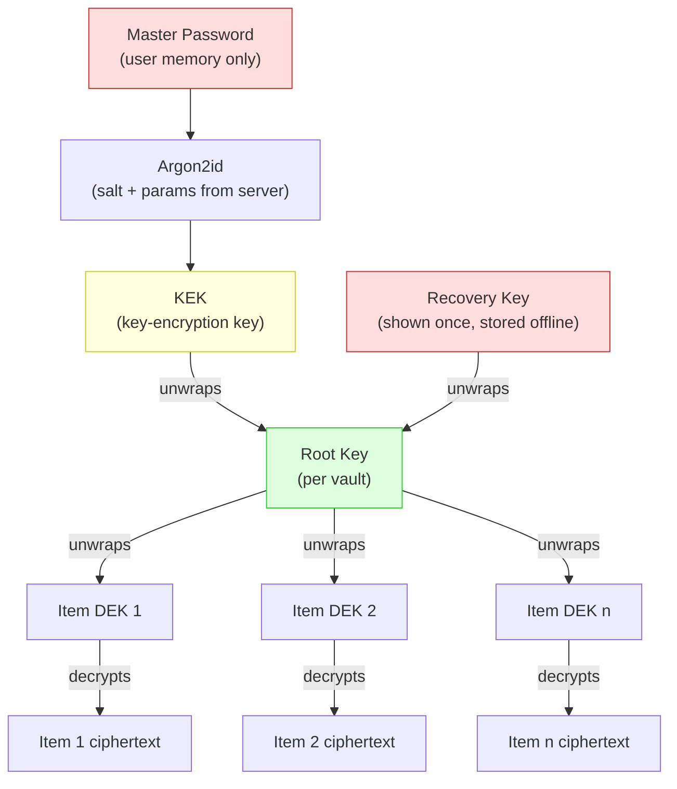
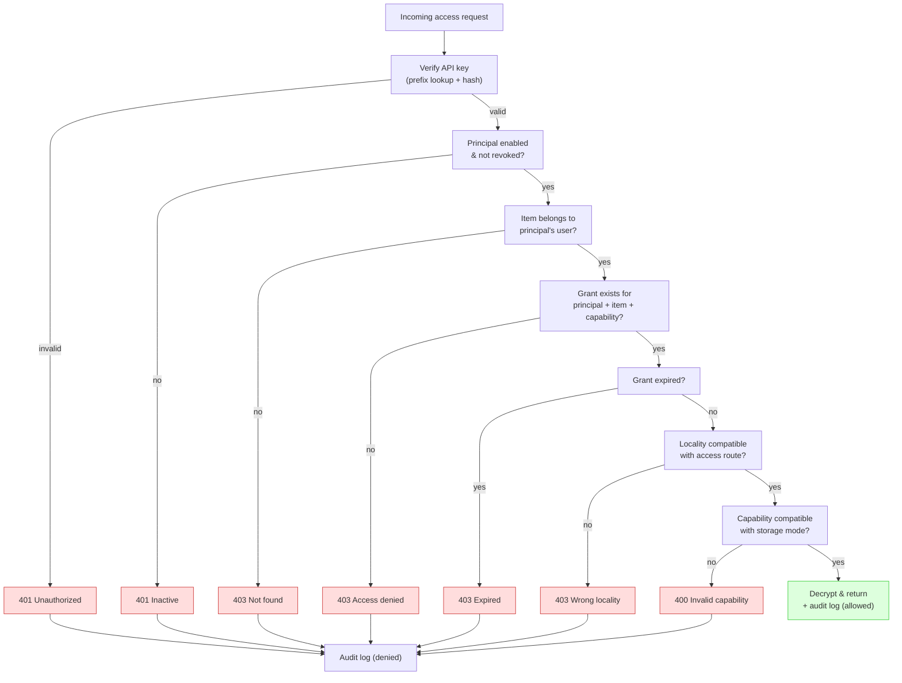
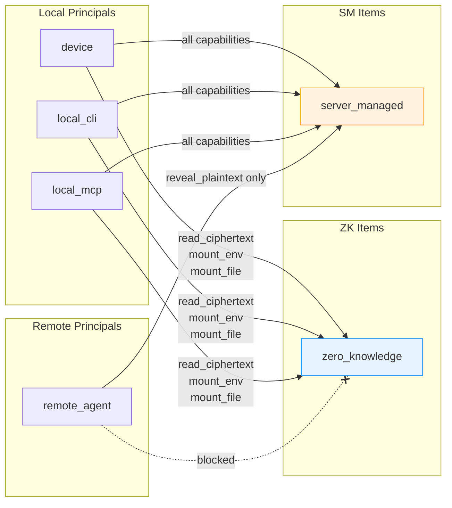
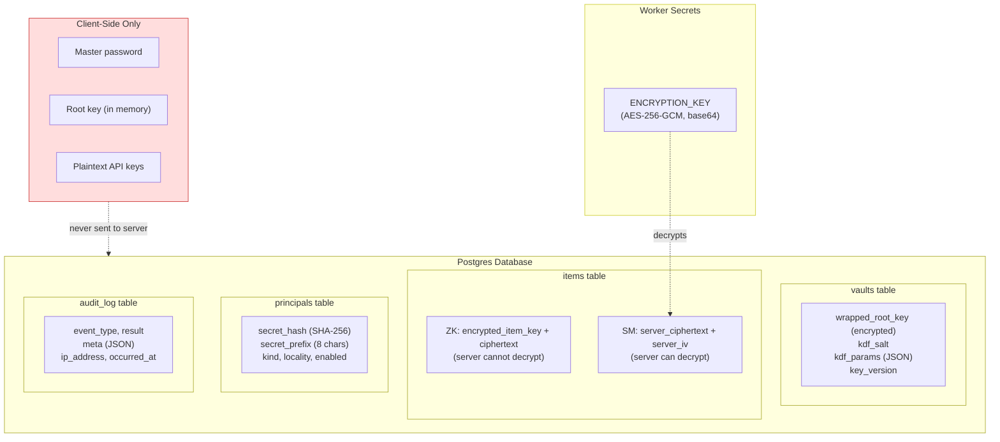

# Security Model

## Core principle

Abadge is an access control plane around credentials. Agents should be able to use credentials
without defaulting to plaintext exposure or broad standing vault access.

The system supports two storage modes: zero-knowledge (client-side encryption, server never sees
plaintext) and server-managed (server-side encryption for remote agent access).

## Encryption

### Zero-knowledge items (default)

* **Key derivation**: Argon2id (65536 KiB memory, 3 iterations, 1 parallelism)
* **Key wrapping**: XChaCha20-Poly1305 (root key wraps per-item DEKs)
* **Content encryption**: XChaCha20-Poly1305 (per-item DEK encrypts payload)
* **Server stores**: wrapped root key, KDF salt, KDF params, wrapped item DEKs, ciphertext
* **Server never stores**: plaintext root key, plaintext item DEKs, plaintext item values

Key hierarchy:

### Server-managed items (opt-in)

* **Algorithm**: AES-256-GCM (via Web Crypto API)
* **IV**: 12 random bytes per item, stored alongside ciphertext (base64-encoded)
* **Key**: Base64-encoded 32-byte key, stored in Cloudflare Worker Secrets (never in DB or code)
* **Decryption**: Only in the API worker, only after all authorization checks pass

Generate a key: `openssl rand -base64 32`

## Item lifecycle

### Zero-knowledge

1. User enters master password in browser or daemon
2. Client derives KEK via Argon2id, unwraps root key
3. Client generates random per-item DEK, encrypts payload
4. Client wraps DEK with root key
5. Wrapped DEK + ciphertext sent to server for storage
6. Plaintext never leaves the client

### Server-managed

1. User submits plaintext value via dashboard or CLI
2. API encrypts with AES-256-GCM using a random 12-byte IV
3. Ciphertext + IV stored in Postgres (base64-encoded)
4. Plaintext exists only in API worker memory during encrypt/decrypt
5. Decryption happens only for authorized access requests

## Principal authentication

### API keys

* Generated at principal registration (32 random bytes + prefix)
* SHA-256 hashed before storage
* Only the hash + 8-char prefix stored in DB
* Full key shown once to user, never retrievable again
* Prefix: `abg_` (remote agents) or `abl_` (local principals)
* Lookup: prefix-based candidate search (8, 6, 4 chars), then constant-time hash verification

### Key verification

Constant-time comparison: hash the candidate, check lengths match, XOR byte-by-byte. Prevents
timing attacks on API key validation.

## Authorization checks (per access request)

All checks are evaluated before any decryption occurs:

1. **Principal identity**: valid API key, principal enabled, not revoked
2. **Item ownership**: item must belong to the principal's registering user
3. **Grant existence**: explicit grant must exist for this principal-item-capability tuple
4. **Grant expiry**: grant must not be expired
5. **Locality check**: access route must be compatible with principal's locality
6. **Capability matrix**: capability must be compatible with item's storage mode

## Capability matrix enforcement

| Principal Locality | Item Storage Mode | Allowed Capabilities |
|-------------------|-------------------|---------------------|
| local | zero\_knowledge | `read_ciphertext`, `mount_env`, `mount_file` |
| local | server\_managed | `read_ciphertext`, `reveal_plaintext`, `mount_env`, `mount_file` |
| remote | zero\_knowledge | None (blocked at grant creation) |
| remote | server\_managed | `reveal_plaintext` only |

Grant creation validates this matrix. Access routes enforce locality and storage mode checks.

## Audit trail

Every access attempt is logged immutably with:

* User ID (indexed)
* Principal ID (indexed, nullable)
* Item ID (indexed, nullable)
* Event type (vault, item, principal, grant, or access event)
* Result (`allowed`, `denied`, `expired`, `revoked`)
* Delivery mode (nullable)
* Metadata (JSON, context-dependent)
* IP address (from cf-connecting-ip header)
* Timestamp (`occurredAt`)

Audit records have no foreign key constraints -- they persist after item or principal deletion.
The audit\_log table is append-only.

## Rate limiting

| Path pattern | Limit |
|-------------|-------|
| `/api/auth/*` | 60 requests per 60 seconds |
| `/v1/*` | 100 requests per 60 seconds |

## Transport security

* Secure headers applied via Hono middleware on all responses
* CORS configured with explicit trusted origins (API\_URL and APP\_URL)
* Credentials (cookies) allowed in cross-origin requests

## Data at rest overview

## What the server stores

| Data | Storage form |
|------|-------------|
| ZK item values | Client-encrypted ciphertext (server cannot decrypt) |
| ZK item DEKs | Wrapped by root key (server cannot unwrap) |
| Vault root keys | Wrapped by master password (server cannot unwrap) |
| Server-managed item values | AES-256-GCM ciphertext + IV |
| API keys | SHA-256 hash + 8-char prefix |
| User passwords | Managed by Better Auth (bcrypt) |
| Access logs | Plaintext (immutable, no secrets) |

## What the server never stores

* Plaintext item values (for either storage mode)
* Plaintext API keys
* Plaintext vault root keys or item DEKs
* Master passwords
* The server encryption key (lives in Worker Secrets only)

## What is NOT in scope for v1

* Hardware security modules (HSM/KMS integration)
* Multi-party approval workflows
* Dynamic database credentials
* Confidential computing / TEE
* Organization-level vault cryptography
* External vault connectors (deferred from MVP)
* Auto-grant rules (deferred from MVP)
* Policy engine with rule evaluation (deferred from MVP)
