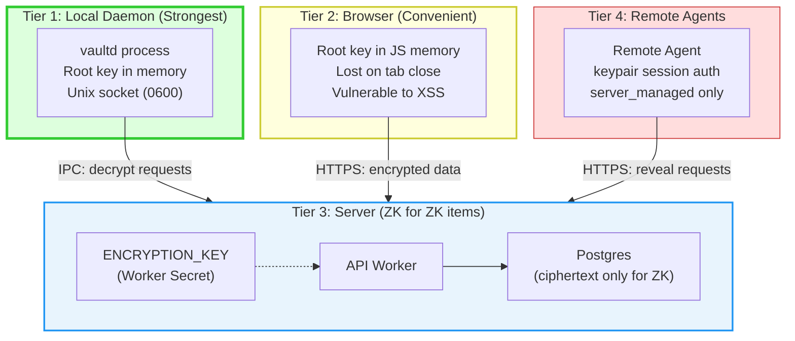
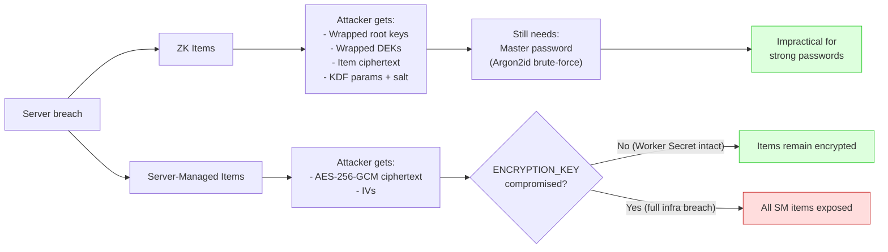

# Threat Model

## Trust Boundary Overview

## Trust Boundaries

### Tier 1: Local Daemon (Strongest)

The local daemon (`vaultd`) is the primary trust boundary for zero-knowledge operations.

**What it protects:**
- Unlocked root key (held in memory only)
- Per-item DEK decryption
- Secret injection into subprocesses

**Attack surface:**
- Unix domain socket (mitigated: file permissions 0o600, owner-only, inside a 0o700 directory)
- Process memory (mitigated: 15-minute inactivity auto-lock that zeroes key buffers via `zeroKey` / `Uint8Array.fill(0)`; best-effort only — the JS runtime does not guarantee the bytes are erased from every copy)
- Swap/core dumps (not mitigated: abadge does not `mlock` key pages)

**Honest limitation:** A local attacker with root/sudo access can read process memory. The daemon protects against network attackers and server compromise, not local root compromise.

### Tier 2: Browser (Convenient)

The browser holds the derived root key in JavaScript memory for the session.

**Additional attack surface beyond daemon:**
- XSS: If achieved, attacker can steal the unlocked root key. **Catastrophic.**
- Malicious JS bundle: If the server ships compromised code, it can exfiltrate the key.
- Browser extensions: Can read page memory.
- Tab persistence: Key lost on tab close (no localStorage/IndexedDB persistence).

**Honest limitation:** The browser is a convenience surface. Users who need the strongest guarantees should use the CLI + daemon.

### Tier 3: Server (Zero Knowledge for ZK Items)

The server stores only ciphertext, wrapped keys, salts, and KDF parameters for ZK items.

**What the server cannot do:**
- Decrypt ZK item ciphertext
- Derive the user's root key or KEK
- Recover a vault without the master password or recovery key

**What the server can do:**
- Decrypt `server_managed` items (by design)
- See item IDs, storage modes, timestamps, and sizes for all items
- Delete or corrupt ciphertext (availability attack, not confidentiality)
- Serve malicious JS to browser clients (see Tier 2)
- Observe access patterns (which agents access which items, when)

**What a full server breach exposes:**
- All `server_managed` item plaintext
- ZK item ciphertext (useless without root keys)
- Wrapped root keys (useless without master passwords)
- KDF parameters (enables offline brute-force of weak master passwords)
- Access patterns and audit metadata

### Tier 4: Remote Agents

Remote agents (hosted agents, cloud workers) authenticate with short-lived Ed25519 keypair sessions (`abs_`) and can only access `server_managed` items with `reveal_plaintext` permissions.

**What a compromised remote agent exposes:**
- Only the `server_managed` items it has permissions for
- Only until the permission expires or is revoked

**What it cannot access:**
- Any ZK item (no decryption capability)
- Any item it doesn't have a permission for

## Key Threats and Mitigations

| Threat | Mitigation |
|--------|-----------|
| Server breach | ZK items remain encrypted. Server-managed items exposed. |
| Weak master password | Argon2id with 64 MiB memory makes brute-force expensive. The dashboard enforces a 12-character minimum and shows a strength meter; there is no hard server-side entropy gate. |
| Lost master password | Recovery key (shown once, user stores offline). No server-side recovery. |
| XSS in browser | Root key in JS memory only, lost on tab close (no `localStorage`/`IndexedDB`). Hono `secureHeaders()` sets baseline hardening headers. Prefer CLI + daemon for high-security ops. |
| Compromised remote agent | Scoped permissions with expiry. Cannot access ZK items. Audit trail. |
| Local attacker with root | Out of scope for v1. Daemon provides defense-in-depth, not a guarantee. |
| Metadata leakage | ZK item metadata encrypted inside ciphertext. Server sees only IDs + timestamps + storage mode. |
| Key rotation failure | Per-item DEKs: rotation rewraps DEKs, doesn't re-encrypt content. Atomic transaction. |
| Nonce reuse | XChaCha20-Poly1305 uses 192-bit random nonces. Collision probability negligible. |

### Server breach impact by storage mode

## Explicit Non-Goals for v1

- Protection against local root/admin attackers
- Hardware security module (HSM) integration
- Secure multi-party computation for shared secrets
- Organization-level vault cryptography
- Tamper-evident audit log chaining
- Protection against a compromised build/deploy pipeline serving malicious JS
