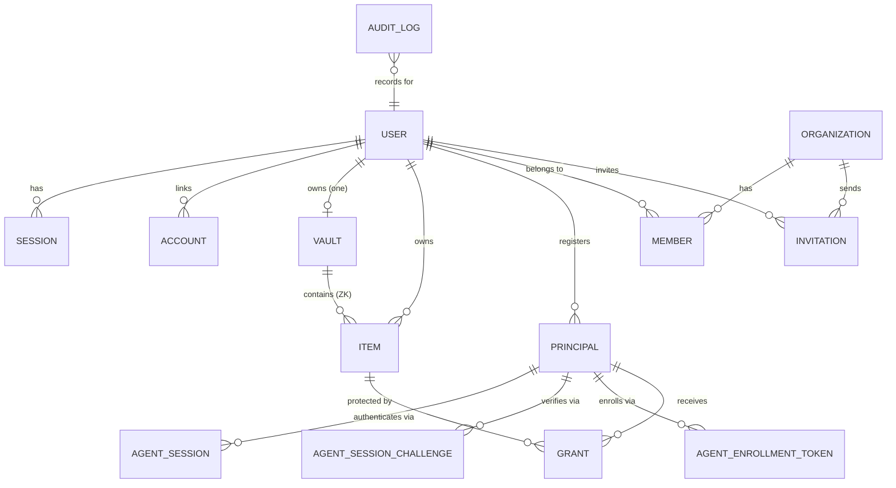
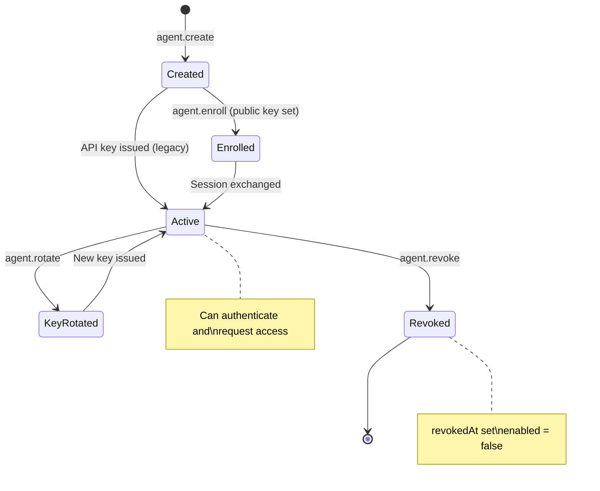
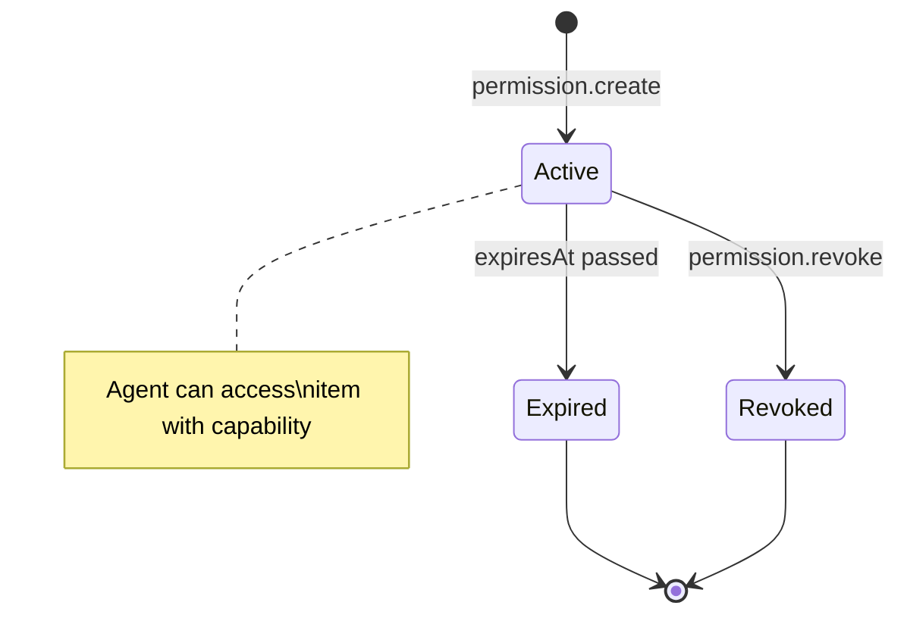

# Entities & Data Model

Complete reference for all database entities, relationships, and data lifecycle in abadge.

---

## Entity Relationship Diagram



---

## Core Entities

### User

The root identity. Every resource in abadge belongs to a user.

| Column | Type | Constraints | Description |
|---|---|---|---|
| `id` | text | PK | Unique user ID |
| `name` | text | NOT NULL | Display name |
| `email` | text | NOT NULL, UNIQUE | Login email |
| `emailVerified` | boolean | NOT NULL, default `false` | Email verification status |
| `image` | text | nullable | Avatar URL |
| `createdAt` | timestamptz | NOT NULL, default `now()` | Account creation |
| `updatedAt` | timestamptz | NOT NULL, default `now()` | Last update |

---

### Vault

One per user. Stores the wrapped root key for zero-knowledge encryption. The server never has the plaintext root key.

| Column | Type | Constraints | Description |
|---|---|---|---|
| `id` | text | PK | Vault ID |
| `userId` | text | FK → user, UNIQUE | Owner (one vault per user) |
| `wrappedRootKey` | text | NOT NULL | Root key encrypted by KEK (XChaCha20-Poly1305) |
| `kdfSalt` | text | NOT NULL | Argon2id salt (16 bytes, base64) |
| `kdfParams` | jsonb | NOT NULL | `{algorithm, memory, iterations, parallelism, hashLength}` |
| `recoveryWrappedRootKey` | text | nullable | Root key encrypted by recovery key |
| `keyVersion` | integer | NOT NULL, default `1` | Incremented on root key rotation |
| `createdAt` | timestamptz | NOT NULL | Creation time |
| `updatedAt` | timestamptz | NOT NULL | Last update |

**Key derivation**: Master password + salt → Argon2id (64 MiB, 3 iterations) → KEK → unwraps root key.

---

### Item

A stored secret. Supports two storage modes with different encryption schemes.

| Column | Type | Constraints | Description |
|---|---|---|---|
| `id` | text | PK | Item ID |
| `userId` | text | FK → user, NOT NULL | Owner |
| `vaultId` | text | FK → vault, nullable | Vault (ZK items only) |
| `storageMode` | text | NOT NULL | `zero_knowledge` or `server_managed` |
| `encryptedItemKey` | text | nullable | DEK wrapped by root key (ZK only) |
| `keyNonce` | text | nullable | Nonce for key wrapping (ZK only) |
| `ciphertext` | text | nullable | Payload encrypted by DEK (ZK only) |
| `contentNonce` | text | nullable | Nonce for content encryption (ZK only) |
| `serverCiphertext` | text | nullable | AES-256-GCM ciphertext (server-managed only) |
| `serverIv` | text | nullable | 12-byte IV (server-managed only) |
| `serverKeyVersion` | integer | nullable | Encryption key version (server-managed only) |
| `cryptoVersion` | integer | NOT NULL, default `1` | Envelope format version |
| `contentVersion` | integer | NOT NULL, default `1` | Optimistic concurrency counter |
| `createdAt` | timestamptz | NOT NULL | Creation time |
| `updatedAt` | timestamptz | NOT NULL | Last update |
| `deletedAt` | timestamptz | nullable | Soft-delete timestamp |

**Item kinds**: `login`, `api_key`, `token`, `json`, `certificate`, `ssh_key`, `opaque`

**Plaintext envelope** (what gets encrypted):
```json
{
  "v": 1,
  "label": "prod postgres",
  "kind": "login",
  "tags": ["prod", "db"],
  "notes": "Primary production database",
  "fields": { "host": "db.example.com", "password": "s3cret" }
}
```

---

### Principal (Agent)

An agent identity that can request access to items.

| Column | Type | Constraints | Description |
|---|---|---|---|
| `id` | text | PK | Agent ID |
| `userId` | text | FK → user, NOT NULL | Owner |
| `kind` | text | NOT NULL | `local_cli`, `local_mcp`, `remote` |
| `locality` | text | NOT NULL | `local` or `remote` (derived from kind) |
| `authMethod` | text | NOT NULL | `public_key_session` or `legacy_api_key` |
| `name` | text | NOT NULL | Human-readable name |
| `secretHash` | text | nullable | SHA-256 hash of API key (legacy auth) |
| `secretPrefix` | text | nullable | First 4-8 chars for fast lookup |
| `publicKey` | text | nullable | Ed25519 public key (session auth) |
| `enabled` | boolean | NOT NULL, default `true` | Whether agent can authenticate |
| `revokedAt` | timestamptz | nullable | Revocation timestamp |
| `lastUsedAt` | timestamptz | nullable | Last successful auth |
| `metadata` | jsonb | NOT NULL, default `{}` | Arbitrary metadata |
| `createdAt` | timestamptz | NOT NULL | Creation time |

**Locality mapping**:
- `local_cli`, `local_mcp` → `local`
- `remote` → `remote`

---

### Grant (Permission)

Links a principal to an item with a specific capability.

| Column | Type | Constraints | Description |
|---|---|---|---|
| `id` | text | PK | Grant ID |
| `principalId` | text | FK → principal, NOT NULL | Agent receiving access |
| `itemId` | text | FK → item, NOT NULL | Item being accessed |
| `capability` | text | NOT NULL | Access type (see below) |
| `expiresAt` | timestamptz | nullable | Auto-expiration |
| `grantedBy` | text | FK → user, NOT NULL | User who created the grant |
| `createdAt` | timestamptz | NOT NULL | Creation time |

**Unique constraint**: `(principalId, itemId, capability)` -- one grant per agent-item-capability triple.

**Capabilities**:

| Capability | Description | Local | Remote |
|---|---|---|---|
| `read_ciphertext` | Download encrypted blob | ZK items only | Never |
| `reveal_plaintext` | Decrypt and return value | Server-managed | Server-managed |
| `mount_env` | Inject as environment variable | Both modes | Never |
| `mount_file` | Write to temp file (0600) | Both modes | Never |

---

### Agent Session

Short-lived authentication token for agents using public-key auth.

| Column | Type | Constraints | Description |
|---|---|---|---|
| `id` | text | PK | Session ID |
| `agentId` | text | FK → principal, NOT NULL | Agent this session belongs to |
| `userId` | text | FK → user, NOT NULL | Agent's owner |
| `tokenHash` | text | NOT NULL, UNIQUE | SHA-256 hash of `abs_...` token |
| `expiresAt` | timestamptz | NOT NULL | Expiration (default: 15 minutes) |
| `revokedAt` | timestamptz | nullable | Revocation timestamp |
| `lastUsedAt` | timestamptz | nullable | Last use |
| `createdAt` | timestamptz | NOT NULL | Creation time |

---

### Agent Session Challenge

One-time challenge for agent session exchange (Ed25519 signature verification).

| Column | Type | Constraints | Description |
|---|---|---|---|
| `id` | text | PK | Challenge ID |
| `agentId` | text | FK → principal, NOT NULL | Target agent |
| `challengeHash` | text | NOT NULL, UNIQUE | SHA-256 hash of challenge |
| `expiresAt` | timestamptz | NOT NULL | Expiration (1 minute) |
| `usedAt` | timestamptz | nullable | When used |
| `createdAt` | timestamptz | NOT NULL | Creation time |

---

### Agent Enrollment Token

One-time bootstrap token for agent enrollment (public key registration).

| Column | Type | Constraints | Description |
|---|---|---|---|
| `id` | text | PK | Token ID |
| `agentId` | text | FK → principal, NOT NULL | Target agent |
| `userId` | text | FK → user, NOT NULL | Agent's owner |
| `createdBy` | text | FK → user, NOT NULL | Issuer |
| `tokenHash` | text | NOT NULL, UNIQUE | SHA-256 hash of `abe_...` token |
| `expiresAt` | timestamptz | NOT NULL | Expiration (10 minutes) |
| `usedAt` | timestamptz | nullable | When used |
| `createdAt` | timestamptz | NOT NULL | Creation time |

---

### Audit Log

Append-only record of every significant event. No foreign key constraints -- audit entries survive entity deletion.

| Column | Type | Constraints | Description |
|---|---|---|---|
| `id` | bigserial | PK | Auto-incrementing ID |
| `userId` | text | NOT NULL | User context |
| `principalId` | text | nullable | Agent involved (if any) |
| `itemId` | text | nullable | Item involved (if any) |
| `eventType` | text | NOT NULL | Event category (see below) |
| `result` | text | NOT NULL | `allowed`, `denied`, `expired`, `revoked` |
| `deliveryMode` | text | nullable | How the secret was delivered |
| `meta` | jsonb | NOT NULL, default `{}` | Structured metadata |
| `ipAddress` | text | nullable | Client IP |
| `occurredAt` | timestamptz | NOT NULL, default `now()` | Event timestamp |

**Event types**:

| Category | Events |
|---|---|
| Profile | `profile.create`, `profile.rotate`, `profile.delete`, `profile.delete_cascade` |
| Item | `item.create`, `item.export`, `item.update`, `item.delete`, `item.delete_cascade` |
| Auth | `auth.login`, `auth.logout`, `auth.token_issue`, `auth.token_revoke` |
| Agent | `agent.create`, `agent.bootstrap_issue`, `agent.enroll`, `agent.rotate`, `agent.revoke`, `agent.revoke_cascade`, `agent.session_issue`, `agent.session_reject`, `agent.session_revoke` |
| Permission | `permission.create`, `permission.revoke`, `permission.revoke_cascade` |
| Access | `access.ciphertext`, `access.reveal`, `access.mount_env`, `access.mount_file` |

---

## Auth & Organization Entities

### Session (Better Auth)

| Column | Type | Description |
|---|---|---|
| `id` | text | PK |
| `token` | text | UNIQUE session token |
| `expiresAt` | timestamptz | Session expiration (7 days) |
| `userId` | text | FK → user |
| `ipAddress` | text | Client IP |
| `userAgent` | text | Browser user agent |
| `activeOrganizationId` | text | Active org context |

### Account (OAuth)

| Column | Type | Description |
|---|---|---|
| `id` | text | PK |
| `accountId` | text | Provider account ID |
| `providerId` | text | `google`, `github`, `credential` |
| `userId` | text | FK → user |
| `accessToken` | text | OAuth access token |
| `refreshToken` | text | OAuth refresh token |
| `password` | text | Hashed password (credential provider) |

### Organization

| Column | Type | Description |
|---|---|---|
| `id` | text | PK |
| `name` | text | Org name |
| `slug` | text | UNIQUE URL slug |
| `metadata` | text | Arbitrary metadata |

### Member

| Column | Type | Description |
|---|---|---|
| `id` | text | PK |
| `organizationId` | text | FK → organization |
| `userId` | text | FK → user |
| `role` | text | `owner` or `member` |

### Device Code

| Column | Type | Description |
|---|---|---|
| `id` | text | PK |
| `deviceCode` | text | UNIQUE device code |
| `userCode` | text | UNIQUE user-facing code |
| `userId` | text | FK → user (set after approval) |
| `status` | text | `pending`, `approved`, `denied` |
| `expiresAt` | timestamptz | Code expiration |

---

## Indexes

| Table | Index | Columns | Type |
|---|---|---|---|
| `vaults` | `vaults_user_id_idx` | userId | UNIQUE |
| `items` | `items_user_id_idx` | userId | Regular |
| `items` | `items_vault_id_idx` | vaultId | Regular |
| `principals` | `principals_user_id_idx` | userId | Regular |
| `principals` | `principals_secret_prefix_idx` | secretPrefix | Regular |
| `grants` | `grants_unique_idx` | principalId, itemId, capability | UNIQUE |
| `grants` | `grants_principal_id_idx` | principalId | Regular |
| `grants` | `grants_item_id_idx` | itemId | Regular |
| `agentSessions` | `agent_sessions_token_hash_idx` | tokenHash | UNIQUE |
| `agentSessions` | `agent_sessions_agent_id_idx` | agentId | Regular |
| `agentSessions` | `agent_sessions_expires_at_idx` | expiresAt | Regular |
| `agentSessionChallenges` | `agent_session_challenges_hash_idx` | challengeHash | UNIQUE |
| `agentEnrollmentTokens` | `agent_enrollment_tokens_token_hash_idx` | tokenHash | UNIQUE |
| `auditLog` | `audit_log_user_id_idx` | userId | Regular |
| `auditLog` | `audit_log_principal_id_idx` | principalId | Regular |
| `auditLog` | `audit_log_item_id_idx` | itemId | Regular |
| `auditLog` | `audit_log_occurred_at_idx` | occurredAt | Regular |
| `organization` | `idx_organization_slug` | slug | Regular |

---

## Token & Prefix Reference

| Token | Prefix | TTL | Storage | Purpose |
|---|---|---|---|---|
| Agent session | `abs_` | 15 minutes | SHA-256 hash | Short-lived access token |
| Bootstrap token | `abe_` | 10 minutes | SHA-256 hash | One-time agent enrollment |
| Challenge | `abc_` | 1 minute | SHA-256 hash | Signature verification |
| Local API key | `abl_` | None | SHA-256 hash + prefix | Legacy local agent auth |
| Remote API key | `abg_` | None | SHA-256 hash + prefix | Legacy remote agent auth |

---

## Data Lifecycle

### Item Lifecycle

```mermaid
stateDiagram-v2
  [*] --> Created: item.create
  Created --> Updated: item.update
  Updated --> Updated: item.update (contentVersion++)
  Updated --> SoftDeleted: item.delete
  Created --> SoftDeleted: item.delete
  SoftDeleted --> [*]

  note right of Created: ZK: ciphertext stored\nSM: AES-256-GCM encrypted
  note right of SoftDeleted: deletedAt set\nData retained
```

### Agent Lifecycle



### Permission Lifecycle


