# Workflows & Flows

Visual guide to every major workflow in abadge, across all surfaces.

---

## System Overview

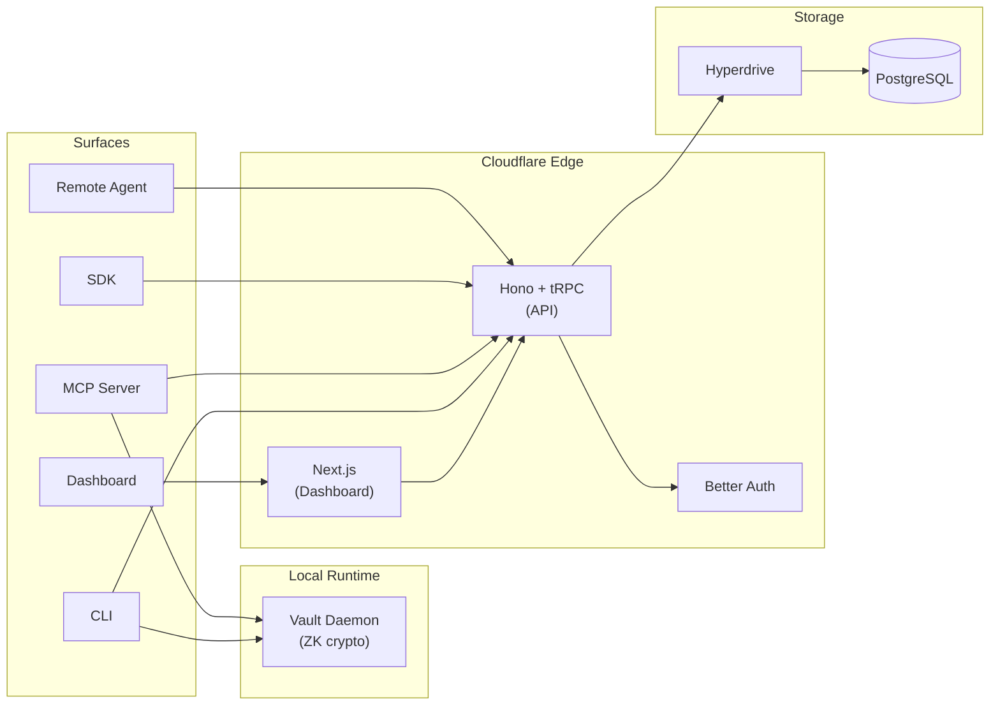
```mermaid
flowchart LR
  subgraph Clients["Surfaces"]
    Browser["Dashboard"]
    CLI["CLI"]
    MCP["MCP Server"]
    SDK["SDK"]
    Remote["Remote Agent"]
  end

  subgraph Local["Local Runtime"]
    Daemon["Vault Daemon\n(ZK crypto)"]
  end

  subgraph Edge["Cloudflare Edge"]
    Web["Next.js\n(Dashboard)"]
    API["Hono + tRPC\n(API)"]
    Auth["Better Auth"]
  end

  subgraph Data["Storage"]
    HD["Hyperdrive"]
    DB[(PostgreSQL)]
  end

  Browser --> Web --> API
  CLI --> API
  CLI --> Daemon
  MCP --> API
  MCP --> Daemon
  SDK --> API
  Remote --> API
  API --> Auth
  API --> HD --> DB
```

---

## User Authentication

### Dashboard Login

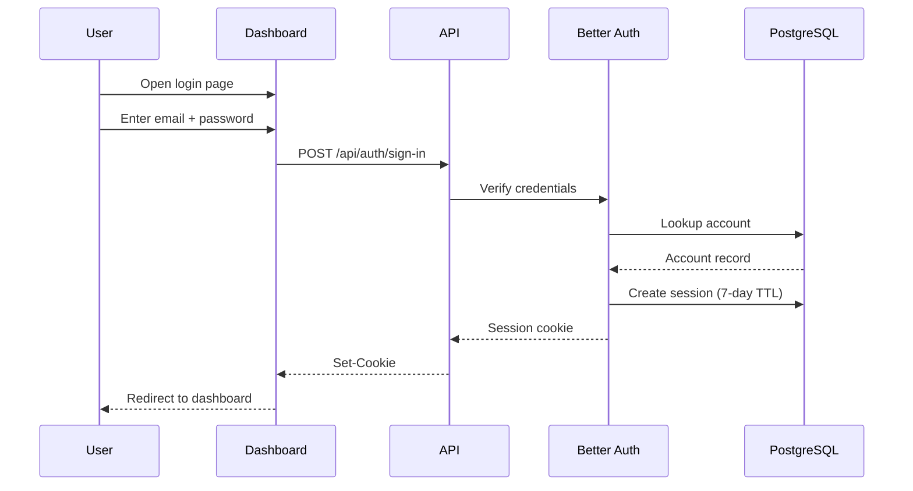
```mermaid
sequenceDiagram
  participant User as User
  participant Web as Dashboard
  participant API as API
  participant Auth as Better Auth
  participant DB as PostgreSQL

  User->>Web: Open login page
  User->>Web: Enter email + password
  Web->>API: POST /api/auth/sign-in
  API->>Auth: Verify credentials
  Auth->>DB: Lookup account
  DB-->>Auth: Account record
  Auth->>DB: Create session (7-day TTL)
  Auth-->>API: Session cookie
  API-->>Web: Set-Cookie
  Web-->>User: Redirect to dashboard
```

### CLI Device Authorization

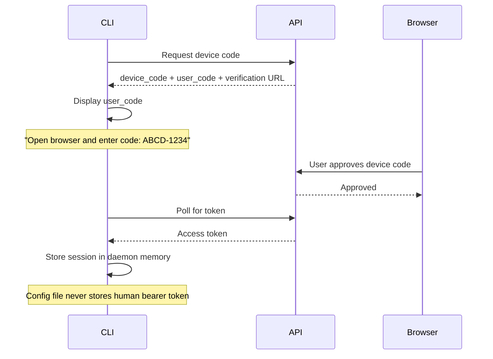
```mermaid
sequenceDiagram
  participant CLI as CLI
  participant API as API
  participant Browser as Browser

  CLI->>API: Request device code
  API-->>CLI: device_code + user_code + verification URL
  CLI->>CLI: Display user_code
  Note over CLI: "Open browser and enter code: ABCD-1234"
  Browser->>API: User approves device code
  API-->>Browser: Approved
  CLI->>API: Poll for token
  API-->>CLI: Access token
  CLI->>CLI: Store session in daemon memory
  Note over CLI: Config file never stores human bearer token
```

### Social Login (Google / GitHub)

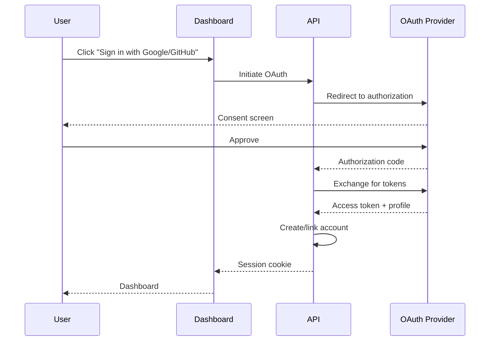
```mermaid
sequenceDiagram
  participant User as User
  participant Web as Dashboard
  participant API as API
  participant Provider as OAuth Provider

  User->>Web: Click "Sign in with Google/GitHub"
  Web->>API: Initiate OAuth
  API->>Provider: Redirect to authorization
  Provider-->>User: Consent screen
  User->>Provider: Approve
  Provider-->>API: Authorization code
  API->>Provider: Exchange for tokens
  Provider-->>API: Access token + profile
  API->>API: Create/link account
  API-->>Web: Session cookie
  Web-->>User: Dashboard
```

---

## Agent Lifecycle

### Agent Registration

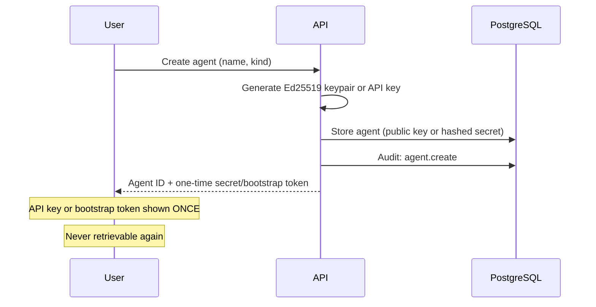
```mermaid
sequenceDiagram
  participant User as User
  participant API as API
  participant DB as PostgreSQL

  User->>API: Create agent (name, kind)
  API->>API: Generate Ed25519 keypair or API key
  API->>DB: Store agent (public key or hashed secret)
  API->>DB: Audit: agent.create
  API-->>User: Agent ID + one-time secret/bootstrap token

  Note over User: API key or bootstrap token shown ONCE
  Note over User: Never retrievable again
```

### Agent Enrollment (Public Key)

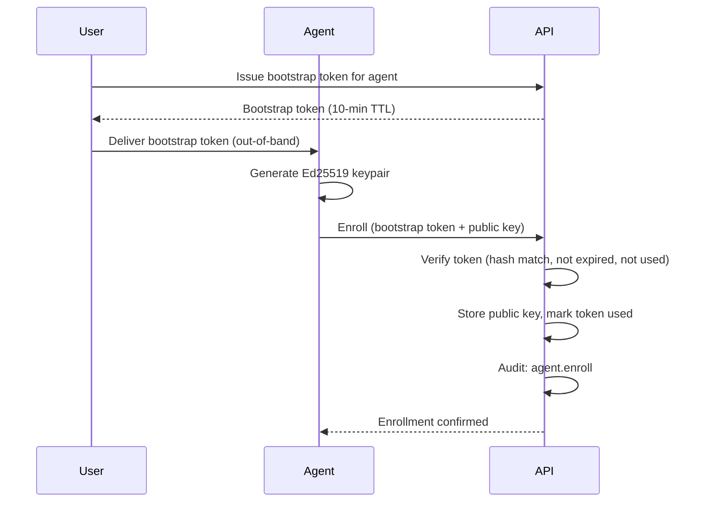
```mermaid
sequenceDiagram
  participant User as User
  participant Agent as Agent
  participant API as API

  User->>API: Issue bootstrap token for agent
  API-->>User: Bootstrap token (10-min TTL)
  User->>Agent: Deliver bootstrap token (out-of-band)

  Agent->>Agent: Generate Ed25519 keypair
  Agent->>API: Enroll (bootstrap token + public key)
  API->>API: Verify token (hash match, not expired, not used)
  API->>API: Store public key, mark token used
  API->>API: Audit: agent.enroll
  API-->>Agent: Enrollment confirmed
```

### Agent Session Exchange

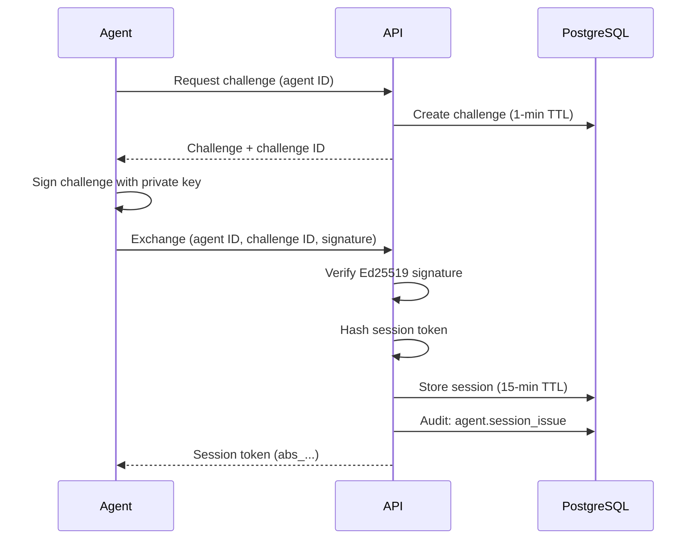
```mermaid
sequenceDiagram
  participant Agent as Agent
  participant API as API
  participant DB as PostgreSQL

  Agent->>API: Request challenge (agent ID)
  API->>DB: Create challenge (1-min TTL)
  API-->>Agent: Challenge + challenge ID

  Agent->>Agent: Sign challenge with private key
  Agent->>API: Exchange (agent ID, challenge ID, signature)
  API->>API: Verify Ed25519 signature
  API->>API: Hash session token
  API->>DB: Store session (15-min TTL)
  API->>DB: Audit: agent.session_issue
  API-->>Agent: Session token (abs_...)
```

---

## Vault & Item Management

### Zero-Knowledge Vault Bootstrap

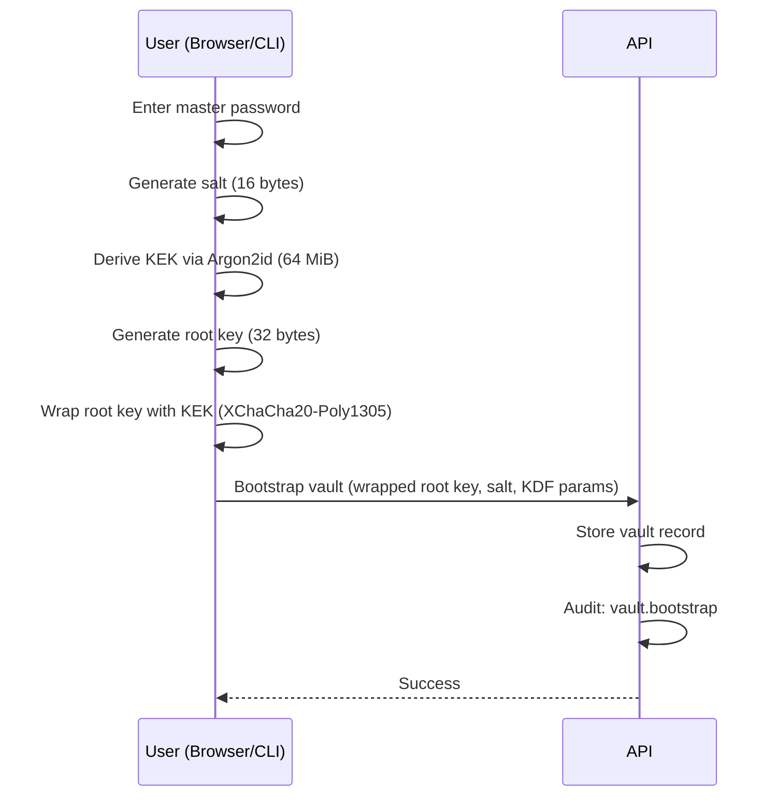
```mermaid
sequenceDiagram
  participant User as User (Browser/CLI)
  participant API as API

  User->>User: Enter master password
  User->>User: Generate salt (16 bytes)
  User->>User: Derive KEK via Argon2id (64 MiB)
  User->>User: Generate root key (32 bytes)
  User->>User: Wrap root key with KEK (XChaCha20-Poly1305)
  User->>API: Bootstrap vault (wrapped root key, salt, KDF params)
  API->>API: Store vault record
  API->>API: Audit: vault.bootstrap
  API-->>User: Success
```

### Creating a Zero-Knowledge Item

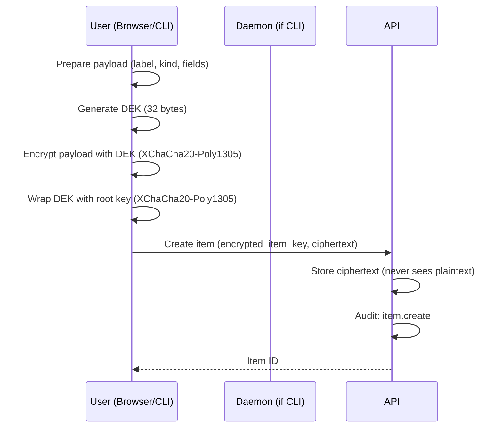
```mermaid
sequenceDiagram
  participant User as User (Browser/CLI)
  participant Daemon as Daemon (if CLI)
  participant API as API

  User->>User: Prepare payload (label, kind, fields)
  User->>User: Generate DEK (32 bytes)
  User->>User: Encrypt payload with DEK (XChaCha20-Poly1305)
  User->>User: Wrap DEK with root key (XChaCha20-Poly1305)
  User->>API: Create item (encrypted_item_key, ciphertext)
  API->>API: Store ciphertext (never sees plaintext)
  API->>API: Audit: item.create
  API-->>User: Item ID
```

### Creating a Server-Managed Item

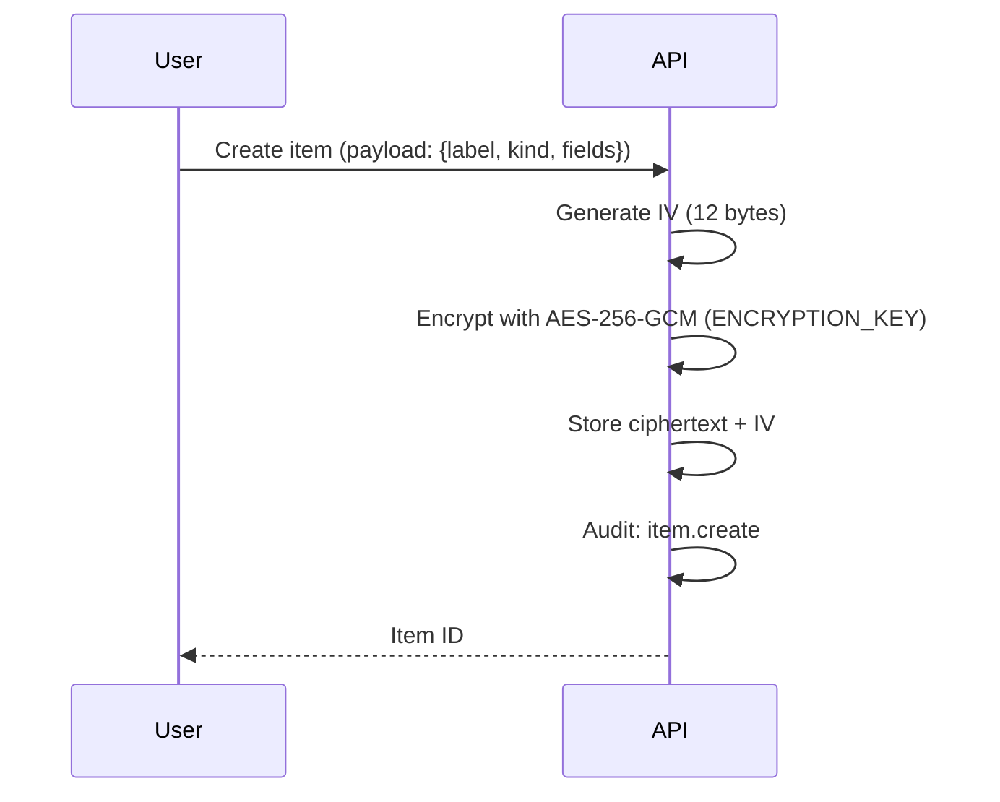
```mermaid
sequenceDiagram
  participant User as User
  participant API as API

  User->>API: Create item (payload: {label, kind, fields})
  API->>API: Generate IV (12 bytes)
  API->>API: Encrypt with AES-256-GCM (ENCRYPTION_KEY)
  API->>API: Store ciphertext + IV
  API->>API: Audit: item.create
  API-->>User: Item ID
```

### Key Rotation Flow

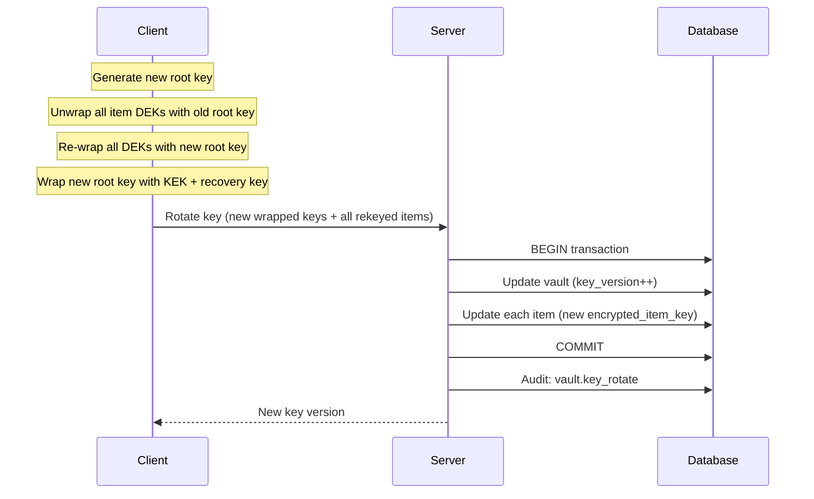
```mermaid
sequenceDiagram
  participant User as Client
  participant API as Server
  participant DB as Database

  Note over User: Generate new root key
  Note over User: Unwrap all item DEKs with old root key
  Note over User: Re-wrap all DEKs with new root key
  Note over User: Wrap new root key with KEK + recovery key

  User->>API: Rotate key (new wrapped keys + all rekeyed items)
  API->>DB: BEGIN transaction
  API->>DB: Update vault (key_version++)
  API->>DB: Update each item (new encrypted_item_key)
  API->>DB: COMMIT
  API->>DB: Audit: vault.key_rotate
  API-->>User: New key version
```

---

## Permission & Access Control

### Grant Permission

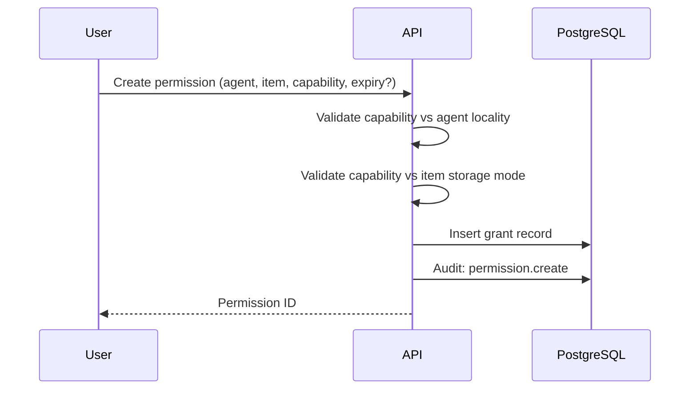
```mermaid
sequenceDiagram
  participant User as User
  participant API as API
  participant DB as PostgreSQL

  User->>API: Create permission (agent, item, capability, expiry?)
  API->>API: Validate capability vs agent locality
  API->>API: Validate capability vs item storage mode
  API->>DB: Insert grant record
  API->>DB: Audit: permission.create
  API-->>User: Permission ID
```

### Capability Matrix

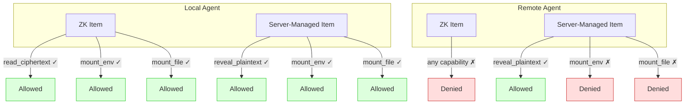
```mermaid
graph TD
  subgraph Local["Local Agent"]
    L_ZK["ZK Item"]
    L_SM["Server-Managed Item"]
  end

  subgraph Remote["Remote Agent"]
    R_ZK["ZK Item"]
    R_SM["Server-Managed Item"]
  end

  L_ZK -->|"read_ciphertext ✓"| OK1["Allowed"]
  L_ZK -->|"mount_env ✓"| OK2["Allowed"]
  L_ZK -->|"mount_file ✓"| OK3["Allowed"]

  L_SM -->|"reveal_plaintext ✓"| OK4["Allowed"]
  L_SM -->|"mount_env ✓"| OK5["Allowed"]
  L_SM -->|"mount_file ✓"| OK6["Allowed"]

  R_ZK -->|"any capability ✗"| DENY1["Denied"]
  R_SM -->|"reveal_plaintext ✓"| OK7["Allowed"]
  R_SM -->|"mount_env ✗"| DENY2["Denied"]
  R_SM -->|"mount_file ✗"| DENY3["Denied"]

  style DENY1 fill:#fdd,stroke:#c33
  style DENY2 fill:#fdd,stroke:#c33
  style DENY3 fill:#fdd,stroke:#c33
  style OK1 fill:#dfd,stroke:#3c3
  style OK2 fill:#dfd,stroke:#3c3
  style OK3 fill:#dfd,stroke:#3c3
  style OK4 fill:#dfd,stroke:#3c3
  style OK5 fill:#dfd,stroke:#3c3
  style OK6 fill:#dfd,stroke:#3c3
  style OK7 fill:#dfd,stroke:#3c3
```

---

## Agent Access Flows

### Full Access Decision Flow

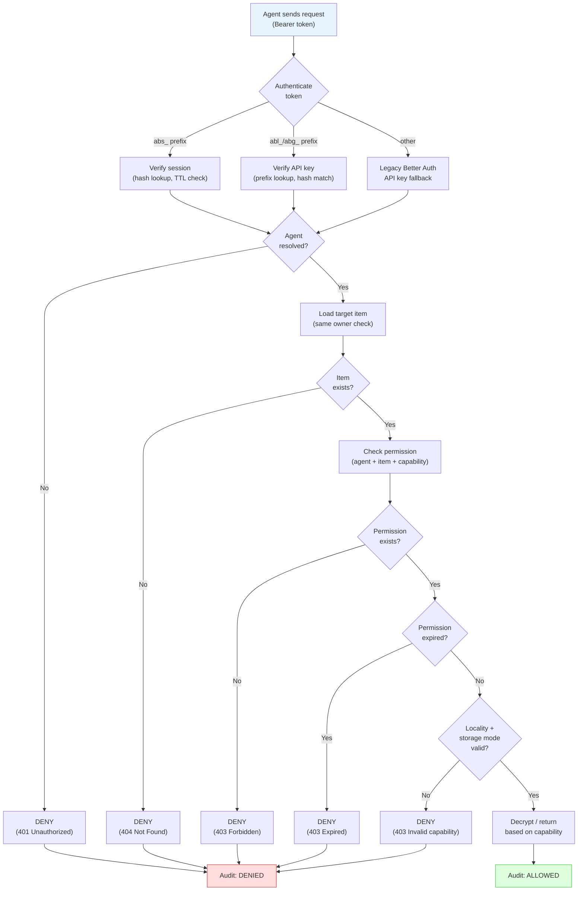
```mermaid
flowchart TD
  Start["Agent sends request\n(Bearer token)"] --> AuthCheck{"Authenticate\ntoken"}
  AuthCheck -->|"abs_ prefix"| SessionAuth["Verify session\n(hash lookup, TTL check)"]
  AuthCheck -->|"abl_/abg_ prefix"| KeyAuth["Verify API key\n(prefix lookup, hash match)"]
  AuthCheck -->|"other"| LegacyAuth["Legacy Better Auth\nAPI key fallback"]

  SessionAuth --> Resolved{"Agent\nresolved?"}
  KeyAuth --> Resolved
  LegacyAuth --> Resolved

  Resolved -->|No| Deny1["DENY\n(401 Unauthorized)"]
  Resolved -->|Yes| LoadItem["Load target item\n(same owner check)"]

  LoadItem --> ItemExists{"Item\nexists?"}
  ItemExists -->|No| Deny2["DENY\n(404 Not Found)"]
  ItemExists -->|Yes| PermCheck["Check permission\n(agent + item + capability)"]

  PermCheck --> HasPerm{"Permission\nexists?"}
  HasPerm -->|No| Deny3["DENY\n(403 Forbidden)"]
  HasPerm -->|Yes| Expired{"Permission\nexpired?"}

  Expired -->|Yes| Deny4["DENY\n(403 Expired)"]
  Expired -->|No| LocalityCheck{"Locality +\nstorage mode\nvalid?"}

  LocalityCheck -->|No| Deny5["DENY\n(403 Invalid capability)"]
  LocalityCheck -->|Yes| Decrypt["Decrypt / return\nbased on capability"]

  Decrypt --> AuditAllow["Audit: ALLOWED"]
  Deny1 --> AuditDeny["Audit: DENIED"]
  Deny2 --> AuditDeny
  Deny3 --> AuditDeny
  Deny4 --> AuditDeny
  Deny5 --> AuditDeny

  style Start fill:#e8f4fd
  style AuditAllow fill:#dfd,stroke:#3c3
  style AuditDeny fill:#fdd,stroke:#c33
```

### Environment Injection (CLI `run`)

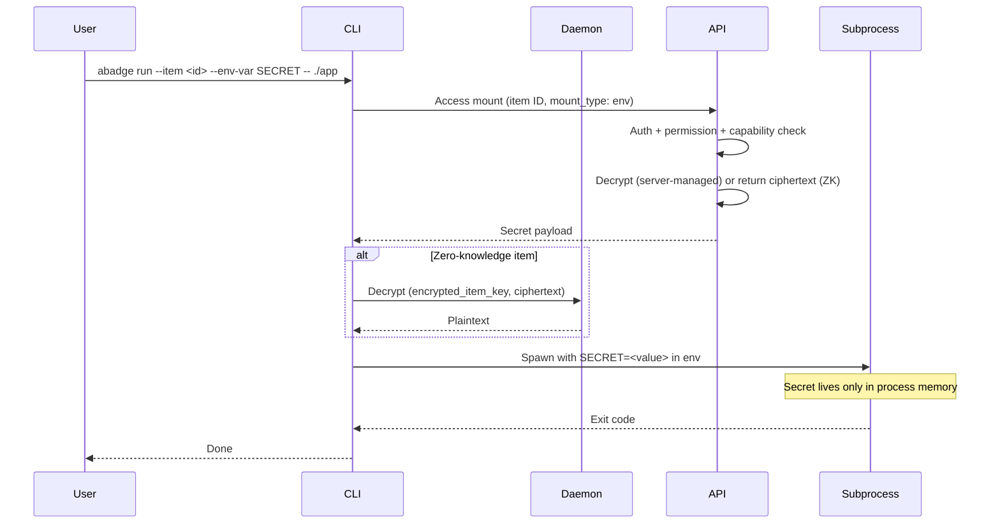
```mermaid
sequenceDiagram
  participant User as User
  participant CLI as CLI
  participant Daemon as Daemon
  participant API as API
  participant Proc as Subprocess

  User->>CLI: abadge run --item <id> --env-var SECRET -- ./app
  CLI->>API: Access mount (item ID, mount_type: env)
  API->>API: Auth + permission + capability check
  API->>API: Decrypt (server-managed) or return ciphertext (ZK)
  API-->>CLI: Secret payload
  alt Zero-knowledge item
    CLI->>Daemon: Decrypt (encrypted_item_key, ciphertext)
    Daemon-->>CLI: Plaintext
  end
  CLI->>Proc: Spawn with SECRET=<value> in env
  Note over Proc: Secret lives only in process memory
  Proc-->>CLI: Exit code
  CLI-->>User: Done
```

### File Mounting (CLI `mount`)

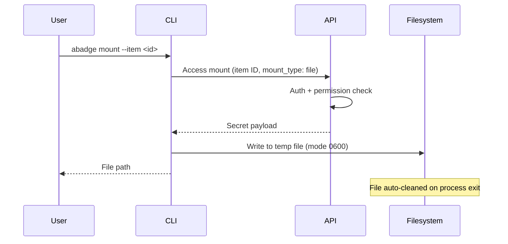
```mermaid
sequenceDiagram
  participant User as User
  participant CLI as CLI
  participant API as API
  participant FS as Filesystem

  User->>CLI: abadge mount --item <id>
  CLI->>API: Access mount (item ID, mount_type: file)
  API->>API: Auth + permission check
  API-->>CLI: Secret payload
  CLI->>FS: Write to temp file (mode 0600)
  CLI-->>User: File path
  Note over FS: File auto-cleaned on process exit
```

### MCP Tool Execution

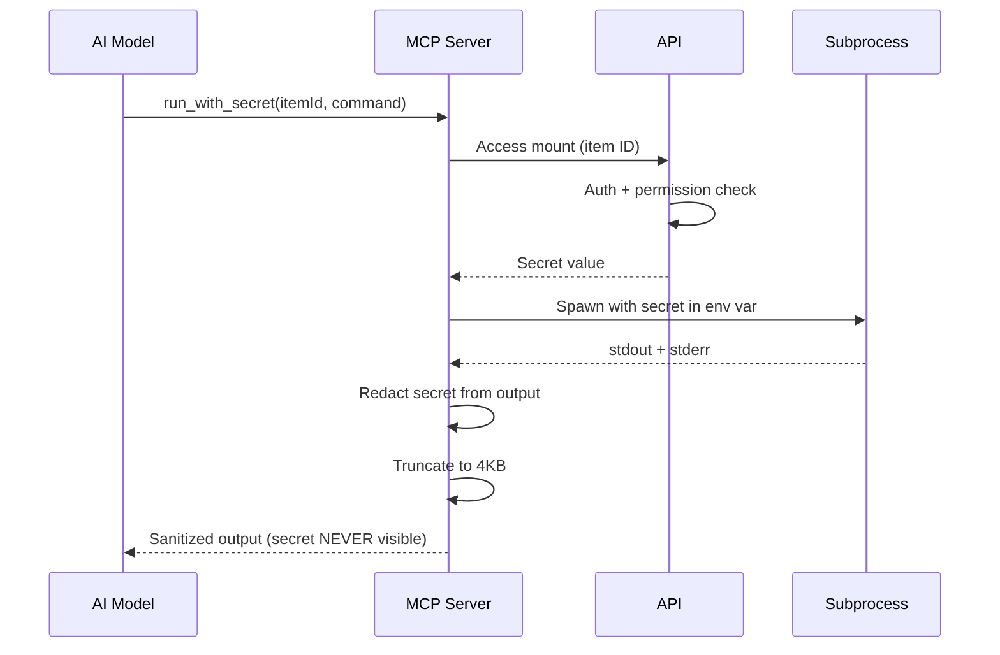
```mermaid
sequenceDiagram
  participant LLM as AI Model
  participant MCP as MCP Server
  participant API as API
  participant Proc as Subprocess

  LLM->>MCP: run_with_secret(itemId, command)
  MCP->>API: Access mount (item ID)
  API->>API: Auth + permission check
  API-->>MCP: Secret value
  MCP->>Proc: Spawn with secret in env var
  Proc-->>MCP: stdout + stderr
  MCP->>MCP: Redact secret from output
  MCP->>MCP: Truncate to 4KB
  MCP-->>LLM: Sanitized output (secret NEVER visible)
```

---

## Data Flow Diagram

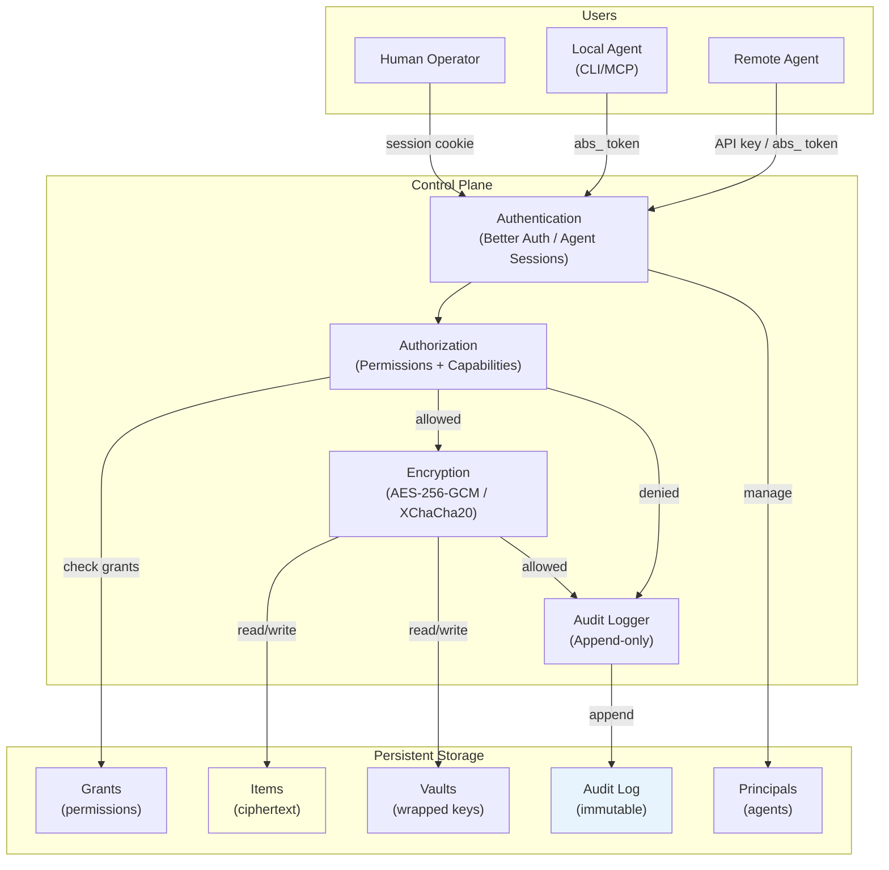
```mermaid
flowchart TB
  subgraph Users["Users"]
    Human["Human Operator"]
    LocalAgent["Local Agent\n(CLI/MCP)"]
    RemoteAgent["Remote Agent"]
  end

  subgraph ControlPlane["Control Plane"]
    AuthN["Authentication\n(Better Auth / Agent Sessions)"]
    AuthZ["Authorization\n(Permissions + Capabilities)"]
    Crypto["Encryption\n(AES-256-GCM / XChaCha20)"]
    Audit["Audit Logger\n(Append-only)"]
  end

  subgraph Storage["Persistent Storage"]
    Vaults["Vaults\n(wrapped keys)"]
    Items["Items\n(ciphertext)"]
    Grants["Grants\n(permissions)"]
    Principals["Principals\n(agents)"]
    AuditLog["Audit Log\n(immutable)"]
  end

  Human -->|"session cookie"| AuthN
  LocalAgent -->|"abs_ token"| AuthN
  RemoteAgent -->|"API key / abs_ token"| AuthN

  AuthN --> AuthZ
  AuthZ -->|"check grants"| Grants
  AuthZ -->|"allowed"| Crypto
  AuthZ -->|"denied"| Audit

  Crypto -->|"read/write"| Items
  Crypto -->|"read/write"| Vaults
  Crypto -->|"allowed"| Audit

  AuthN -->|"manage"| Principals

  Audit -->|"append"| AuditLog

  style AuditLog fill:#e8f4fd
  style Items fill:#ffd
```

---

## End-to-End Journey

### First-Time Setup

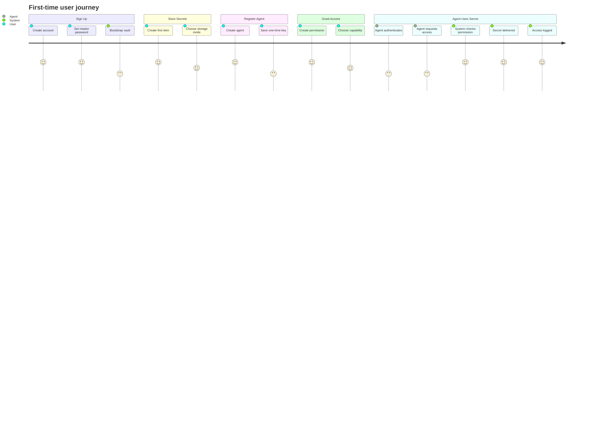
```mermaid
journey
  title First-time user journey
  section Sign Up
    Create account: 5: User
    Set master password: 5: User
    Bootstrap vault: 3: System
  section Store Secrets
    Create first item: 5: User
    Choose storage mode: 4: User
  section Register Agent
    Create agent: 5: User
    Save one-time key: 3: User
  section Grant Access
    Create permission: 5: User
    Choose capability: 4: User
  section Agent Uses Secret
    Agent authenticates: 3: Agent
    Agent requests access: 3: Agent
    System checks permission: 5: System
    Secret delivered: 5: System
    Access logged: 5: System
```

### Ongoing Operations

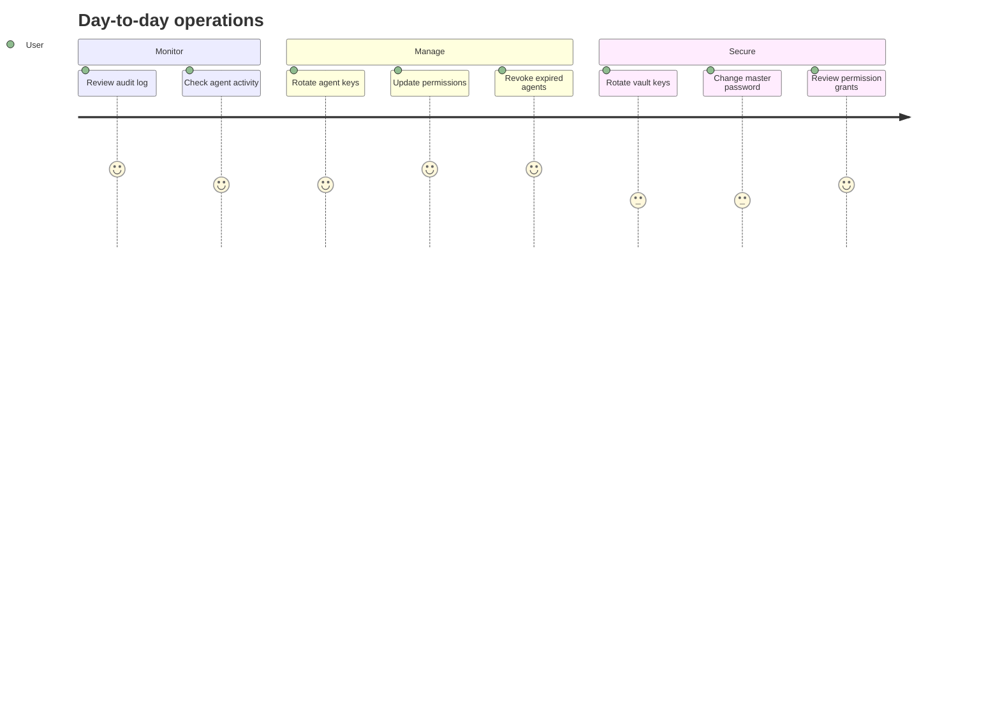
```mermaid
journey
  title Day-to-day operations
  section Monitor
    Review audit log: 5: User
    Check agent activity: 4: User
  section Manage
    Rotate agent keys: 4: User
    Update permissions: 5: User
    Revoke expired agents: 5: User
  section Secure
    Rotate vault keys: 3: User
    Change master password: 3: User
    Review permission grants: 4: User
```
