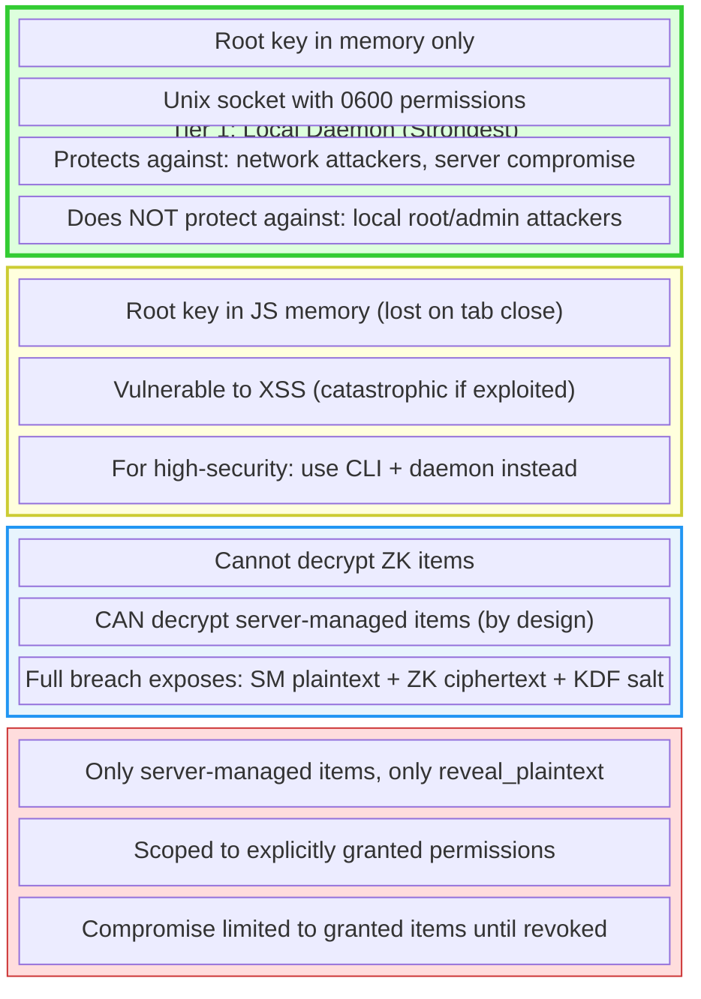

# Security Model

How abadge protects credentials across every surface.

---

## Principles

1. **No plaintext at rest** -- credentials are always encrypted in the database
2. **No decrypt before auth** -- authorization checks run before any decryption
3. **No implicit access** -- every agent-credential pair requires an explicit permission
4. **No silent access** -- every attempt (allowed or denied) is logged
5. **No secret exposure to LLMs** -- MCP tools inject secrets into subprocesses, never into model context

---

## Encryption

abadge supports two storage modes with different trust models.

### Zero-Knowledge Mode

The server never sees plaintext. All cryptographic operations happen in the browser or local CLI daemon.

```
Master Password → Argon2id (64 MiB, 3 iterations) → KEK (32 bytes)
KEK → unwraps → Root Key (32 bytes, per vault)
Root Key → unwraps → DEK (32 bytes, per item)
DEK → decrypts → Item Payload
```

| Operation | Algorithm | Key Size | Nonce Size |
|---|---|---|---|
| Password → KEK | Argon2id | 32 bytes output | N/A |
| Key wrapping | XChaCha20-Poly1305 | 32 bytes | 24 bytes |
| Item encryption | XChaCha20-Poly1305 | 32 bytes | 24 bytes |

**What the server stores**: Wrapped root key, KDF salt/params, wrapped DEKs, ciphertext. The server cannot derive any plaintext without the master password.

**Recovery**: A 256-bit recovery key (base32, shown once) independently wraps the root key. No server-side recovery exists.

### Server-Managed Mode

The API worker encrypts and decrypts with a shared key.

| Operation | Algorithm | Key Size | Nonce Size |
|---|---|---|---|
| Item encryption | AES-256-GCM | 32 bytes | 12 bytes (random) |

**Key source**: `ENCRYPTION_KEY` environment variable on the Cloudflare Worker. Decryption only happens after all authorization checks pass.

### Comparison

| Property | Zero-Knowledge | Server-Managed |
|---|---|---|
| Server sees plaintext | Never | During decrypt |
| Server breach exposure | Ciphertext only (unusable) | Plaintext if `ENCRYPTION_KEY` also compromised |
| Remote agent access | Not supported | `reveal_plaintext` only |
| Local agent access | `read_ciphertext`, `mount_env`, `mount_file` | `reveal_plaintext`, `mount_env`, `mount_file` |
| Setup complexity | Requires master password + vault | Just store the secret |

---

## Authentication

### Human Operators

| Surface | Method | Session Duration |
|---|---|---|
| Dashboard | Better Auth session cookie (email/password or OAuth) | 7 days |
| CLI | Better Auth device authorization flow | Bearer token in daemon memory |

**Dashboard**: Standard cookie-based sessions with CSRF protection via Better Auth. Supports Google and GitHub OAuth.

**CLI**: The CLI initiates a device authorization flow -- user approves in the browser, CLI receives a bearer token. The token is held in daemon memory only; the config file never stores a human bearer token.

### Agent Authentication

Agents authenticate using one of two methods:

#### Public Key Sessions (Default)

The preferred method for all new agents.

```
1. User issues bootstrap token (abe_..., 10-min TTL)
2. Agent generates Ed25519 keypair locally
3. Agent enrolls with bootstrap token + public key
4. For each session:
   a. Agent requests challenge (abc_..., 1-min TTL)
   b. Agent signs challenge with private key
   c. Server verifies Ed25519 signature
   d. Server issues session token (abs_..., 15-min TTL)
```

**Storage**: Private key stored locally with `0600` permissions. Public key stored on server. Session tokens stored as SHA-256 hashes.

#### Legacy API Keys (Migration Only)

For backward compatibility with existing integrations.

- Prefixes: `abl_` (local), `abg_` (remote)
- Full key shown once at creation, never retrievable
- Server stores SHA-256 hash + prefix (first 4-8 chars) for fast lookup
- Authentication: prefix-based DB lookup, then constant-time hash comparison

### Auth Resolution Order

Agent procedures try these methods in order:

1. `abs_` prefix → session token (hash lookup, TTL check)
2. `abl_`/`abg_` prefix → API key (prefix lookup, hash match)
3. Fallback → legacy Better Auth API key verification

Successful authentication updates `lastUsedAt` on the agent record.

---

## Authorization

### Permission Model

Access requires an explicit grant linking an agent to an item with a specific capability. There are no wildcards, no default permissions, and no implicit inheritance.

```
Agent + Item + Capability → Grant → Access
```

### Decision Flow

Every access request follows this exact order:

1. **Authenticate** the bearer token
2. **Resolve** the target item (must belong to the same user as the agent)
3. **Check** for an explicit grant matching (agent, item, capability)
4. **Verify** the grant has not expired
5. **Enforce** locality and storage mode constraints
6. **Audit** the attempt (before returning any data)
7. **Decrypt** only if all checks passed

Denied requests are audited and return an error. The order ensures no decryption happens unless fully authorized.

### Capability Enforcement Matrix

| | ZK Item (Local) | ZK Item (Remote) | SM Item (Local) | SM Item (Remote) |
|---|---|---|---|---|
| `read_ciphertext` | Allowed | **Denied** | N/A | N/A |
| `reveal_plaintext` | N/A | N/A | Allowed | Allowed |
| `mount_env` | Allowed | **Denied** | Allowed | **Denied** |
| `mount_file` | Allowed | **Denied** | Allowed | **Denied** |
| `use_without_reveal` | Allowed | **Denied** | Allowed | Allowed |

**Key restrictions**:
- Remote agents can never access zero-knowledge items (no decryption capability)
- Remote agents can only `reveal_plaintext` or `use_without_reveal` on server-managed items
- Mount capabilities require a local runtime to inject secrets into

---

## Delivery Modes

How secrets reach agents -- designed to minimize exposure.

### Environment Injection (`mount_env`)

Secret is passed as an environment variable to a spawned subprocess. The secret exists only in process memory -- never written to disk. The parent process does not retain the value after spawning.

### File Mounting (`mount_file`)

Secret is written to a temporary file with `0600` permissions (owner read/write only). The MCP server auto-deletes after 5 minutes. The CLI returns the path for manual cleanup.

### Direct Reveal (`reveal_plaintext`)

Secret value returned over HTTPS in the API response. Used by remote agents that cannot use local injection. Available only for server-managed items.

### MCP Secret Handling

The MCP server adds additional protections for AI model contexts:

- Secrets are injected into subprocess env vars, never passed to the LLM
- stdout/stderr is scanned and the secret value is replaced with `[REDACTED]`
- Output is truncated to 4KB to prevent memory issues
- The `mount_secret` tool returns only the file path, never the content

---

## Audit Trail

### Guarantees

- **Append-only**: Audit entries are never updated or deleted
- **No foreign keys**: Entries survive entity deletion (agents, items, permissions)
- **Every attempt**: Both allowed and denied access is logged
- **Metadata**: Structured `meta` field captures additional context per event type

### What Gets Logged

| Category | Events Logged |
|---|---|
| Vault | Bootstrap, unlock, password change, key rotation |
| Items | Create, read, update, delete |
| Auth | Login, logout |
| Agents | Create, bootstrap issue, enroll, rotate, revoke, session issue/reject/revoke |
| Permissions | Create, revoke |
| Access | Ciphertext read, reveal, env mount, file mount |

### Audit Entry Fields

Each entry records: user, agent (if applicable), item (if applicable), event type, result (`allowed`/`denied`/`expired`/`revoked`), delivery mode, IP address, timestamp, and a `meta` JSON blob.

---

## Network Security

### Transport

- All API traffic over HTTPS (Cloudflare edge TLS)
- Local daemon communication over Unix domain socket (`0600` permissions)
- No unencrypted network paths

### API Hardening

| Control | Implementation |
|---|---|
| Rate limiting | In-memory per-IP counters (60/min auth, 100/min API) |
| CORS | Restricted to trusted origins only |
| Secure headers | Hono `secureHeaders()` middleware |
| CSRF | Better Auth built-in protection |
| Input validation | Zod schemas on all external input |
| SQL injection | Drizzle ORM parameterized queries (no raw SQL) |

### Credential Handling on Disk

| Data | Location | Permissions |
|---|---|---|
| CLI config directory | `~/.abadge/` | `0700` |
| CLI config file | `~/.abadge/config.json` | `0600` |
| Agent private keys | `~/.abadge/*.key` | `0600` |
| Daemon socket | `~/.abadge/vaultd.sock` | `0600` |
| Mounted secret files | OS tmpdir | `0600` |

---

## Trust Boundaries



## Server Breach Impact

| What's exposed | Zero-Knowledge Items | Server-Managed Items |
|---|---|---|
| Ciphertext | Yes (useless without root key) | Yes |
| Plaintext | **No** (requires master password brute-force through Argon2id) | **Yes** if `ENCRYPTION_KEY` also compromised |
| KDF parameters | Yes (enables offline attack on weak passwords) | N/A |
| Access patterns | Yes (which agents accessed what, when) | Yes |

**Bottom line**: ZK items remain protected after a full server breach, assuming a strong master password. Server-managed items are exposed if the attacker also obtains the Worker's `ENCRYPTION_KEY`.

---

## Stored Data Summary

| Data | Stored Form | Retrievable? |
|---|---|---|
| Vault root key | KEK-wrapped ciphertext | Only by master password holder |
| Recovery key | Shown once, wraps root key | Never stored in plaintext |
| ZK item value | XChaCha20-Poly1305 ciphertext | Only by vault owner |
| Server-managed item value | AES-256-GCM ciphertext + IV | By server on authorized request |
| Agent API key | SHA-256 hash + prefix | Shown once at creation |
| Agent session token | SHA-256 hash | Shown once at exchange |
| Bootstrap token | SHA-256 hash | Shown once at issuance |
| Challenge token | SHA-256 hash | Used once, 1-min TTL |
| Audit entries | Metadata only | Via audit API (no secrets) |

---

## Explicit Non-Goals (v1)

These are **not** protected against in the current version:

- Local root/admin attackers reading process memory
- HSM or hardware key management integration
- Secure multi-party computation for shared secrets
- Tamper-evident audit log chaining (e.g., hash chains)
- Protection against compromised build/deploy pipelines serving malicious JS
- Organization-level vault cryptography
